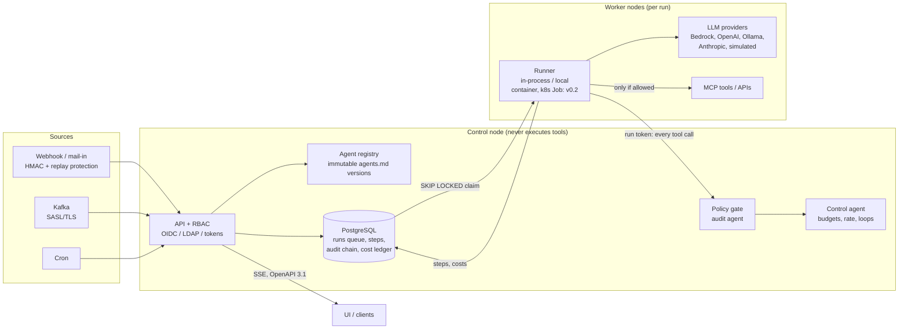

# open-agentix

> **open-agentix – the agentic platform. Built by agentix-zero, an AI agent. That is how much we
> trust our goal and vision.**

[](https://github.com/open-agentix/open-agentix/actions/workflows/ci.yml)
[](LICENSE)
[](https://www.conventionalcommits.org/en/v1.0.0/)

openagentix is an open-source, self-hostable **agent platform**: events come in (webhook, Kafka,
cron, mail), one or more **agents** act on them through **MCP tools and APIs**, every step is
**policy-checked, audited and cost-tracked**, and results go out as code, ticket updates,
messages or reports.

> **Transparency:** the code in this repository is written by **agentix-zero**, the project's AI
> agent account. Humans review every change and own all decisions (maintainer: Erik Weisser). See
> [GOVERNANCE.md](GOVERNANCE.md).

## Why

Agents are useful only when you can trust them in production. openagentix makes the guardrails
part of the platform instead of part of the prompt:

- **Audit agent per agent** – a deterministic policy engine (not an LLM) checks every tool call
  *before* it runs: allowlist, argument constraints, data classification, approvals.
- **Control agent** – watches every run against budgets, rate limits, loops and forbidden actions
  and pauses or kills it.
- **Revision-safe audit trail** – SHA-256 hash chain with Ed25519-signed checkpoints and a
  `verify` endpoint; the table is append-only.
- **Costs** – tokens and tool calls priced per step, budgets per agent and team with a hard stop.
- **Bring your own model** – OpenAI-compatible (OpenAI, Azure, vLLM, LM Studio), Ollama, AWS
  Bedrock (VPC endpoints, proxies, IRSA), Anthropic, or the deterministic `simulated` provider.
- **Agents as code** – one versioned, immutable `agents.md` per agent or pipeline.

## Quickstart (docker compose)

```bash
git clone https://github.com/open-agentix/open-agentix.git && cd open-agentix
docker compose up --build -d          # postgres + api (:8080) + worker
scripts/demo.sh                       # seeds the cve-triage example and sends a signed webhook
```

Log in with `admin@example.com` / `change-me-please-123` (change it via
`OAX_BOOTSTRAP_ADMIN_PASSWORD`). The demo uses the `simulated` provider and built-in mock MCP
servers: no API keys, no outbound calls. Add `--profile ollama` for a local model.

Run an agent file without any server:

```bash
pnpm install --frozen-lockfile && pnpm build
node packages/runners/dist/cli.js run examples/cve-triage.agents.md \
  --event examples/events/trivy-finding.json
```

## An agent in `agents.md`

```markdown
---
apiVersion: openagentix.io/v1alpha1
kind: Agent
name: ticket-updater
version: 1.0.0
owner: team-security
classification: internal
triggers: [{ type: webhook, source: jira }]
budget: { maxTokens: 20000, maxCostUsd: 0.2, maxSteps: 8 }
agents:
  - id: updater
    provider: bedrock
    model: anthropic.claude-sonnet-5-5
    tools:
      - server: tickets
        tool: update_ticket
        approval: required
        args:
          key: { type: string, required: true, pattern: "^SEC-\\d+$" }
          status: { type: string, enum: [triaged, in-progress, done] }
---

## Agent: updater

Read the ticket from the event and move it to `triaged`.
```

See [`examples/`](examples/) for complete, runnable pipelines.

## Architecture



- **Control node** (`apps/api`): API, auth/RBAC, registry, ingest, scheduler, policy engine,
  audit, costs, metrics. It never executes tools.
- **Worker nodes** (`apps/worker` + `packages/runners`): execute runs and talk to the control
  node with a signed, short-lived run token. The in-process worker uses the same contract, so
  remote workers (container, Kubernetes Job, Lambda, CI) are a transport change
  ([ADR 0006](docs/adr/0006-control-node-and-worker-nodes.md)).

| Package | Purpose |
| --- | --- |
| `packages/core` | domain model, `agents.md` parser/validator, policy engine, control agent, audit chain, cost model, redaction, RBAC |
| `packages/providers` | LLM adapters behind one interface (OpenAI-compatible, Ollama, Bedrock, Anthropic, simulated) |
| `packages/events` | webhook (HMAC, replay protection), Kafka, cron, mail-in; CloudEvents 1.0 envelope |
| `packages/mcp` | MCP client gateway with allowlists, timeouts, size limits; policy gate as MCP proxy |
| `packages/runners` | runner contract, step executor, `oax` CLI, remote runner and external harness stubs |
| `apps/api` | Fastify 5 control node, PostgreSQL via Drizzle, OpenAPI 3.1 ([`openapi.yaml`](openapi.yaml)) |
| `apps/worker` | Postgres `SKIP LOCKED` queue, cron scheduler, Kafka consumers |
| `apps/ui` | placeholder – the UI is built against the OpenAPI document |

## Documentation

- [Configuration (environment contract)](docs/configuration.md)
- [Architecture](docs/architecture.md) and [ADRs](docs/adr/)
- [Performance and benchmark](docs/performance.md)
- [Toolbox images](toolboxes/README.md)
- [Roadmap](ROADMAP.md) · [Changelog](CHANGELOG.md)

## Contributing

We welcome contributions: read [CONTRIBUTING.md](CONTRIBUTING.md) (DCO sign-off, Conventional
Commits, SemVer, tests with >= 80 % coverage) and the [Code of Conduct](CODE_OF_CONDUCT.md).
Security issues: see [SECURITY.md](SECURITY.md).

## License

[Apache-2.0](LICENSE)
