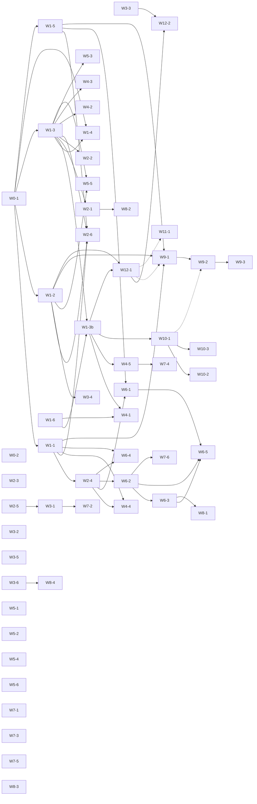

# Implementation plan: from promises to code

Status: proposal for review (2026-10-04; waves 9-12 added the same day from ADRs 0010-0012 and
the demo repository agent design). Owner: the maintainers. Source of truth for the order of
work until the items are closed; [ROADMAP.md](../ROADMAP.md) carries the milestone view and the
GitHub issues (label `roadmap`, labels `wave/*`) carry the work.

The question this plan answers: the website, the docs, the blog and the concept list a lot as
"planned". All of it is meant to be built. This document lists every promised capability, checks
it against the code on `main` (commit `37cb507`), and orders the missing work into waves that can
run in parallel.

Inputs: the product concept and the product specification (internal design notes, addenda of
2026-10-04 included), `README.md`, `ROADMAP.md`, `CHANGELOG.md`, `docs/` (ADRs 0001-0007,
configuration, tenancy, budgets, providers, air-gapped, harnesses, demo), the website
(openagentix.si: landing page and docs, incl. the agentix pattern page) and the blog
(blog.openagentix.si, seven posts incl. "Agent architecture is not application architecture").

## How to read the statuses

| Status | Meaning |
| --- | --- |
| **done** | Implemented on `main` with tests; may still be unreleased (see "Release state" below). |
| **partial** | Part of the promise works; the gap column says what is missing. |
| **stub** | Typed interface or configuration exists, execution throws `NotImplementedError` or the field is parsed but ignored. |
| **planned** | On the roadmap with a milestone before this plan, no code. |
| **not started** | Promised in concept, docs, website or blog, but neither code nor a roadmap entry existed. |

Nothing is marked done because an interface, a config schema, an env variable or a doc page exists.

## Release state

`v0.1.0` (2026-10-04) is the only release. Everything under `[Unreleased]` in
`CHANGELOG.md` is on `main` only: tenant isolation (#13), BYOK model connections and the pinned
models.dev catalog (#15), air-gapped mode (#16), the Claude Code harness (#17), monthly budgets
with hard stop (#18) and the runnable demo profile (#21). These are `feat` changes, so under
SemVer they ship in `0.2.0`.

Decision needed (project lead): either tag a pre-release now (`v0.2.0-alpha.1`) so the website can
honestly say "available in 0.2.0-alpha.1", or keep them unreleased until wave 1 lands and then tag
`v0.2.0`. Until one of the two happens, website and blog must call these features "on `main`,
ships in 0.2", not "available in 0.1". Recommendation: tag `v0.2.0-alpha.1` after this plan is
merged; it costs nothing and removes most wording problems in appendix B.

## 1. Gap matrix

Evidence paths are relative to this repository unless prefixed (`helm:` = open-agentix-helm).
"Plan" points to the work item in section 2.

### 1.1 Agent definition and orchestration

| Capability | Promised in | Status | Evidence | Gap | Plan |
| --- | --- | --- | --- | --- | --- |
| `agents.md`: YAML front matter + markdown, pipelines of 1..n agents, budgets, tool allowlists with argument constraints, approvals, classification, runtime/toolbox, immutable SemVer versions with digest | spec, concept 14, website agents-md reference, blog | done | `packages/core/src/agents/{schema,parser,validate}.ts`, `apps/api/src/services/agents.ts`, v0.1.0 | - | - |
| Typed handovers: input/output JSON Schema, validated before the next step, minimal handover | pattern R4 (website, blog), concept 6, 14 | not started | `packages/runners/src/executor.ts` passes `previous.content` as text; `format: json` is only `JSON.parse`d (executor.ts ~400) | Schemas in agents.md, validation, failure handling, minimal handover | W0-1, W1-1 |
| Conditional steps (`when`) | pattern R5, blog plan sketch | not started | `pipeline` is an ordered id list (`schema.ts`) | Safe expression evaluator, skipped steps audited | W0-1, W1-1 |
| Runtime-neutral agent contract (input/output schema, capabilities, limits, `policy.mode: read-only`) | concept 14 | partial | limits and tools exist; no schemas, no read-only mode | Schemas (W1-1), `access: read-only` (W1-2) | W1-1, W1-2 |
| Output targets (`outputs[].target`, e.g. post to chat) | spec ("results go out as ... message"), concept 26 | stub | `OutputSchema.target` parsed in `schema.ts`, never used by the executor | Deliver outputs through the gate | W3-4 |
| Stable `openagentix.io/v1` agents.md and `v1` API | roadmap v1.0, website roadmap | planned | `API_VERSION = 'openagentix.io/v1alpha1'` | Freeze, conversion, deprecation policy | W8-1 |

### 1.2 Lifecycle: Describe, Agent Check, Agent Plan, Agent Build, Evaluate, Publish, Approve

| Capability | Promised in | Status | Evidence | Gap | Plan |
| --- | --- | --- | --- | --- | --- |
| Describe: workflow wizard that drafts `agents.md` | spec persona, blog "why" | done | `apps/ui/src/features/wizard/*` (deterministic template, no model) | - | - |
| Agent Check (user-selected model analyses a process, advisory) | concept 3, website pattern page, blog | not started | no code | Endpoint, model call, schema-validated result | W1-5 |
| Agent Plan (versionable blueprint, least-privilege decomposition, human review) | concept 4-5, blog plan sketch | not started | no code | `AgentPlan` schema, lint, storage, draft generator | W1-5, W2-6 |
| Agent Build (plan -> scaffolding, schemas, tool binding, eval cases, packaging) | concept 6, website roadmap "Later" | not started | no code | Generator | W6-1 |
| Evaluate: test suites and evaluations (task success, tool use, policy compliance, security, quality, cost, latency, failure, output validity) | concept 21, roadmap v0.2/v1.0, website guidelines page | not started | no eval code (`grep eval` only finds `evaluate*` of the policy engine) | Test suites, eval runner, promotion gate | W2-4, W6-2 |
| Publish (immutable version, digest) | concept 20 | done | `apps/api/src/services/agents.ts`, `apps/ui/src/features/agents/PublishDialog.tsx` | - | - |
| Approve an agent version (bound to digest, model, eval set, policy; re-evaluate on change) | concept 20 | not started | publish has a confirmation dialog only | Approval records, staleness | W6-3 |
| Agent archive | roadmap v0.2 | planned | no code | Archive/unarchive | W3-6 |
| Dark software factory mode with fixed notice | addendum 8, website factory page, blog | partial | `mode: dark-factory` + `DARK_FACTORY_NOTICE` warning in `packages/core/src/agents/validate.ts`; no UI notice | UI notice; template | W6-4 |
| Dark software factory pipeline template | roadmap v0.2 (#6), blog | planned | no example | Template | W6-4 |
| Development guidelines (versioned, global -> tenant -> agent, stricter wins, enforced by the gate) | addendum 9, website guidelines page | partial | `packages/core/src/guidelines.ts`, `apps/api/src/services/guidelines.ts`, `/v1/guidelines`; no UI; not part of any eval | UI (W6-5), evaluation (W2-4) | W2-4, W6-5 |
| Global hardening agent (reviews PRs/outputs, stricter only) | addendum 10, website, blog | partial | deterministic `POST /v1/guidelines/review`; nothing calls it automatically | Automatic review of dev agents' outputs | W6-4 |
| LLM second opinion for hardening and control agent | roadmap v0.2 (#7), spec | stub | `ControlReviewer` hook in `packages/core/src/control/controller.ts`, no implementation | Reviewer implementation | W6-4 |
| Red-teaming of agents | roadmap v1.0 | planned | no code | Campaigns | W7-6 |

### 1.3 Events and outputs

| Capability | Promised in | Status | Evidence | Gap | Plan |
| --- | --- | --- | --- | --- | --- |
| Signed webhooks (HMAC, `oax-v1` and GitHub schemes, replay protection) | spec, website | done | `packages/events/src/webhook.ts` | - | - |
| Kafka (SASL/TLS, CloudEvents binary/structured) | spec, website | done | `packages/events/src/kafka.ts`, `apps/worker/src/sources.ts` | - | - |
| Cron with cluster-wide de-duplication | spec, website | done | `packages/events/src/cron.ts`, `apps/worker/src/scheduler.ts` | - | - |
| E-mail | spec, website | partial | mail-in via signed webhook (`packages/events/src/mail.ts`) | IMAP polling | W5-4 |
| Microsoft Teams and Slack (inbound) | spec, concept 9, website landing tile "Teams and Slack start runs" | partial | only through the generic webhook source | Dedicated adapters with native signature checks | W5-4 |
| "Streams" / log stream source | concept 9, website diagram | not started | Kafka only | Wording fix now (appendix B); more sources only on demand | W0-2 |
| Change gate for schedules: HTTP and file probes, audited, no tokens | addendum 6, website change-gate page | done | `packages/events/src/change-gate.ts`, `apps/api/src/services/ingest.ts` (`changeCheck`) | - | - |
| Change gate probes: API with secrets, SQL query, MCP read | addendum 6, roadmap v0.2 (#4), website probe table | planned | not in `ProbeSchema` | Three probe types | W3-2 |
| Outputs: PR, ticket update, chat message, report, metric | spec, concept 26, website hero | partial | only via tool calls an agent makes; `outputs[].target` ignored | Output delivery | W3-4 |

### 1.4 Identity, tenants and access

| Capability | Promised in | Status | Evidence | Gap | Plan |
| --- | --- | --- | --- | --- | --- |
| OIDC (PKCE) | spec, website | done | `apps/api/src/auth/oidc.ts` | - | - |
| LDAP/AD bind with group -> role mapping | spec, website | done | `apps/api/src/auth/ldap.ts` | - | - |
| Local bootstrap admin, hashed scoped expiring API tokens | spec | done | `apps/api/src/bootstrap.ts`, `apps/api/src/auth/tokens.ts` | - | - |
| RBAC: six roles, per-route permission declarations enforced at start-up and in tests | spec, website rbac page | done | `packages/core/src/rbac.ts`, `apps/api/test/routes.test.ts` | - | - |
| Tenants as isolation boundary (agents, runs, connections, keys, audit partition, costs; 404 on foreign resources) | addendum 4, website tenants page | done (unreleased) | PR #13, `apps/api/test/tenancy.test.ts`, `docs/tenancy.md` | - | - |
| Per-agent role bindings (hidden agents 404, denial audited) | addendum 4 | done | `agent_role_bindings` in `apps/api/src/db/schema.ts`, v0.1.0 | - | - |
| Policy bindings per team/agent | roadmap v0.2 | planned | `policies.scope` is platform or tenant only | Team/agent scopes | W3-3 |
| SCIM, tenant-scoped IdPs | roadmap v0.3, `docs/tenancy.md` | planned | no code | SCIM, per-tenant OIDC/LDAP | W5-1 |

### 1.5 Policy, guardrails and approvals

| Capability | Promised in | Status | Evidence | Gap | Plan |
| --- | --- | --- | --- | --- | --- |
| Audit agent: deterministic policy gate before every tool call (allowlist, args, classification, approvals) | spec, concept 10-11, website | done | `packages/core/src/policy/engine.ts`, `apps/api/src/services/control-plane.ts` | - | - |
| Control agent (budget, timeout, rate, loops, error streak, denials, forbidden actions, provider clearance) | spec, website | done | `packages/core/src/control/controller.ts` | - | - |
| Control-agent rule API | roadmap v0.2 | planned | thresholds from config only | API | W3-3 |
| Human approval (approver roles, timeout, audit) | spec, concept 18 | done | `apps/api/src/services/runs.ts`, `apps/ui/src/features/runs/ApprovalCard.tsx` | - | - |
| Approval inbox, notifications, one-click decisions (Slack/Teams/mail) | roadmap v0.2 | planned | no code | Notifier + signed decision links | W2-5, W3-1 |
| Multi-step approvals (four-eyes, chains, windows) | roadmap v1.0, website "approval workflows" | planned | single approval only | Workflows | W7-2 |
| Emergency security overrides ("a security block always wins") | concept 13, website roadmap | partial | a platform policy with `forbiddenTools` denies, but it is a normal reviewed policy, cached up to 30 s per replica (`apps/api/src/services/catalog.ts`), with no dedicated audit/expiry | Dedicated override objects, immediate effect | W2-3 |
| ReDoS-safe patterns (RE2) | roadmap v0.2, blog | planned | patterns compiled with `RegExp` | RE2 | W3-3 |
| OPA adapter | roadmap v0.3 | planned | no code | Adapter | W5-6 |
| Data classification and provider clearance | spec | done | `packages/core/src/classification.ts`, engine and controller | - | - |

### 1.6 MCP and tools

| Capability | Promised in | Status | Evidence | Gap | Plan |
| --- | --- | --- | --- | --- | --- |
| MCP gateway (stdio, streamable HTTP) with per-agent allowlists, timeouts, result limits | spec, website MCP page | done | `packages/mcp/src/{gateway,connection,config}.ts` | - | - |
| Policy gate as MCP proxy (stdio and loopback HTTP bridge) | spec, website | done | `packages/mcp/src/{gate-server,gate-http}.ts` | - | - |
| Bring your own MCP: servers registered per platform, tenant, team or agent | addendum 3, website MCP tile | done (unreleased) | connections of kind `mcp` with scope, `resolveConnections` in `apps/api/src/services/catalog.ts` (PR #13) | Remote servers only; "as a container" is W5-5 | W5-5 |
| Named read/write tool profiles per MCP server | pattern R1 (website, blog), concept 12 "profiles" | not started | grants name tools directly | Profiles, access classes, read-only agents | W1-2 |
| MCP catalog governance (listing/review states, who may use, per-server egress) | concept 12, website roadmap "MCP catalog" | partial | scopes decide who may use a connection; no review states, no per-server egress | Catalog states and egress | W5-5 |
| HTTP/API connections | roadmap v0.2, spec "MCP tools / APIs" | planned | MCP only | `http` connections | W3-4 |

### 1.7 Audit trail

| Capability | Promised in | Status | Evidence | Gap | Plan |
| --- | --- | --- | --- | --- | --- |
| Append-only SHA-256 hash chain, Ed25519 checkpoints, verify endpoint/CLI, NDJSON export, DB role + trigger without UPDATE/DELETE | spec, concept 17, website, blog | done | `packages/core/src/audit/chain.ts`, `apps/api/src/services/audit.ts`, `deploy/sql/roles.sql`, migrations | - | - |
| Coverage: events, runs, versions, decisions, tool calls/results, model calls, approvals, denials, failures, costs | concept 17 | done | steps are recorded with an audit entry (`ControlPlane.recordStep`), plus ingest/policy/approval entries | - | - |
| Tenant partition key on entries | addendum 4 | done (unreleased) | PR #13 | - | - |
| Per-tenant chains and Merkle proofs | roadmap v1.0, `docs/tenancy.md` | planned | single chain | Chains, proofs | W7-1 |
| SIEM export | roadmap v0.3 | planned | no code | Sinks | W5-2 |

### 1.8 Costs and budgets

| Capability | Promised in | Status | Evidence | Gap | Plan |
| --- | --- | --- | --- | --- | --- |
| Cost per step/run in micro-USD from a price table, cost lines with tenant, agent, use case, run, step, model, provider | spec, addendum 5 | done | `packages/core/src/cost/model.ts`, `cost_ledger`, `apps/api/src/services/costs.ts` | - | - |
| Aggregation by any dimension, CSV/JSON export, Prometheus counter | addendum 5, blog cost post | done | `apps/api/src/services/costs.ts`, `oax_cost_micro_usd_total` in `apps/api/src/metrics.ts` | - | - |
| Per-run budgets (tokens, cost, steps, tool calls, timeout) with hard stop | spec, concept 19 | done | `BudgetSchema`, control agent | - | - |
| Monthly budgets per tenant, use case and team with hard stop at admission and mid-run | addendum 5, issue #3 | done (unreleased) | PR #18, `apps/api/src/services/budgets.ts`, `docs/budgets.md` | - | - |
| Budget alerts at 50/80/100 % as events and audit entries | roadmap v0.2 | done (unreleased) | PR #18 (`io.openagentix.budget.alert`) | Delivery to chat/mail is W2-5 | - |
| Concurrency-safe budgets: worst-case reservation before every model call, settlement from measured usage (no overshoot by one call or a burst) | spec ("hard stop"), addendum 5 | not started | `docs/budgets.md` documents that one call or a burst can overshoot; budgets are checked after each call (`packages/core/src/control/controller.ts`, `apps/api/src/services/budgets.ts`) | Reservations, settlement, cache-token prices | W1-3b |
| Per-agent monthly budgets, alert delivery, alert API | roadmap v0.2, website costs page | planned | not in `budgets.ts` | Agent scope, channels, API | W2-5 |
| Cost chargeback (cost centres, ERP export) | roadmap v1.0 | planned | no code | Reports | W7-3 |

### 1.9 Observability

| Capability | Promised in | Status | Evidence | Gap | Plan |
| --- | --- | --- | --- | --- | --- |
| `/metrics` (Prometheus) | spec, concept 23 | partial | 8 families in `apps/api/src/metrics.ts` (HTTP, events, runs, policy decisions, cost, worker) | tool calls, approvals, tokens, budget exhaustion, durations | W3-5 |
| OpenTelemetry traces (OTLP optional) | spec, website metrics tile | partial | OTLP exporter in `apps/api/src/telemetry.ts`; one `oax.run` span in `apps/worker/src/worker.ts` | step/model/tool spans, HTTP spans | W3-5 |
| JSON logs with run-id correlation, `/healthz`, `/readyz` | spec | done | pino logger, `apps/api/src/http/routes/system.ts`, `apps/worker/src/http.ts` | - | - |

### 1.10 Providers and models

| Capability | Promised in | Status | Evidence | Gap | Plan |
| --- | --- | --- | --- | --- | --- |
| Adapters: OpenAI-compatible (OpenAI, Azure, vLLM, LM Studio, OpenRouter), Ollama, Bedrock (VPC endpoint, proxy, IRSA), Anthropic, simulated; egress guard | spec, concept 24 | done | `packages/providers/src/*` | - | - |
| BYOK: model connections with secret references scoped to platform/tenant/team/agent | addendum 1, issue #2 | done (unreleased) | PR #15, `apps/api/src/services/models.ts` (`connectionsForRun('model', scope)`) | - | - |
| Model catalog from a pinned models.dev snapshot with local overrides and a reviewed weekly refresh PR | addendum 2, issue #5 | done (unreleased) | `packages/providers/catalog/`, `scripts/import-models-dev.mjs`, `.github/workflows/catalog-refresh.yml` (PR #15) | - | - |
| Model access for isolated run nodes through a control-node model proxy (keys never on nodes, usage measured on the control node, streaming Anthropic/OpenAI surfaces) | ADR 0008 (3.4), concept 16, 24 | not started | W1-3a (PR #76) ships a fail-closed placeholder (`packages/runners/src/model-proxy.ts`); nodes can only use `simulated`, node-reported cost is dropped | Proxy, accounting, surfaces | W1-3b |
| Model routing (classification, cost, latency) | roadmap v0.3 | planned | no code | Routing rules | W4-5 |
| Private model hosting via the chart (vLLM/Ollama, GPU) | roadmap v1.0 | planned | compose `--profile ollama` only | Chart templates | W8-3 |

### 1.11 Runners, workers, toolboxes and credentials

| Capability | Promised in | Status | Evidence | Gap | Plan |
| --- | --- | --- | --- | --- | --- |
| `in-process` runner | spec, concept 31 | done | `packages/runners/src/in-process.ts`, `apps/worker/src/worker.ts` | - | - |
| `local` runner / CLI (`oax run`, `oax validate`) | spec | done | `packages/runners/src/{local,cli}.ts` | - | - |
| Remote worker protocol (signed run tokens, HTTP control plane, worker routes) | ADR 0006 | partial (run node done in W1-3a, model proxy W1-3b) | `packages/runners/src/http-control-plane.ts`, `apps/api/src/http/routes/worker.ts`, `packages/core/src/run-token.ts`, `apps/worker/src/run-node.ts` | run nodes cannot call models yet (W1-3b) | W1-3b |
| `container` runner (Docker/Podman, one short-lived container per step, read-only, egress allowlist) | spec, concept 16, 31, website runners page, issue #10 | done in W1-3a (unreleased), opt-in | `packages/runners/src/{container,container-engine,container-hijack,egress-proxy}.ts`, `docs/runners.md` | model proxy for run nodes (W1-3b) | W1-3b |
| `kubernetes-job` runner (EKS/IRSA, NetworkPolicy) | spec, website, issue #11, helm #6 | stub | `StubRunner`; `OAX_K8S_*` parsed (`docs/configuration.md`, "feature-flagged off"); helm values render RBAC/ConfigMap/NetworkPolicies that the platform does not consume | Implementation | W1-4 |
| `aws-lambda` runner | spec, website | stub | `StubRunner` | Implementation | W4-3 |
| `github-actions` / `gitlab-ci` runners with signed callbacks | spec, website | stub | `StubRunner` | Implementation | W4-2 |
| Per-step scoped credentials, issued once per step by the credential broker and revoked after the step | concept 16, 25, pattern R6, website security model page | done in W1-3a (unreleased) | `apps/api/src/services/run-nodes.ts`, `POST /v1/worker/runs/{id}/credentials`, `tenants.secret_refs` | dynamic sources with real revocation (W5-3) | W5-3 |
| Toolbox images: catalog, minimal, digest-pinned, cosign, SBOM, Trivy | spec, website toolbox page | partial | `toolboxes/catalog.yaml` (digests `null`), one Dockerfile, publish-time allowlist (`OAX_TOOLBOX_ALLOWLIST`); platform images are signed with SBOM in `release.yml` | Build/sign/scan toolboxes, verify at start | W2-1 |
| mTLS between workers and control node | spec, roadmap v0.2 | planned | run tokens only | mTLS | W2-2 |
| Secret managers (Vault, AWS SM) with leases | roadmap v0.3 | planned | env/file resolver only (`packages/core/src/secrets.ts`) | Backends | W5-3 |
| Scale-out run queue (Valkey/Kafka) | roadmap v0.3 | planned | Postgres `SKIP LOCKED` queue | Queue backends | W7-5 |

### 1.12 External harnesses

| Capability | Promised in | Status | Evidence | Gap | Plan |
| --- | --- | --- | --- | --- | --- |
| Claude Code adapter (`claude -p`, policy gate as loopback MCP bridge, platform-enforced limits) | spec, concept 15 | done (unreleased) | PR #17, `packages/runners/src/{harness,harness-runner}.ts`, `docs/verification/claude-code-harness.md` | - | - |
| OpenCode adapter | spec, concept 15 (first example) | stub | `StubHarness` in `packages/runners/src/harness.ts` | Implementation | W1-6 |
| Harnesses (Claude Code, OpenCode) inside isolated run nodes, cost measured by the platform | spec, concept 15, ADR 0005 | not started | harnesses run only as children of the orchestrator/CLI (`packages/runners/src/harness-runner.ts`), cost is harness-reported | Proxy mode, `runtime.harness`, harness run-node images | W1-3b |
| Hermes, OpenClaw adapters | spec, concept 15 | stub | `StubHarness` | Implementation | W4-1 |

### 1.13 UI (console)

| Capability | Promised in | Status | Evidence | Gap | Plan |
| --- | --- | --- | --- | --- | --- |
| Console: dashboard, agents (editor, versions, diff, publish, test runs), wizard, events, runs (live SSE), approvals, connections, policies, audit, costs and budgets, users/teams/RBAC, tokens, settings; en/de; a11y | spec, concept 22 | done | `apps/ui/src/features/*`, coverage gate 80 % | - | - |
| Console for Agent Plans, evaluations, guidelines, tenants, version approvals, dark-factory notice | concept 22 | not started | no pages | Pages | W2-6, W6-5 |
| Settings write API (providers, runners from the UI, audited) | roadmap v0.2 | planned | settings are read-only | API + UI | W3-6 |

### 1.14 Deployment, air-gapped, demo, docs

| Capability | Promised in | Status | Evidence | Gap | Plan |
| --- | --- | --- | --- | --- | --- |
| Docker Compose stack | spec | done | `docker-compose.yml` | - | - |
| Helm chart: api, worker, ui, bundled PostgreSQL and Valkey, generated credentials, ingress, IRSA, NetworkPolicies, restricted PSS, HPA, PDB, ServiceMonitor, migration job, demo and air-gapped modes | spec | done | helm: `charts/open-agentix/templates/*`, helm PR #14, chart 0.2.1 | - | - |
| Helm OCI publishing, chart signing, golden files, kind install test | helm roadmap | planned | helm issues #1-#5 | - | helm |
| Air-gapped mode (fail-closed self-check, egress policy, vendored catalog, `/readyz`) | spec non-negotiables, website | done (unreleased) | PR #16, `apps/api/src/airgap.ts`, `docs/airgapped.md` | - | - |
| Air-gapped offline bundle (images, chart, SBOMs, signatures) | roadmap v1.0 | planned | no bundle job | Bundle | W8-2 |
| Data residency | roadmap v1.0 | planned | no code | Region pinning | W7-4 |
| Demo profile (compose, fixed scenarios, limits, optional Claude Code mode) and deterministic seed | spec, addendum | done (unreleased) | PR #21, `apps/api/src/demo/*`, `docs/demo.md` | - | - |
| Demo resets | roadmap v0.2 (#9) | planned | no reset job | Reset job | W3-6 |
| Public demo at `demo.openagentix.si` | spec, website ("coming soon"), blog (linked as live) | not started | no deployment recorded in any of the repositories (the blog links it as live, the website says "coming soon") | Deploy, verify, then link | W8-4, W0-2 |
| Platform docs (configuration, tenancy, budgets, providers, air-gapped, harnesses, demo, ADRs 0001-0007) | spec | done | `docs/` | - | - |
| Website docs in sync with the code | spec | partial | many pages still say "Coming with the API"/"Roadmap" for shipped features (appendix B) | Wording sync | W0-2 |
| API reference generated from `openapi.yaml` on the website | spec | not started | website `reference/api.md` is a TODO | Generation | W8-1 |
| Homelab example agents (CVE triage, log anomalies, auto-repair PRs, incidents, backup verification) | roadmap v0.2, concept 30 | partial | `examples/cve-triage.agents.md`, `examples/ticket-updater.agents.md` | Four more, with tests | W4-4 |

<!-- gap-1-15:start -->
### 1.15 Owner requests of 2026-10-04: authoring, GitOps, outbound network, connections, data protection

| Capability | Promised in | Status | Evidence | Gap | Plan |
| --- | --- | --- | --- | --- | --- |
| Graphical no-code agent builder with a round-trip code view | owner request | not started | `apps/ui/src/features/agents/AgentEditor.tsx` is a textarea with live validation | Edit model, form, live lint | W9-1 |
| Agent Check lint while editing agents.md | owner request, `docs/agent-check.md` | partial | lint runs on plans only (`packages/core/src/plan/lint.ts`) | `planFromDefinition`, validate response | W9-1-2 |
| Agents from Git repositories (GitOps) with review, publish and drift handling | owner request | not started | agents live only in the database | Bindings, sync, publish modes, PR-back | W9-2, W9-3 |
| Per-destination outbound proxies, CA bundles, mTLS, safe connectivity tests | owner request, ADR 0004 | partial | env proxies and per-provider `proxyUrl` (`packages/providers/src/proxy.ts`) | Network configuration, resolver, trust store, admin page | W10-1 |
| Private model endpoints (Bedrock PrivateLink, Azure private endpoints, Vertex PSC) | ADR 0004, website providers page | partial | Bedrock `endpoint` override exists | Signing region, control endpoint, Entra auth, Vertex | W10-2, W10-3 |
| Real read-only demo agent on the project repository | owner request | not started | demo agents run fixed scenarios only (`docs/demo.md`) | Pinned GitHub MCP server, ask endpoint, caps | W11-1 |
| Separate MCP server and model provider areas, several typed instances, central grants | owner request | partial | one `connections` table and page; platform connections visible to every tenant | Types, grants, namespace rules, UI split | W12-1 |
| Data protection: data flow rules, retention, PII, processing record, export, erasure, operator separation | owner request, concept (GDPR) | not started | secrets redacted, capture `metadata` in the model proxy only | ADR 0012 section 7 | W12-2 |

<!-- gap-1-15:end -->

## 2. Wave plan

Conventions for every item:

- **Model** follows the project rule: architecture and complex design = `opus`, implementation =
  `sonnet`, tests and summaries = `haiku`. An item marked `sonnet` whose acceptance criteria say
  "design by opus" gets a short opus design comment on its issue before implementation.
- **Size:** S = up to 1 day of agent work and one small PR, M = 2-4 days, L = about a week, several
  commits in one PR.
- **Tests:** every PR keeps the coverage gate (>= 80 % lines, branches, functions, statements per
  package) green; tests land in the same commit as the code.
- **Security review:** items marked yes need a reviewer pass with the `security-and-hardening`
  checklist (threat model in the PR description, negative tests listed) before merge.
- **Parallelism:** items of one wave touch disjoint modules except where noted; `openapi.yaml`,
  `apps/ui/src/api/schema.d.ts` and `apps/ui/src/i18n/locales/*.json` are regenerated or appended on
  rebase, never hand-merged. Migration numbers are fixed here: 0005 agent plans (W1-5), 0006
  security overrides (W2-3), 0007 evaluations (W2-4), 0008 agent budgets and channels (W2-5),
  0009 run node sessions (W1-3a), 0010 model proxy reservations and ledger columns (W1-3b),
  0011 agent repositories (W9-2), 0012 connection instances, grants and data protection columns
  (W12-1, W12-2), 0013 tenant hierarchy (W13-1).
- **Docs and website:** the item's PR updates the platform docs; the website/blog change is made
  when the item ships in a release (never before).
- Subagents leave PRs open; the main agent reviews, merges and checks the result.

### Dependency overview

### Wave 0: preparation (day 0)

Milestone: **v0.2** (exceptions per item). Unblocks everything else: one reviewed contract for the new agents.md fields and the worker protocol, and honest wording on the public sites today.

| Item | Title | Size | Model | Security review | Depends on | Touches | Issue |
| --- | --- | --- | --- | --- | --- | --- | --- |
| W0-1 | ADR 0008: agents.md data flow and isolation contract (handovers, when, tool profiles, per-step credentials, run node) | S | opus | yes | - | docs/adr/0008-*.md, packages/core/src/agents/schema.ts, packages/core/src/agents/validate.ts, packages/core/test/agents*.test.ts | #23 |
| W0-2 | Website and blog wording sync with the code (status badges, released features, planned items) | S | haiku | no | - | openagentix.si: src/content/docs/**, src/i18n/ui/{en,de}/*.ts, src/components/landing/*.astro; blog.openagentix.si: src/content/posts/{en,de}/*.md | #24 |

#### W0-1 ADR 0008: agents.md data flow and isolation contract (handovers, when, tool profiles, per-step credentials, run node)

*As an agent engineer, I want one reviewed design for the new agents.md fields and the worker contract so that the wave 1 items can be built in parallel without redesigning each other's interfaces.* Milestone v0.2, size S, model `opus`, security review required.

Acceptance criteria:

- `docs/adr/0008-*.md` decides: `agents[].input.schema` / `agents[].output.schema` (JSON Schema 2020-12 subset, inline or `$ref` into a top-level `schemas:` map), `onInvalid: fail|retry` (one retry with the validation error), `agents[].when` expression grammar (no `eval`, paths over `event` and `steps.<id>.output`, operators `== != < <= > >= in && || !`, `exists()`), `tools[].profile` (named read/write profile of a connection), `agents[].credentials` (secret references per step), `agents[].access: read-only|write`.
- The same ADR fixes the remote run-node contract: how a runner starts a worker (`oax run-node`), what it receives (run id, control URL, run token file, step group), the credential broker endpoint and its audit entries, revocation on step end.
- The zod schema in `packages/core/src/agents/schema.ts` gets the new optional fields (additive, `apiVersion` stays `openagentix.io/v1alpha1`), with validation rules (references to later steps refused, `when` parsed at publish, profile names checked at publish).
- Existing agents.md files and examples still validate unchanged.

Tests: Parser/validator tests for every new field and every refusal; existing tests unchanged; coverage of `packages/core` stays >= 80 %.

Docs and website: ADR 0008, `docs/architecture.md` link; no website wording change yet (fields are not functional until W1-1..W1-4 land).

#### W0-2 Website and blog wording sync with the code (status badges, released features, planned items)

*As a reader of openagentix.si and the blog, I want every status claim to match the code so that I can trust what is marked available and what is planned.* Milestone v0.2, size S, model `haiku`, security review not required.

Acceptance criteria:

- Every replacement listed in appendix B of `docs/IMPLEMENTATION-PLAN.md` is applied in `openagentix.si` (EN and DE) and `blog.openagentix.si` (EN and DE), or explicitly rejected in the PR with a reason.
- No page says a feature is available that the plan's gap matrix marks as stub, planned or not started; no page calls a shipped feature 'coming with the API' or 'Roadmap'.
- The demo link is only kept where the demo deployment is verified live.

Tests: Website build and its existing checks (links, budget script) green; a grep-based check for 'Coming with the API' returns nothing.

Docs and website: Is itself the docs change; the platform repo is not touched.

### Wave 1: what the pattern page already promises

Milestone: **v0.2** (exceptions per item). The claims the website and blog make as planned and that are cheapest and most valuable: typed handovers, `when`, tool profiles, isolated workers with per-step credentials, a first Agent Check, OpenCode.

| Item | Title | Size | Model | Security review | Depends on | Touches | Issue |
| --- | --- | --- | --- | --- | --- | --- | --- |
| W1-1 | Typed handovers with JSON Schema validation and conditional steps (`when`) | L | sonnet | no | W0-1 | packages/core/src/handover.ts (new), packages/core/src/conditions.ts (new), packages/runners/src/executor.ts (output and loop head), packages/runners/test/*, examples/ticket-triage.agents.md (new), docs/pipelines.md | #25 |
| W1-2 | Named read/write tool profiles per MCP server | M | sonnet | yes | W0-1 | packages/mcp/src/config.ts, apps/api/src/services/catalog.ts, apps/api/src/services/agents.ts (publish expansion), packages/core/src/policy/engine.ts, apps/ui/src/features/connections/*, openapi.yaml (regenerate on rebase) | #26 |
| W1-3 | Remote run node, per-step credential broker and the container runner | L | sonnet | yes | W0-1 | apps/worker/src/run-node.ts (new), apps/api/src/http/routes/worker.ts, apps/api/src/services/control-plane.ts, packages/runners/src/container.ts (new), packages/runners/src/http-control-plane.ts, packages/runners/src/stubs.ts, Dockerfile, docker-compose.yml | #10 |
| W1-3b | Model proxy on the control node: model access for run nodes, measured cost, budget reservations, harnesses through the proxy | L (10 tasks) | sonnet (design: opus, ADR 0009) | yes | W1-3 (W1-3a, PR #76), W1-6 (harness tasks only) | apps/api/src/services/{model-proxy,model-accounting}.ts (new), apps/api/src/http/routes/{worker,model-proxy}.ts, apps/api/drizzle/0010_model_proxy.sql (new), packages/providers/src/stream/* (new), packages/runners/src/{model-proxy,executor,harness,harness/opencode}.ts, apps/worker/src/{run-node,node-dispatcher}.ts, packages/core/src/{model-token,token-estimate}.ts (new), Dockerfile, docker-compose.yml | - |
| W1-4 | Kubernetes Job runner (EKS/IRSA) with per-step credentials | M | sonnet | yes | W0-1, W1-3 (run node, for the end-to-end test only) | packages/runners/src/kubernetes-job.ts (new), packages/runners/src/stubs.ts, apps/api/src/config.ts (existing OAX_K8S_* settings), open-agentix-helm: charts/open-agentix/templates/runners/* | #11 |
| W1-5 | Agent Check and Agent Plan v1 (advisory plan generation with a least-privilege lint) | M | sonnet | yes | W0-1 (AgentPlan schema section, designed by opus) | packages/core/src/plan/* (new), apps/api/src/services/agent-check.ts (new), apps/api/src/http/routes/plans.ts (new), apps/api/drizzle/0005_agent_plans.sql (new), openapi.yaml | #27 |
| W1-6 | OpenCode harness adapter behind the policy gate | M | sonnet | yes | - | packages/runners/src/harness.ts (split per adapter: harness/opencode.ts new), packages/runners/src/cli.ts, docs/harnesses.md | #28 |

#### W1-1 Typed handovers with JSON Schema validation and conditional steps (`when`)

*As an agent engineer, I want each step to hand over a schema-validated JSON artifact and to run only when its condition holds so that agents never pass free text between each other and plans can branch without an orchestrator agent.* Milestone v0.2, size L, model `sonnet`, security review not required.

Acceptance criteria:

- The executor validates the final output of an agent against `output.schema` before the next step; invalid output fails the run with `handover_invalid` (or retries once with the validation errors when `onInvalid: retry`), recorded as a step and an audit entry `handover.invalid`.
- The first agent's `input.schema` validates the event data; later agents get only the validated JSON of the steps they reference, not the previous agent's full text.
- `when` is evaluated by a deterministic evaluator without `eval`/`Function`; a false condition records a `decision` step with status `skipped` and an audit entry; evaluation errors fail the run (fail-closed).
- JSON Schema validation uses a pinned, reviewed library (ajv 8 is already in the lockfile through the MCP SDK) with strict mode, no remote `$ref` resolution and size/depth limits.
- `examples/` gets a three-step ticket triage pipeline (research -> analysis -> action with `when`) that runs with the simulated provider and the demo MCP servers.

Tests: Unit tests for validator and evaluator (incl. malicious expressions, deep nesting, prototype pollution keys), executor tests for valid/invalid/retry/skip, end-to-end example test; coverage of core and runners >= 80 %.

Docs and website: `docs/pipelines.md` (new) in the platform; website: agents.md reference gets `input`, `output.schema`, `when`; agentix-pattern page and blog status move 'typed handovers' and 'conditional steps' to available in the release that ships them.

#### W1-2 Named read/write tool profiles per MCP server

*As an integrator, I want to publish named profiles per MCP server (for example `read` and `write`) with each tool classified as read or write so that agent engineers grant `jira:read` instead of hand-picking tools and a read-only step can never receive a write tool.* Milestone v0.2, size M, model `sonnet`, security review required.

Acceptance criteria:

- A connection of kind `mcp` can declare `tools: {<name>: {access: read|write}}` and `profiles: {<name>: [tool, ...]}`; unknown tools in a profile are refused when the connection is saved.
- A grant `{ server: jira, profile: read }` expands at publish time into concrete tool grants; the expansion is stored in the immutable version (digest covers it) so that a later profile change never widens a published version silently.
- An agent with `access: read-only` that is granted a write tool (directly or via a profile) fails validation at publish; the policy gate denies a write tool for a read-only agent as defence in depth (reason code `profile_write_denied`).
- Connections UI shows access classes and profiles; the agent overview shows which profile a grant came from.

Tests: Catalog service tests (save, refuse unknown tools), publish expansion tests, policy engine tests for read-only agents, UI component tests; coverage >= 80 % in api, core and ui.

Docs and website: `docs/providers.md` sibling `docs/mcp.md` (new) with profiles; website MCP page and agentix-pattern page status; blog status line.

#### W1-3 Remote run node, per-step credential broker and the container runner

*As a platform engineer, I want each run step in a short-lived container that receives only its own credentials and a short-lived run token so that a compromised tool cannot touch other runs or other steps' secrets.* Milestone v0.2, size L, model `sonnet`, security review required.

Acceptance criteria:

- `oax run-node` (worker image target) executes one run or one step group against the control node through `HttpControlPlane` with the run token read from a file; it never connects to PostgreSQL.
- Credential broker: the control node hands out the secret values of exactly the credentials a step declares (`agents[].credentials` and the step's MCP connections), once per step, only to a valid run token of that run; every issue and revocation is an audit entry; values never enter steps, logs or audit payloads.
- The `container` runner (Docker or Podman API over a socket proxy, no privileged socket in the worker by default) starts one container per step group from the pinned worker/toolbox image: non-root, read-only root fs, `no-new-privileges`, all capabilities dropped, CPU/memory limits, tmpfs for secrets, an internal network whose only egress is the control node plus `runtime.egress`; the container is removed when the step ends and the run token expires.
- Policy gate, approvals, budgets, cancellation and costs behave exactly as with `in-process` (same executor); the `StubRunner` for `container` is removed.
- Compose: an opt-in profile that runs the worker with the container runner behind a socket proxy.

Tests: Unit tests with a fake engine API; an opt-in integration test (`OAX_TEST_DOCKER=1`) that runs the cve-triage example in a container and proves: no secret of another step is readable, egress outside the allowlist fails, container is gone afterwards; coverage >= 80 %.

Docs and website: `docs/runners.md` (new), `docs/configuration.md` runner section, ADR 0005 status update; website runners page, toolbox page and security model page wording ('per-step credentials' instead of 'per-run' where it ships).

Split (2026-10-04): W1-3a (PR #76) delivers the run node, the credential broker and the container runner. Model access of run nodes and the measured cost of isolated steps (the 'costs behave exactly as with `in-process`' part of the criteria above) moved to **W1-3b** (model proxy, [ADR 0009](adr/0009-model-proxy.md)).

#### W1-3b Model proxy on the control node: model access for run nodes, measured cost, budget reservations, harnesses through the proxy

*As a platform engineer, I want isolated run nodes to call models only through a model proxy on the control node so that provider keys never reach a node, cost is measured by the platform instead of reported by the node, and budgets are hard limits even with concurrent calls.* Milestone v0.2, size L (split into ten PR-sized tasks below), model `sonnet` (design by `opus`: [ADR 0009](adr/0009-model-proxy.md)), security review required.

W1-3 was split in two: W1-3a (PR #76) delivers the run node, the credential broker and the container runner and leaves nodes without model access (only the keyless `simulated` provider; node-reported cost is dropped). W1-3b closes that gap. The design, threat model, API, accounting and error codes are fixed in ADR 0009; a task that needs to deviate amends the ADR first.

Acceptance criteria (item level):

- With `OAX_MODEL_PROXY_ENABLED=true`, a step in a `container` or `kubernetes-job` node can use every configured provider kind (Anthropic, Bedrock, OpenAI, Azure OpenAI, OpenRouter, vLLM, LM Studio, Ollama, OpenAI-compatible, simulated), resolved with the run's BYOK scopes; no provider key, BYOK secret or OAuth token is ever readable inside a node.
- Tokens and cost of every model call (proxied and in-process) are measured on the control node from provider-reported usage (estimate and floor as fallback), written to the cost ledger with `usage_source` and `via`, and count against run, step and monthly tenant/use case/team budgets.
- A reservation of the worst-case cost precedes every model call; with the default `upper-bound` mode the settled plus reserved cost of any scope never exceeds its limit under concurrency (proved by a concurrency test).
- Streams are supported on the Anthropic Messages and OpenAI Chat Completions passthrough surfaces; a stream is cut on revocation, cancellation, deadline or output beyond the reservation and settled with the usage so far.
- Classification clearance, air-gapped egress, model pinning per published step and (when W2-3 lands) emergency overrides are enforced on the proxy; every refusal is fail closed and audited.
- Claude Code and OpenCode can run inside a run node with only the proxy URL and a step-scoped model token; their cost is measured by the proxy.

Tasks (each one PR, Conventional Commits, tests in the same commit, coverage >= 80 % per package, subagents leave the PR open):

| Task | Title | Size | Model | Depends on | Touches |
| --- | --- | --- | --- | --- | --- |
| W1-3b-1 | Contracts: model token, wire schemas, token estimator, cache prices | S | sonnet | W1-3a merged | packages/core/src/{model-token,token-estimate}.ts (new), packages/core/src/cost/model.ts, packages/providers/src/types.ts (`Usage` cache fields, optional), packages/runners/src/model-proxy.ts (wire schemas only) |
| W1-3b-2 | Accounting: migration 0010, `ModelAccountingService` (reserve, settle, expire), ledger columns | M | sonnet | 1 | apps/api/drizzle/0010_model_proxy.sql, apps/api/src/db/schema.ts, apps/api/src/services/model-accounting.ts (new), apps/api/src/services/control-plane.ts (settlement path), apps/worker/src/queue.ts (reaper) |
| W1-3b-3 | Native endpoint, model-token endpoint and the admission pipeline | M | sonnet | 2 | apps/api/src/services/model-proxy.ts (new), apps/api/src/http/routes/worker.ts, apps/api/src/services/run-nodes.ts (`model_token_jti`), apps/api/src/config.ts (`OAX_MODEL_PROXY_*` block), apps/api/src/metrics.ts |
| W1-3b-4 | Run node and executor switch: `ModelProxyProvider`, metered providers, in-process reservations, authoritative counters | M | sonnet | 3 | packages/runners/src/{model-proxy,executor,http-control-plane,types}.ts, apps/worker/src/{run-node,node-dispatcher}.ts, apps/api/src/http/routes/worker.ts (`model-reservations`), docs/runners.md |
| W1-3b-5 | Streaming upstream transports for the two surfaces | M | sonnet | 1 (parallel to 2-4) | packages/providers/src/stream/{sse,anthropic,bedrock,openai,meter}.ts (new) |
| W1-3b-6 | Passthrough surfaces: Anthropic Messages and OpenAI Chat Completions with streaming and the mid-stream stop | L | sonnet | 3, 5 | apps/api/src/http/routes/model-proxy.ts (new), apps/api/src/services/model-proxy.ts, apps/api/src/http/schemas.ts |
| W1-3b-7 | Harness adapters through the proxy and `agents[].runtime.harness` | M | sonnet | 6, W1-6 | packages/core/src/agents/{schema,validate}.ts (additive field, ADR 0009 section 10), packages/runners/src/{harness,harness-runner,harness/opencode}.ts, apps/api/src/services/agents.ts (publish checks), docs/harnesses.md |
| W1-3b-8 | Harness steps inside run nodes and the harness run-node images | M | sonnet | 4, 7 | apps/worker/src/run-node.ts, packages/runners/src/{container,kubernetes-job}.ts (image by harness), Dockerfile (`run-node-claude-code`, `run-node-opencode`) |
| W1-3b-9 | Deployment, configuration, observability and docs | S | sonnet | 4, 6 | docker-compose.yml, docs/{model-proxy,configuration,budgets,airgapped,providers,runners}.md (model-proxy.md new), apps/api/src/telemetry.ts, CHANGELOG.md; open-agentix-helm mirror issue |
| W1-3b-10 | Opt-in end-to-end abuse suite against a real engine | S | haiku (tests; must run them and report real results) | 8, 9 | packages/runners/test/model-proxy.integration.test.ts (new), apps/worker/test/run-node-e2e.test.ts |

Order and parallelism: 1 first; then 2 and 5 in parallel; 3 after 2; 4 and 6 after 3 (6 also after 5); 7 after 6; 8 after 4 and 7; 9 after 4 and 6; 10 last. Tasks 1 and 5 touch no W1-3a files and may start before PR #76 is merged.

##### W1-3b-1 Contracts: model token, wire schemas, token estimator, cache prices

Acceptance criteria:

- `issueModelToken` / `verifyModelToken` (`oaxmt.` prefix, claims `v, aud: "model", runId, sid, nodeId, agentId, jti, iat, exp`, key = HMAC of the run token secret with the label `openagentix/model-token/v1`), constant-time comparison.
- Strict zod schemas `WorkerModelRequest`, `WorkerModelResponse`, `ModelTokenResponse` and the error envelope (ADR 0009 sections 2.2, 2.3, 2.5).
- `estimateInputUpperBound(request, catalogLimits)`, `estimateOutputTokens(text)`, `outputFloor(text)` as pure functions; `CostModel.modelCall` prices cache reads/writes (`cacheReadPerMTok`, `cacheWritePerMTok`, fallback input / 1.25 x input).

Tests: token round trip; expired, not-yet-valid, wrong audience, tampered claims, truncated token refused. Security tests: a run token (`oaxrt.`) is refused by `verifyModelToken` and a model token is refused by `verifyRunToken` (domain separation); a token signed with the run token key directly (no label) is refused; property test that the input upper bound is >= the real token count for random Unicode text with a byte-level BPE fixture tokenizer; cost table tests with and without cache prices.

##### W1-3b-2 Accounting: migration 0010, reservations and settlement

Acceptance criteria:

- Migration `0010_model_proxy.sql`: `model_reservations`, `cost_ledger.{usage_source, cache_read_tokens, cache_write_tokens, reservation_id, via}`, `run_node_sessions.model_token_jti` (ADR 0009 section 4.5); tenant-partitioned like every table.
- `ModelAccountingService.reserve(ctx, bound)` in one transaction with a tenant advisory lock checks run, step, model-call count, monthly scopes and concurrency against ledger plus active reservations; `settle(reservationId, usage)` writes the trusted `model_call` step, ledger line, run counters, alerts and audit and closes the reservation atomically; `expire()` settles overdue reservations at the reserved amount (`model.reservation_expired`).
- Unpriced model with any applicable cost limit -> `model_unpriced`.

Tests: unit and database tests for every limit and code. Security tests: 50 concurrent reservations against a budget that fits 10 grant at most 10 and the sum never exceeds the limit (run, step, tenant, team, use case each); a reservation that would land exactly on the limit is allowed, one micro more is refused; two tenants reserve concurrently without blocking each other; a crash between reserve and settle (fault injection) leaves either both writes or none; an expired reservation is charged in full and audited; reservations of tenant A are invisible to every tenant B query.

##### W1-3b-3 Native endpoint, model-token endpoint, admission

Acceptance criteria:

- `POST /v1/worker/runs/{id}/model` and `POST /v1/worker/runs/{id}/model-token` with the admission order of ADR 0009 section 3 (token, context, model pin, classification, egress, overrides hook, cancellation, validation, reservation), forwarding through the existing non-streaming adapters with keys resolved on the control node, settlement afterwards.
- New route access kind `model-token`; `OAX_MODEL_PROXY_ENABLED` (default `false`, routes answer `503 model_proxy_unavailable`) and the other `OAX_MODEL_PROXY_*` limits in `apps/api/src/config.ts` and `docs/configuration.md`.
- Metrics `oax_model_proxy_*` (ADR 0009 section 12); audit `model_token.issued`, `model.denied` (rate-limited per session).

Tests: API tests per error code. Security tests: a node token of step A calling for step B -> `403 model_not_allowed`; another run's id in the path -> `403`; a revoked or expired session -> `403 run_node_session_revoked` on the very next call; an orchestrator token (no `sid`) is refused on the node endpoint; `model` different from the published one -> `403`, and a `provider` field is refused by the strict schema; node-supplied `hints.simulation` is ignored (the published one is used); classification above clearance -> `403` with zero upstream connections (fetch spy); air-gapped and not allowlisted -> `403 egress_denied` with zero connection attempts; second model-token request -> `409`; body over the limit -> `413`; `__proto__` keys refused; the provider key value never appears in any response, error, log line or audit payload (captured and searched), also when the provider error body echoes it.

##### W1-3b-4 Run node and executor switch

Acceptance criteria:

- `ModelProxyProvider` (`metered = true`) used by `oax run-node` for every provider including `simulated`; `ModelProxyUnavailableProvider` deleted (the code `model_proxy_unavailable` remains for a disabled proxy).
- The executor skips cost and `model_call` records for metered providers; in-process calls reserve through `ControlPlane.reserveModelCall` and settle through `recordStep` with `reservationId` (`HttpControlPlane`: `POST /v1/worker/runs/{id}/model-reservations`, orchestrator tokens only; the local CLI: no-op).
- The control node refuses node-posted steps of kind `model_call` (`400 step_kind_refused`); `NodeDispatcher` re-reads the run counters after each node step.
- `docs/runners.md`: the "Model proxy (W1-3b)" paragraph is replaced by a link to `docs/model-proxy.md`; the statement that isolated steps do not count against budgets is removed.

Tests: run-node end-to-end test (simulated provider through the proxy): ledger lines with `via = 'proxy'`, run counters, audit entries. Security tests: a fake node that bypasses the executor and calls the proxy in a loop is stopped by the proxy at the step's `maxSteps` and `maxCostUsd`; a node posting a `model_call` step with cost is refused and nothing reaches the ledger; a run whose budget is used up by an in-process step refuses the next node step's first call; the run-node module graph does not import `createProvider` or the secret resolver.

##### W1-3b-5 Streaming upstream transports

Acceptance criteria:

- SSE reader/writer with line and event size limits; upstream transports for Anthropic Messages (HTTP), Bedrock (`InvokeModelWithResponseStream` with the Anthropic body), and the OpenAI family (OpenAI, Azure deployment URLs, OpenRouter, vLLM, LM Studio, Ollama `/v1`, OpenAI-compatible) that force `stream_options.include_usage`; a usage meter that extracts provider usage incl. cache tokens and estimates output from deltas.
- Proxy URL, timeouts and retries as in the existing adapters; retries only before the first byte.

Tests: recorded fixtures per family (text, tool use, thinking, usage at start/end, missing usage). Security tests: an over-long SSE line, an event without terminator, invalid JSON and an endless stream (idle timeout) end in a controlled error, never in unbounded memory; a response over the size limit is cut; aborting the signal closes the upstream socket (asserted on the fake server).

##### W1-3b-6 Passthrough surfaces with streaming

Acceptance criteria:

- `/v1/model-proxy/anthropic/v1/messages` (+ `count_tokens`, `models`) and `/v1/model-proxy/openai/v1/chat/completions` (+ `models`) with the parameter allowlists, limits and re-serialization of ADR 0009 section 6, forced max-token parameter, protocol error envelopes, simulated provider synthesis, `x-oax-call-id` / `x-oax-cost-micros` headers.
- Mid-stream stop on output beyond the reservation, revocation (polling plus Valkey channel when configured), cancellation, deadline; partial settlement and `model.aborted`.

Tests: protocol conformance with fixtures for both surfaces (stream and JSON). Security tests (table-driven, each asserts `400` and zero upstream requests): server tools (`web_search_*`, `web_fetch_*`, `code_execution_*`, `computer_*`), `mcp_servers`, `container`, URL and file image/document sources, OpenAI `n: 2`, `web_search_options`, `audio`, `service_tier`, unknown keys; CRLF or unknown values in `anthropic-beta`; a client `x-api-key`/`authorization` never reaches upstream (upstream sees only the platform key); `content-length` plus `transfer-encoding` refused; `max_tokens: 1e9` is clamped in the upstream body; a fake provider that ignores `max_tokens` is cut at the bound + 10 % and the settled cost is within the reservation; revoking the session ends an open stream within one poll interval; a client disconnect aborts the upstream request and settles an estimate; injected unknown SSE event types are not relayed; a model token of a step with an OpenAI-family provider on the Anthropic surface -> `model_surface_mismatch`; no request or response body in the logs.

##### W1-3b-7 Harness adapters through the proxy

Acceptance criteria:

- Optional `agents[].runtime.harness: claude-code | opencode` (additive; ADR 0009 section 10 amends ADR 0008 section 1.5) with publish checks (`OAX_HARNESSES_ENABLED`, provider fits the harness surface, `harness_requires_model_connection` for node steps without a model connection).
- Claude Code proxy mode: `ANTHROPIC_BASE_URL`, `ANTHROPIC_AUTH_TOKEN` = model token, every model variable pinned to `agent.model`, no OAuth token; variable names verified against the pinned CLI version and written into `docs/verification/claude-code-harness.md`. OpenCode proxy mode: provider entry with the proxy base URL and `{env:OAX_OPENCODE_API_KEY}` = model token; `azure-openai` and `bedrock` (Anthropic models) accepted through the proxy.
- In-orchestrator harness steps with a model connection use a harness session and the proxy; the OAuth subscription mode stays as today (`via = 'harness-report'`) and is refused for node steps.

Tests: invocation builder tests (environment and config files), fake `claude`/`opencode` binaries that call a test proxy over HTTP. Security tests: the child environment contains neither a provider key nor `CLAUDE_CODE_OAUTH_TOKEN` in proxy mode; the model token is scrubbed from everything the harness returns; a background call for another model (the small/fast model) is refused and does not break the run; the ledger uses the proxy measurement even when the fake harness reports a different cost.

##### W1-3b-8 Harness steps inside run nodes and images

Acceptance criteria:

- The run node runs a harness step with the model token and the in-node gate bridge; the runner chooses the image target `run-node-claude-code` or `run-node-opencode` (digest-pinned, harness binary pinned and checksummed at build time, nothing downloaded at run time).
- Opt-in real tests `OAX_TEST_DOCKER=1` plus `OAX_TEST_CLAUDE_CODE=1` / `OAX_TEST_OPENCODE=1` against the proxy (a local vLLM/Ollama or the simulated surface).

Tests: unit tests with the fake engine; opt-in container tests. Security tests (in the container): `env`, `/proc/*/environ` and the filesystem of the node contain no provider key; the harness cannot reach `api.anthropic.com` or any provider directly (no route) but completes through the proxy; the model token is refused after the step ends.

##### W1-3b-9 Deployment, configuration, observability, docs

Acceptance criteria:

- Compose `container-runner` profile with `OAX_MODEL_PROXY_ENABLED=true`; `docs/model-proxy.md` (new: how it works, limits, codes, reservation modes, capture levels), updates of `docs/configuration.md`, `docs/budgets.md` (reservations, overshoot only for priced tool calls), `docs/airgapped.md`, `docs/providers.md`, `docs/harnesses.md`, `docs/runners.md`; changelog bullet under `[Unreleased]` incl. the pre-1.0 behaviour change (isolated steps now count against budgets).
- OTel span `oax.model.call` with `gen_ai.*` attributes, no content.
- Helm mirror issue in open-agentix-helm: `modelProxy.enabled`, `/v1/model-proxy/` and `/v1/worker/` kept off the public ingress unless `modelProxy.exposeOnIngress=true`, internal api Service as the node target.

Tests: `docker compose --profile container-runner config` in CI; metrics and span unit tests. Security test: a check that the default ingress paths of the Compose/Helm docs do not route `/v1/model-proxy/` publicly.

##### W1-3b-10 Opt-in end-to-end abuse suite

Acceptance criteria: an opt-in integration test (`OAX_TEST_DOCKER=1`) starts a run node whose step is a hostile script and proves, with a real engine and the real api: no provider key readable in the node; another run's or step's model calls refused; concurrent calls cannot exceed a USD 0.01 budget (ledger sum checked afterwards); server tools and URL sources refused; a revoked token is dead for the model routes; the ledger, run counters and audit chain are consistent (`audit verify` passes). The report in the PR lists every check with its real result; nothing is claimed that did not run.

Docs and website: ADR 0009, `docs/model-proxy.md` (new), the docs listed in W1-3b-9; website runners, security model, harness and costs pages say "model access for isolated steps through the control node's model proxy" only when it ships in a release.

Helm: model proxy values, ingress exclusion of `/v1/model-proxy/` and `/v1/worker/`, internal api Service for run nodes (mirrors W1-3b-9).

#### W1-4 Kubernetes Job runner (EKS/IRSA) with per-step credentials

*As an EKS operator, I want one Job per run step with its own ServiceAccount, IRSA role and NetworkPolicy so that credentials are scoped per agent step and nothing outlives the run.* Milestone v0.2, size M, model `sonnet`, security review required.

Acceptance criteria:

- The `kubernetes-job` runner creates a Job (and a short-lived Secret holding only the run token and the step's credentials, owner-referenced to the Job) in `OAX_K8S_NAMESPACE`, using the existing `OAX_K8S_*` settings; `activeDeadlineSeconds` and `ttlSecondsAfterFinished` are set; the Secret is deleted when the step ends.
- Pods run with restricted PodSecurity (non-root, read-only rootfs, seccomp RuntimeDefault, no service account token unless IRSA needs it), a per-run NetworkPolicy built from `runtime.egress`/`OAX_K8S_EGRESS`, and only allowlisted toolbox images (`OAX_TOOLBOX_ALLOWLIST`).
- The runner uses the in-cluster API with the minimal RBAC the Helm chart renders (create/get/delete Jobs, Secrets and NetworkPolicies in the run namespace only).
- Cancellation deletes the Job; a lost worker is detected by the existing lease logic.

Tests: Unit tests against a fake Kubernetes API (manifest golden tests, RBAC minimality), an opt-in kind test in CI (`OAX_TEST_KIND=1`) running the cve-triage example as a Job; coverage >= 80 %.

Docs and website: `docs/runners.md` section, `docs/configuration.md` (drop 'feature-flagged off' once shipped); Helm chart docs (mirrored issue in open-agentix-helm); website runners and helm pages.

Helm: Kubernetes Job runner: RBAC for Secrets and NetworkPolicies in the run namespace, run-node image, per-step credentials (mirrors W1-4)

#### W1-5 Agent Check and Agent Plan v1 (advisory plan generation with a least-privilege lint)

*As a business user, I want to describe a process in plain language and get a reviewable Agent Plan that splits it into least-privilege steps so that an agent engineer starts from a safe blueprint instead of a god agent.* Milestone v0.2, size M, model `sonnet`, security review required.

Acceptance criteria:

- `AgentPlan` schema (`kind: AgentPlan`, versioned, steps with purpose, capabilities as `server.profile` or `server.tool`, `access`, `approval`, `input`/`output` schema names, `when`) in `packages/core/src/plan/`.
- `POST /v1/agent-check` takes a description, the available connections (names, profiles, tool access classes only, never secrets) and a user-selected model connection; the model output must validate against the AgentPlan schema (one repair attempt), otherwise the check fails with the validation errors.
- A deterministic least-privilege lint runs on every plan (model-made or hand-written): write capabilities without approval, steps holding read and write of different systems, steps holding more than one system's write tools, unknown capabilities, missing output schemas; lint findings can only add warnings, never grant anything.
- Plans are stored as versioned drafts per tenant (`/v1/plans`), audited (`plan.checked`, `plan.saved`), and can be turned into a draft agents.md (deterministic generator, no model) for the editor; nothing is published automatically.
- The check runs in the simulated provider with a scripted plan for tests and the demo; the model call is costed and budget-checked like a run step.

Tests: Schema and lint unit tests (table-driven, incl. adversarial model outputs that try to add capabilities not offered), API tests with the simulated provider, generator round-trip test (plan -> agents.md validates); coverage >= 80 %.

Docs and website: `docs/agent-check.md` (new); website: lifecycle/agentix-pattern pages move 'Agent Check / Agent Plan generation' to available (v1, advisory) when shipped; blog status line.

#### W1-6 OpenCode harness adapter behind the policy gate

*As an agent engineer, I want to run an agent with OpenCode under openagentix so that its tool calls are policy-checked, approved, audited and costed exactly like native runs and like the Claude Code adapter.* Milestone v0.2, size M, model `sonnet`, security review required.

Acceptance criteria:

- `createHarness('opencode')` builds a non-interactive OpenCode invocation from the agent definition: no built-in tools, the only MCP server is the loopback policy gate bridge (`serveGateHttp`), a temporary working directory and a minimal environment.
- Budget, step and timeout limits are enforced by the platform (process killed on breach, same error codes as the Claude Code adapter); cancellation kills the process.
- The OpenCode binary is a pinned, checksummed version installed at image build time; nothing is downloaded at run time; air-gapped mode refuses the harness unless the model endpoint is allowlisted.
- `oax run --harness opencode` works; an opt-in real-run test (`OAX_TEST_OPENCODE=1`) and a verification note `docs/verification/opencode-harness.md`.

Tests: Invocation builder and stream parser unit tests with recorded fixtures, kill/timeout tests with a fake process, opt-in real-run test; coverage of runners >= 80 %.

Docs and website: `docs/harnesses.md` table; website harness page (OpenCode from stub to implemented when shipped).

### Wave 2: isolation hardening, tests, notifications, console

Milestone: **v0.2** (exceptions per item). Makes wave 1 safe to operate: signed toolboxes, mTLS, an emergency kill switch, test suites, alert delivery and the console pages.

| Item | Title | Size | Model | Security review | Depends on | Touches | Issue |
| --- | --- | --- | --- | --- | --- | --- | --- |
| W2-1 | Toolbox images in CI: build, cosign signing, SBOM, Trivy scan, digest pinning and verification | M | sonnet | yes | W1-3 | toolboxes/*, .github/workflows/toolboxes.yml (new), packages/runners/src/toolbox.ts (new) | #29 |
| W2-2 | mTLS between remote worker nodes and the control node | M | sonnet | yes | W1-3 | apps/api/src/http/app.ts, apps/api/src/config.ts, packages/runners/src/http-control-plane.ts, apps/worker/src/run-node.ts | #30 |
| W2-3 | Emergency security overrides (kill switch that always wins) | S | sonnet | yes | - | packages/core/src/policy/engine.ts (override input), apps/api/src/services/overrides.ts (new), apps/api/src/http/routes/overrides.ts (new), apps/api/drizzle/0006_security_overrides.sql (new), apps/ui/src/features/policies/* | #31 |
| W2-4 | Agent test suites (`## Tests` in agents.md) and eval runner v1 incl. guideline evaluation | L | sonnet | no | W1-1 | packages/core/src/evals/* (new), packages/runners/src/eval.ts (new), packages/runners/src/cli.ts, apps/api/src/services/agents.ts, apps/api/drizzle/0007_evaluations.sql (new) | #8 |
| W2-5 | Notification channels, budget alert delivery and per-agent monthly budgets | M | sonnet | yes | - | packages/notify/* (new), apps/api/src/services/budgets.ts, apps/api/src/http/routes/budgets.ts, apps/api/drizzle/0008_agent_budgets_channels.sql (new), apps/ui/src/features/costs/* | #32 |
| W2-6 | Console support for wave 1: plans, handovers and conditions, tool profiles, runners and credentials | M | sonnet | no | W1-1, W1-2, W1-3, W1-5 | apps/ui/src/features/{agents,runs,wizard,connections,plans}/*, apps/ui/src/i18n/locales/*.json, apps/ui/src/api/schema.d.ts (regenerated) | #33 |

#### W2-1 Toolbox images in CI: build, cosign signing, SBOM, Trivy scan, digest pinning and verification

*As a security engineer, I want toolbox images built, signed (cosign), SBOM'd (syft) and scanned (trivy) so that only verified binaries run as worker nodes.* Milestone v0.2, size M, model `sonnet`, security review required.

Acceptance criteria:

- A workflow builds every entry of `toolboxes/catalog.yaml` (trivy, git+node, jira-cli at least) multi-arch, signs keylessly, attests the SBOM and fails on critical findings with a fix available.
- The release writes digests back into the catalog by PR; runners only start images by digest and, with `OAX_TOOLBOX_REQUIRE_SIGNATURE=true`, verify the signature before start.
- Images are non-root, read-only-rootfs compatible and carry only the listed binaries.

Tests: Workflow dry run on PRs (build without push), unit tests for digest resolution and signature-required refusal; coverage >= 80 %.

Docs and website: `toolboxes/README.md`, website toolbox page (remove 'Roadmap' when shipped).

Helm: Admission policy examples (Kyverno / sigstore policy-controller) for signed toolbox digests (already part of helm #6)

#### W2-2 mTLS between remote worker nodes and the control node

*As an operator, I want mTLS between worker nodes and the control node so that run tokens are not the only protection.* Milestone v0.2, size M, model `sonnet`, security review required.

Acceptance criteria:

- The worker API can require client certificates (`OAX_WORKER_MTLS=required`), with a CA bundle setting and certificate subject to worker identity mapping; run tokens stay mandatory.
- `oax run-node` presents a client certificate from a mounted file; certificate rotation without restart.
- Container and Kubernetes Job runners mount per-node certificates (Kubernetes: cert-manager example).

Tests: API tests with generated test CAs (valid, expired, wrong CA, missing cert), run-node client tests; coverage >= 80 %.

Docs and website: `docs/configuration.md`, `docs/runners.md`, Helm chart docs.

Helm: Worker mTLS: certificates for the control node and run nodes (cert-manager Issuer example, values for CA/secret names)

#### W2-3 Emergency security overrides (kill switch that always wins)

*As a security lead, I want to block a tool, server, agent or tenant immediately during an incident, without editing reviewed policies, so that a security block always wins and takes effect within seconds.* Milestone v0.2, size S, model `sonnet`, security review required.

Acceptance criteria:

- `security_overrides` (scope platform/tenant, target server/tool glob/agent, effect `deny`, reason, expiry optional) with `POST/DELETE /v1/security-overrides` for admins only; every change is audited.
- The policy gate checks overrides first and is never served from a stale cache (version counter invalidated on write, also across replicas via Valkey); running runs are denied on their next tool call (reason `security_override`).
- The UI shows active overrides prominently and lets admins add/remove them with a confirmation.

Tests: Engine tests (override beats allow, approval and guideline), API tests incl. multi-replica invalidation with the cache layer, UI tests; coverage >= 80 %.

Docs and website: `docs/security-overrides.md` (new); website security model page and roadmap ('emergency security overrides' moves to available when shipped).

#### W2-4 Agent test suites (`## Tests` in agents.md) and eval runner v1 incl. guideline evaluation

*As an agent engineer, I want scripted test cases run against the simulated provider on every publish, and guideline compliance measured in every eval run, so that regressions are caught before production.* Milestone v0.2, size L, model `sonnet`, security review not required.

Acceptance criteria:

- agents.md `## Tests` (YAML block) defines cases: event, scripted model responses, expected tool calls/denials/approvals, expected output (schema-valid, JSON pointer assertions), max cost/steps.
- `oax test agents.md` and `POST /v1/agents/{id}/versions/{v}/evaluate` run the suite deterministically; results (pass/fail per case, policy compliance, guideline findings, structured-output validity, cost, latency) are stored and audited (`agent.evaluated`).
- Publishing can require a passing suite (`OAX_PUBLISH_REQUIRE_TESTS`), default off for compatibility.
- Design of the result model is reviewed by opus before implementation (comment on the issue).

Tests: Suite runner unit tests, CLI tests, API tests; the shipped examples get test suites; coverage >= 80 %.

Docs and website: `docs/evaluations.md` (new); website: evaluations wording (guidelines page 'evaluated in the eval suite').

#### W2-5 Notification channels, budget alert delivery and per-agent monthly budgets

*As a finance owner, I want a monthly limit per agent and budget alerts pushed to chat or mail, configured through the API, so that the hard stop is never a surprise.* Milestone v0.2, size M, model `sonnet`, security review required.

Acceptance criteria:

- `packages/notify` with outbound channels: signed webhook, SMTP, Slack and Microsoft Teams incoming webhooks; endpoints are connections with secret references and pass the egress guard / air-gapped allowlist.
- Budget alerts (50/80/100 %) are delivered once per threshold and month to the configured channels; delivery failures are retried and audited, never block runs.
- Per-agent monthly budgets (hard stop like tenant/use case/team, error code `agent_budget_exceeded`) and a budget alert API (`/v1/budgets/alerts`: thresholds, channels).
- Costs UI manages per-agent budgets and alert channels.

Tests: Channel adapters against local fake servers, budget tests (admission and mid-run), API and UI tests; coverage >= 80 %.

Docs and website: `docs/budgets.md`, `docs/notifications.md` (new); website costs page; blog cost post status lines.

#### W2-6 Console support for wave 1: plans, handovers and conditions, tool profiles, runners and credentials

*As an agent engineer, I want to see Agent Plans, step handovers, skipped steps, tool profiles and the runner of each step in the console so that every run is visible step by step.* Milestone v0.2, size M, model `sonnet`, security review not required.

Acceptance criteria:

- Agent Check page (describe -> plan -> lint findings -> save -> generate draft agents.md), integrated with the existing wizard.
- Run timeline shows handover validation results, skipped steps with the evaluated condition, the runner and issued/revoked credentials (names only).
- Editor autocompletion/validation for `input`, `output.schema`, `when`, `profile`, `credentials`; en and de strings; axe checks pass.
- Bundle budget (initial JS < 200 KB gzip) kept.

Tests: Component and route tests (Testing Library, axe); tests may be written by haiku; coverage of apps/ui >= 80 %.

Docs and website: `apps/ui/README.md`; website screenshots later.

### Wave 3: governance and operations

Milestone: **v0.2** (exceptions per item). Closes the remaining v0.2 roadmap items.

| Item | Title | Size | Model | Security review | Depends on | Touches | Issue |
| --- | --- | --- | --- | --- | --- | --- | --- |
| W3-1 | Approval inbox with notifications and one-click decisions in Slack, Teams and mail | M | sonnet | yes | W2-5 | apps/api/src/services/runs.ts (approvals), apps/api/src/http/routes/runs.ts, packages/notify/*, apps/ui/src/features/approvals/* (new) | #34 |
| W3-2 | More change-gate probes: API with secrets, SQL query, MCP read | M | sonnet | yes | - | packages/events/src/change-gate.ts, apps/api/src/services/ingest.ts | #4 |
| W3-3 | Policy bindings per team and agent, control-agent rule API and RE2 patterns | M | sonnet | yes | - | packages/core/src/policy/engine.ts, packages/core/src/control/controller.ts, apps/api/src/services/catalog.ts (policies), apps/api/src/http/routes/catalog.ts | #35 |
| W3-4 | HTTP/API connections and delivery of agent outputs to targets | M | sonnet | yes | W1-2 | packages/mcp/src/* (http tool adapter), packages/runners/src/executor.ts (output delivery), apps/api/src/services/catalog.ts | #36 |
| W3-5 | Observability completion: step, model and tool spans and the missing metrics | S | sonnet | no | - | apps/api/src/metrics.ts, apps/api/src/telemetry.ts, packages/runners/src/executor.ts (span hooks only) | #37 |
| W3-6 | Operations API: settings write API, agent archive, demo resets, lighter run list and PostgreSQL benchmark in CI | M | sonnet | yes | - | apps/api/src/http/routes/system.ts, apps/api/src/services/agents.ts, apps/api/src/demo/*, apps/worker/src/scheduler.ts, scripts/bench.mjs, .github/workflows/ci.yml | #9 |

#### W3-1 Approval inbox with notifications and one-click decisions in Slack, Teams and mail

*As an operator, I want approvals in Slack/Teams/mail with one-click decisions so that agents do not wait for me to open the UI.* Milestone v0.2, size M, model `sonnet`, security review required.

Acceptance criteria:

- Pending approvals are sent to the configured channels with a signed, single-use, short-lived decision link that still requires sign-in (OIDC/LDAP/local) and the approver role before the decision is recorded.
- The decision, the channel and the identity are audited; replayed or expired links are refused.
- An approval inbox page lists all approvals the user may decide across agents of the tenant.

Tests: Link signing/expiry/replay tests, API tests for role checks, UI tests; coverage >= 80 %.

Docs and website: `docs/approvals.md` (new); website runs/approvals wording.

#### W3-2 More change-gate probes: API with secrets, SQL query, MCP read

*As an integrator, I want schedules to run only when an authenticated API response, a database query or an MCP resource changes.* Milestone v0.2, size M, model `sonnet`, security review required.

Acceptance criteria:

- Probe types `api` (connection with secret reference, GET only), `query` (read-only SQL through a connection with a read-only role, statement timeout, row limit) and `mcp-read` (one allowlisted read tool/resource of a connection).
- Digests and audit entries as for HTTP/file probes; probe secrets never appear in audit payloads.
- Probes honour the egress guard and air-gapped mode.

Tests: Probe tests with fakes (PGlite for SQL, in-memory MCP), audit payload redaction tests; coverage >= 80 %.

Docs and website: Website change-gate page (probe table matches the shipped types).

#### W3-3 Policy bindings per team and agent, control-agent rule API and RE2 patterns

*As a security engineer, I want to bind policy bundles to teams or agents, tune control-agent thresholds per team through the API and use ReDoS-safe patterns.* Milestone v0.2, size M, model `sonnet`, security review required.

Acceptance criteria:

- Policies get scopes `team` and `agent` (in addition to platform and tenant); resolution is additive and only stricter.
- `/v1/control-rules` reads and writes rate, loop, error-streak and anomaly thresholds per tenant/team (audited, bounded values).
- Policy, guideline and argument patterns are compiled with RE2 (pinned dependency); patterns RE2 cannot compile are refused at save time.

Tests: Engine and resolution tests, API tests, ReDoS regression tests; coverage >= 80 %.

Docs and website: `docs/tenancy.md`, website policy pages.

#### W3-4 HTTP/API connections and delivery of agent outputs to targets

*As an integrator, I want plain HTTP API connections next to MCP servers, and agent outputs delivered to their declared target, so that agents call REST APIs and post results without writing an MCP server.* Milestone v0.2, size M, model `sonnet`, security review required.

Acceptance criteria:

- Connection kind `http`: base URL, auth by secret reference, allowed methods and path patterns, read/write classification per route (works with tool profiles).
- `outputs[].target` (parsed today but unused) is delivered through the policy gate as a tool call (approval rules apply) after the step's output validated.
- Egress guard and air-gapped allowlist apply.

Tests: Gateway tests with a local fake API, executor tests for output delivery incl. denial; coverage >= 80 %.

Docs and website: `docs/mcp.md`, website MCP and agents.md reference.

#### W3-5 Observability completion: step, model and tool spans and the missing metrics

*As an operator, I want traces per run step, model call and tool call and metrics for tool calls, approvals, tokens and budget exhaustion so that I can see every run in my own monitoring.* Milestone v0.2, size S, model `sonnet`, security review not required.

Acceptance criteria:

- Spans `oax.step`, `oax.model_call`, `oax.tool_call`, `oax.policy_decision` under `oax.run`, with bounded attributes (no prompts, no arguments); HTTP server spans for the API.
- Metrics: `oax_tool_calls_total{decision}`, `oax_approvals_total{outcome}`, `oax_tokens_total{direction,provider}`, `oax_budget_exhausted_total{scope}`, run duration histogram; label cardinality bounded and tested.
- Grafana dashboard JSON in the repo.

Tests: Metric and span tests with in-memory exporters; coverage >= 80 %.

Docs and website: `docs/observability.md` (new); website metrics page (drop 'coming with the API').

Helm: Grafana dashboards as ConfigMaps (existing helm #12) use the new metrics

#### W3-6 Operations API: settings write API, agent archive, demo resets, lighter run list and PostgreSQL benchmark in CI

*As an admin, I want to manage providers and enabled runners from the UI (audited), archive agents instead of deleting them, a demo that resets itself and measured p95 numbers on PostgreSQL for every release.* Milestone v0.2, size M, model `sonnet`, security review required.

Acceptance criteria:

- Settings write API (providers incl. Bedrock region/VPC endpoint/proxy, enabled runners) with audit entries; environment settings stay authoritative when locked.
- Agent archive: hidden, no new runs, history and audit kept; unarchive.
- Demo reset job (scheduled, demo mode only) rebuilds the seed and keeps the audit chain verifiable.
- Run list projection without outputs; CI benchmark against PostgreSQL 16 records p95 in `docs/performance-baseline.json`.

Tests: API and UI tests, demo reset test (chain verifies after reset), benchmark smoke in CI; coverage >= 80 %.

Docs and website: `docs/configuration.md`, `docs/demo.md`, `docs/performance.md`.

### Wave 4: external runtimes and remaining runners

Milestone: **v0.3** (exceptions per item). Everything that executes elsewhere, plus the homelab examples (v0.2 milestone, needs test suites).

| Item | Title | Size | Model | Security review | Depends on | Touches | Issue |
| --- | --- | --- | --- | --- | --- | --- | --- |
| W4-1 | Hermes and OpenClaw harness adapters | M | sonnet | yes | W1-6 | packages/runners/src/harness/{hermes,openclaw}.ts (new) | #38 |
| W4-2 | GitHub Actions and GitLab CI runners with signed callbacks | L | sonnet | yes | W1-3 | packages/runners/src/{github-actions,gitlab-ci}.ts (new), apps/api/src/http/routes/worker.ts (callbacks) | #39 |
| W4-3 | AWS Lambda runner | L | sonnet | yes | W1-3 | packages/runners/src/aws-lambda.ts (new) | #40 |
| W4-4 | Homelab example agents: CVE triage, log anomalies, auto-repair PRs, uptime incidents, backup verification | M | sonnet | no | W1-1, W2-4 | examples/* only | #41 |
| W4-5 | Model routing per step (classification, cost, latency) | M | sonnet | yes | - | packages/providers/src/registry.ts, packages/core/src/routing.ts (new), packages/runners/src/executor.ts (model selection hook) | #42 |

#### W4-1 Hermes and OpenClaw harness adapters

*As an agent engineer, I want to run Hermes or OpenClaw agents under openagentix with the same policy gate, audit and costs as native runs.* Milestone v0.3, size M, model `sonnet`, security review required.

Acceptance criteria:

- Both adapters follow the OpenCode/Claude Code pattern (gate bridge as the only tool source, platform-enforced limits, pinned binaries, no run-time downloads).
- Opt-in real-run tests and verification notes; stubs removed.

Tests: Builder/parser fixtures, fake-process kill tests; coverage >= 80 %.

Docs and website: `docs/harnesses.md`, website harness page.

#### W4-2 GitHub Actions and GitLab CI runners with signed callbacks

*As a developer, I want code-changing agents to run in CI next to the repository with signed callbacks so that results arrive as reviewed PRs.* Milestone v0.3, size L, model `sonnet`, security review required.

Acceptance criteria:

- `github-actions` dispatches a workflow (`workflow_dispatch`) and `gitlab-ci` triggers a pipeline with a run token scoped to the run; the CI job runs `oax run-node` and talks to the control node like any worker.
- Callbacks are signed and bound to the run; replay and cross-run use are refused.
- A reusable workflow/template is published in the repo; no long-lived platform credentials in CI.

Tests: Unit tests with fake GitHub/GitLab APIs, callback signature tests; coverage >= 80 %.

Docs and website: `docs/runners.md`, website runners page.

Helm: Lambda and CI runner settings (existing helm #10)

#### W4-3 AWS Lambda runner

*As a serverless team, I want one function per agent version inside our VPC so that runs scale to zero and reach Bedrock through VPC endpoints.* Milestone v0.3, size L, model `sonnet`, security review required.

Acceptance criteria:

- Function per agent version (`<prefix>-<agent>-<version>`), created/updated by an explicit deploy step, invoked per run with the run token; VPC config and role from the existing schema.
- Credentials per step via the broker; timeouts mapped to the 900 s Lambda limit with a clear error.

Tests: Unit tests with AWS SDK mocks; optional LocalStack test; coverage >= 80 %.

Docs and website: `docs/runners.md`, website runners page.

Helm: Lambda and CI runner settings (existing helm #10)

#### W4-4 Homelab example agents: CVE triage, log anomalies, auto-repair PRs, uptime incidents, backup verification

*As a homelab owner, I want ready-made, tested example agents for daily CVE triage, log anomaly summaries, auto-repair PRs, incident summaries and backup restore tests.* Milestone v0.2, size M, model `sonnet`, security review not required.

Acceptance criteria:

- Five agents.md examples with typed handovers, least-privilege steps, test suites and simulated-provider runs; the change gate is used where it saves runs.
- Each example lists the MCP servers it expects and their read/write profiles.

Tests: Each example's test suite runs in CI.

Docs and website: `examples/README.md`; website examples/scenarios wording.

#### W4-5 Model routing per step (classification, cost, latency)

*As a platform owner, I want rules that choose the provider/model per step so that sensitive data stays on private models and cheap tasks use cheap models.* Milestone v0.3, size M, model `sonnet`, security review required.

Acceptance criteria:

- Routing rules (tenant/team scope) evaluated deterministically before each model call: classification clearance first, then cost/latency preferences; the chosen model is recorded in the step and audit.
- A rule can never route restricted data to a provider without clearance (fail-closed).

Tests: Rule evaluation tests, executor tests; coverage >= 80 %.

Docs and website: `docs/providers.md`.

### Wave 5: enterprise integration

Milestone: **v0.3** (exceptions per item). Identity, audit export, secrets, chat/mail inbound, MCP catalog, OPA.

| Item | Title | Size | Model | Security review | Depends on | Touches | Issue |
| --- | --- | --- | --- | --- | --- | --- | --- |
| W5-1 | SCIM provisioning and tenant-scoped identity providers | L | sonnet | yes | - | apps/api/src/services/identity.ts, apps/api/src/http/routes/scim.ts (new), apps/api/src/auth/* | #43 |
| W5-2 | SIEM export of the audit trail (syslog, HTTP, S3) | M | sonnet | yes | - | apps/api/src/services/audit.ts, apps/worker/src/siem.ts (new) | #44 |
| W5-3 | Secret managers: HashiCorp Vault and AWS Secrets Manager with short-lived leases | M | sonnet | yes | W1-3 | packages/core/src/secrets.ts, apps/api/src/services/control-plane.ts (broker) | #45 |
| W5-4 | Inbound Slack and Teams adapters and IMAP polling for mail | M | sonnet | yes | - | packages/events/src/{slack,teams,imap}.ts (new), apps/api/src/services/ingest.ts | #46 |
| W5-5 | MCP catalog governance: review states, per-server egress and container MCP servers | M | sonnet | yes | W1-2, W1-3 | apps/api/src/services/catalog.ts, packages/mcp/src/config.ts, packages/runners/src/{container,kubernetes-job}.ts | #47 |
| W5-6 | OPA (Rego) adapter for the policy gate | M | sonnet | yes | - | packages/core/src/policy/opa.ts (new), apps/api/src/services/control-plane.ts | #48 |

#### W5-1 SCIM provisioning and tenant-scoped identity providers

*As an IT admin, I want users and groups provisioned via SCIM from Entra ID/Okta, per tenant, so that leavers lose access immediately.* Milestone v0.3, size L, model `sonnet`, security review required.

Acceptance criteria:

- SCIM 2.0 Users/Groups endpoints with a per-tenant bearer token (hashed, scoped), group-to-role mapping, deprovisioning revokes sessions and API tokens.
- OIDC/LDAP configuration per tenant (today platform-wide).

Tests: SCIM conformance subset tests, revocation tests; coverage >= 80 %.

Docs and website: `docs/tenancy.md`, website RBAC page.

#### W5-2 SIEM export of the audit trail (syslog, HTTP, S3)

*As a SOC analyst, I want audit entries streamed to Splunk/Elastic/Sentinel so that agent activity is part of our detections.* Milestone v0.3, size M, model `sonnet`, security review required.

Acceptance criteria:

- At-least-once streaming with a persisted cursor, per-tenant filters, hash and checkpoint fields included so the receiver can verify the chain.
- Sinks: syslog (TLS), HTTP (HEC-compatible), S3; egress guard applies.

Tests: Sink tests against fakes, cursor/resume tests; coverage >= 80 %.

Docs and website: `docs/audit.md` (new).

#### W5-3 Secret managers: HashiCorp Vault and AWS Secrets Manager with short-lived leases

*As a security engineer, I want secret references resolved from Vault/AWS SM with short-lived leases that the credential broker revokes after each step.* Milestone v0.3, size M, model `sonnet`, security review required.

Acceptance criteria:

- `SecretResolver` backends `vault:` and `aws-sm:` with lease handling; the broker revokes leases at step end; failures fail closed with the real reason.

Tests: Resolver tests with fakes, lease revocation tests; coverage >= 80 %.

Docs and website: `docs/configuration.md`, website security model page.

#### W5-4 Inbound Slack and Teams adapters and IMAP polling for mail

*As a support lead, I want tasks created from shared mailboxes and chat mentions without writing a relay.* Milestone v0.3, size M, model `sonnet`, security review required.

Acceptance criteria:

- Slack (signing secret verification) and Teams (outgoing webhook / bot HMAC) event sources normalise into CloudEvents; IMAP poll source (TLS, app password by reference, idempotent by Message-ID).
- Same replay protection and audit as webhooks.

Tests: Signature and normalisation tests with recorded payloads; IMAP tests against a local fake server; coverage >= 80 %.

Docs and website: Website events pages (Teams/Slack/IMAP from roadmap to available when shipped).

#### W5-5 MCP catalog governance: review states, per-server egress and container MCP servers

*As a platform admin, I want a catalog with review states that decides which MCP servers a tenant may register and use, with network rules per server, and MCP servers that run as containers.* Milestone v0.3, size M, model `sonnet`, security review required.

Acceptance criteria:

- Catalog entries (name, version, remotes, tools, runtime hints, credential references) with states proposed/approved/blocked; tenants can only bind approved entries.
- Per-server egress rules enforced by the egress guard and the runner network policies.
- MCP servers of transport `container` started per run by the container/Kubernetes runner.

Tests: Catalog state machine tests, binding refusal tests, runner tests; coverage >= 80 %.

Docs and website: `docs/mcp.md`, website MCP page.

#### W5-6 OPA (Rego) adapter for the policy gate

*As a compliance team, I want to reuse Rego policies in the gate, which can only make decisions stricter.* Milestone v0.3, size M, model `sonnet`, security review required.

Acceptance criteria:

- Optional OPA sidecar/endpoint evaluated after the built-in engine; results can only deny or require approval; timeouts fail closed; decisions audited with the policy id.

Tests: Adapter tests with a fake OPA, stricter-only tests; coverage >= 80 %.

Docs and website: `docs/policies.md` (new).

### Wave 6: the agent lifecycle

Milestone: **v0.4** (exceptions per item). From Agent Plan to an evaluated, approved production version.

| Item | Title | Size | Model | Security review | Depends on | Touches | Issue |
| --- | --- | --- | --- | --- | --- | --- | --- |
| W6-1 | Agent Build v1: Agent Plan to agent scaffolding with schemas, tool bindings and eval cases | M | sonnet | no | W1-5, W2-4 | packages/core/src/plan/build.ts (new), apps/api/src/services/agent-check.ts | #49 |
| W6-2 | Evaluations v2: golden datasets, graders and a promotion gate | L | sonnet | no | W2-4 | packages/core/src/evals/*, apps/api/src/services/evaluations.ts (new) | #50 |
| W6-3 | Version approval bound to digest, model, eval set and policy, with re-evaluation on material change | M | sonnet | yes | W6-2 | apps/api/src/services/agents.ts, apps/api/drizzle/*_version_approvals.sql (new) | #51 |
| W6-4 | Dark software factory pipeline template, automatic hardening review of PRs and the LLM second opinion | M | sonnet | yes | W1-1, W2-4 | examples/dark-factory.agents.md (new), apps/api/src/services/guidelines.ts, packages/core/src/guidelines.ts, apps/ui (notice) | #6 |
| W6-5 | Console for the lifecycle: plans, evaluations, approvals of versions, guidelines and tenant admin | M | sonnet | no | W6-1, W6-2, W6-3 | apps/ui/src/features/{evaluations,guidelines,tenants,plans}/* | #52 |

#### W6-1 Agent Build v1: Agent Plan to agent scaffolding with schemas, tool bindings and eval cases

*As an agent engineer, I want an approved Agent Plan turned into agents.md files with schemas, profile-based tool bindings, budgets, approvals and starter test cases so that I tune behaviour instead of writing boilerplate.* Milestone v0.4, size M, model `sonnet`, security review not required.

Acceptance criteria:

- Deterministic scaffolding plus an optional model-assisted prompt draft (advisory, reviewed); generated agents validate and their test suites run.
- Runtime selection (native or harness) and runner selection are part of the scaffold.

Tests: Generator tests across the example plans; coverage >= 80 %.

Docs and website: `docs/agent-build.md` (new); website lifecycle wording.

#### W6-2 Evaluations v2: golden datasets, graders and a promotion gate

*As an agent engineer, I want golden datasets and graders run on every new version and model so that quality regressions block promotion.* Milestone v0.4, size L, model `sonnet`, security review not required.

Acceptance criteria:

- Datasets per agent, deterministic graders plus optional LLM judges (budgeted, advisory weight configurable), metrics: task success, tool-use correctness, policy compliance, security, output validity, cost, latency, failure behaviour.
- Promotion gate: a version cannot be approved for production when it regresses beyond thresholds.
- Design of graders and gate by opus before implementation.

Tests: Grader tests, gate tests; coverage >= 80 %.

Docs and website: `docs/evaluations.md`.

#### W6-3 Version approval bound to digest, model, eval set and policy, with re-evaluation on material change

*As a risk officer, I want an agent version approved for production only together with its model configuration, evaluation set and policy, and re-evaluated when any of them changes.* Milestone v0.4, size M, model `sonnet`, security review required.

Acceptance criteria:

- Approval record references version digest, model connection/model, eval run id and policy digest; runs of unapproved combinations are refused in environments that require approval.
- A material change (model, policy, toolbox digest) marks the approval stale and triggers re-evaluation.

Tests: Approval binding and staleness tests; coverage >= 80 %.

Docs and website: `docs/lifecycle.md` (new); website lifecycle pages.

#### W6-4 Dark software factory pipeline template, automatic hardening review of PRs and the LLM second opinion

*As a founder, I want a spec -> code -> tests -> PR template for prototypes with the fixed notice, and the hardening agent reviewing every development agent's PR automatically (optionally with a model that can only add findings).* Milestone v0.4, size M, model `sonnet`, security review required.

Acceptance criteria:

- Template pipeline (typed handovers, git+node toolbox, PR output) with `mode: dark-factory`; merge/deploy tools always require approval in production-classified tenants.
- Hardening review runs automatically on PR outputs of development agents; the optional LLM reviewer can only add findings; findings audited.
- UI, CLI and docs show the fixed notice wherever the mode is used.

Tests: Template test suite, review tests (stricter-only property tests); coverage >= 80 %.

Docs and website: Website software-factory and guidelines pages.

#### W6-5 Console for the lifecycle: plans, evaluations, approvals of versions, guidelines and tenant admin

*As a platform admin, I want Agent Plans, evaluations, version approvals, guidelines and tenants in the console so that the whole path from process to production is visible in one place.* Milestone v0.4, size M, model `sonnet`, security review not required.

Acceptance criteria:

- Pages for evaluations (results, trends), version approvals, guideline sets (global/tenant/agent, stricter wins shown), tenants (platform operators).
- en/de, axe checks, bundle budget kept.

Tests: Component/route tests (haiku may write them); coverage >= 80 %.

Docs and website: `apps/ui/README.md`.

### Wave 7: enterprise readiness A

Milestone: **v1.0** (exceptions per item). Audit proofs, approval workflows, chargeback, residency, scale-out queue, red-teaming.

| Item | Title | Size | Model | Security review | Depends on | Touches | Issue |
| --- | --- | --- | --- | --- | --- | --- | --- |
| W7-1 | Per-tenant audit chains and Merkle proofs | L | opus | yes | - | packages/core/src/audit/chain.ts, apps/api/src/services/audit.ts, migrations | #53 |
| W7-2 | Multi-step approval workflows (four-eyes, role chains, time windows) | M | sonnet | yes | W3-1 | apps/api/src/services/runs.ts, packages/core/src/policy/* | #54 |
| W7-3 | Cost chargeback reports per team and cost centre with ERP export | S | sonnet | no | - | apps/api/src/services/costs.ts | #55 |
| W7-4 | Data residency: region pinning of tenant data, models and audit storage | L | opus | yes | W4-5 | apps/api/src/services/tenants.ts, packages/core/src/routing.ts | #56 |
| W7-5 | Scale-out run queue on Valkey or Kafka | L | opus | no | - | apps/worker/src/queue.ts, apps/api/src/services/runs.ts | #57 |
| W7-6 | Red-teaming campaigns against staging agents | M | sonnet | yes | W6-2 | packages/core/src/evals/redteam/* (new) | #58 |

#### W7-1 Per-tenant audit chains and Merkle proofs

*As an auditor, I want one chain per tenant and compact proofs for single entries.* Milestone v1.0, size L, model `opus`, security review required.

Acceptance criteria:

- Migration path from the single chain with a signed bridge checkpoint; per-tenant checkpoints; inclusion proofs verifiable offline with the CLI.

Tests: Chain migration tests, proof tests incl. tampering; coverage >= 80 %.

Docs and website: ADR 0002 update, `docs/audit.md`.

#### W7-2 Multi-step approval workflows (four-eyes, role chains, time windows)

*As a risk officer, I want multi-step approvals for dangerous tools.* Milestone v1.0, size M, model `sonnet`, security review required.

Acceptance criteria:

- Approval policies with n-of-m approvers, distinct identities, role chains and time windows; requester can never approve.

Tests: Workflow state tests; coverage >= 80 %.

Docs and website: `docs/approvals.md`.

#### W7-3 Cost chargeback reports per team and cost centre with ERP export

*As a finance controller, I want monthly cost reports per team/cost centre with export to our ERP.* Milestone v1.0, size S, model `sonnet`, security review not required.

Acceptance criteria:

- Cost centre attribute on teams/use cases, monthly report endpoint and scheduled export (CSV/JSON to a connection).

Tests: Aggregation tests; coverage >= 80 %.

Docs and website: `docs/budgets.md`.

#### W7-4 Data residency: region pinning of tenant data, models and audit storage

*As an EU company, I want tenant data, models and audit storage pinned to a region.* Milestone v1.0, size L, model `opus`, security review required.

Acceptance criteria:

- Tenant region attribute enforced by model routing, storage selection and runners; refusal when no compliant resource exists.

Tests: Routing and refusal tests; coverage >= 80 %.

Docs and website: ADR, `docs/tenancy.md`.

#### W7-5 Scale-out run queue on Valkey or Kafka

*As an operator of large installations, I want higher run throughput than a Postgres queue provides.* Milestone v1.0, size L, model `opus`, security review not required.

Acceptance criteria:

- Queue interface with Postgres (default), Valkey streams and Kafka implementations; same lease/retry semantics; benchmark shows the gain.

Tests: Queue contract test suite run against all implementations; coverage >= 80 %.

Docs and website: ADR, `docs/performance.md`.

Helm: Queue backend values (Valkey/Kafka) and KEDA scaling (existing helm #7)

#### W7-6 Red-teaming campaigns against staging agents

*As a security engineer, I want automated prompt-injection and tool-abuse campaigns against staging agents so that guardrail gaps are found before attackers find them.* Milestone v1.0, size M, model `sonnet`, security review required.

Acceptance criteria:

- Campaign suites (injection in events and tool results, exfiltration attempts, budget exhaustion) run with the eval runner; findings feed the promotion gate.

Tests: Campaign runner tests; coverage >= 80 %.

Docs and website: `docs/red-teaming.md` (new).

### Wave 8: enterprise readiness B

Milestone: **v1.0** (exceptions per item). Stable APIs, offline bundle, private model hosting, public demo.

| Item | Title | Size | Model | Security review | Depends on | Touches | Issue |
| --- | --- | --- | --- | --- | --- | --- | --- |
| W8-1 | Stable v1 API and `openagentix.io/v1` agents.md with a deprecation policy and documented upgrades | M | opus | no | W6-3 | packages/core/src/agents/*, openapi.yaml, docs/* | #59 |
| W8-2 | Air-gapped offline bundle: images, charts, SBOMs, signatures | M | sonnet | yes | W2-1 | .github/workflows/release.yml, scripts/bundle.mjs (new) | #60 |
| W8-3 | Private model hosting managed by the Helm chart (vLLM/Ollama with GPU scheduling) | M | sonnet | no | - | open-agentix-helm (charts), apps/api bootstrap of the connection | #61 |
| W8-4 | Public demo at demo.openagentix.si on the release images | S | haiku | yes | W3-6 | deployment config only (homelab), website demo page | #62 |

#### W8-1 Stable v1 API and `openagentix.io/v1` agents.md with a deprecation policy and documented upgrades

*As an integrator, I want stable APIs and a stable agents.md schema with a deprecation policy so that upgrades do not break my automations.* Milestone v1.0, size M, model `opus`, security review not required.

Acceptance criteria:

- `v1` freeze review, conversion from `v1alpha1`, deprecation policy in GOVERNANCE.md, upgrade guide, API reference generated from openapi.yaml on the website.

Tests: Conversion tests, OpenAPI diff check in CI.

Docs and website: Upgrade guide; website API reference page (today a TODO).

#### W8-2 Air-gapped offline bundle: images, charts, SBOMs, signatures

*As a defence/critical-infrastructure operator, I want an offline bundle and no outbound calls at all.* Milestone v1.0, size M, model `sonnet`, security review required.

Acceptance criteria:

- Release job produces a signed bundle (platform, UI, toolbox and harness images by digest, chart, SBOMs, signatures, model catalog snapshot) with an import script and verification instructions.

Tests: Bundle build and import test in CI with networking disabled.

Docs and website: `docs/airgapped.md`, Helm air-gapped docs.

Helm: Air-gapped offline bundle: chart and images with a registry import script

#### W8-3 Private model hosting managed by the Helm chart (vLLM/Ollama with GPU scheduling)

*As a regulated enterprise, I want vLLM/Ollama deployments managed by the Helm chart with GPU scheduling so that restricted data never leaves our cluster.* Milestone v1.0, size M, model `sonnet`, security review not required.

Acceptance criteria:

- Optional subchart/templates for vLLM and Ollama with GPU resources, model connection created automatically with `restricted` clearance.

Tests: Helm golden tests; kind smoke without GPU.

Docs and website: Helm docs, `docs/providers.md`.

Helm: Private model hosting: vLLM/Ollama templates with GPU scheduling

#### W8-4 Public demo at demo.openagentix.si on the release images

*As a visitor, I want a live demo that I can trigger by curl or e-mail and whose audit chain I can verify.* Milestone v1.0, size S, model `haiku`, security review required.

Acceptance criteria:

- Demo deployment via the documented demo profile (read-only API, simulated provider, limits), resets daily, linked from website and blog only once live.

Tests: Smoke check of the demo endpoints after deploy.

Docs and website: Website demo page (today 'coming soon').

<!-- waves-9-12:start -->
### Wave 9: agent authoring (form builder, code view, Git-synced agents)

Milestone: **v0.3** (W9-2-5 and W9-3: v0.4). Design: [ADR 0010](adr/0010-agent-authoring-builder-and-git-sync.md) with Amendment 1 (any Git host over plain Git, owner decision 2026-10-04). Independent of W1-3b; the builder pickers use connection instances of W12-1 when they exist and plain connections before.

| Item | Title | Size | Model | Security review | Depends on | Touches | Issue |
| --- | --- | --- | --- | --- | --- | --- | --- |
| W9-1 | No-code agent builder with a round-trip code view and live Agent Check lint | L (6 tasks) | sonnet (design: opus, ADR 0010) | yes | W1-5 (lint), W1-1, W1-2 (fields); W12-1 optional (instance pickers) | packages/core/src/agents/edit.ts (new), packages/core/src/plan/from-definition.ts (new), apps/api/src/http/routes/agents.ts (validate response), apps/ui/src/features/agents/builder/* (new), apps/ui/src/features/agents/{AgentEditor,EditorTab,NewAgentPage}.tsx, apps/ui/src/i18n/locales/*.json | #84, #85, #86, #87, #88, #89 |
| W9-2 | Git-synced agent repositories (GitOps) for any Git host over plain Git: bindings, sync, review and publish, drift | L (8 tasks) | sonnet (design: opus, ADR 0010 incl. Amendment 1) | yes | W9-1-2 (lint), W10-1-1 (outbound resolver), W10-1-2 (dispatcher factory, for the Git relay) | apps/api/drizzle/0011_agent_repositories.sql (new), apps/api/src/services/repositories/* (new), apps/api/src/http/routes/{repositories,repo-hooks}.ts (new), apps/worker/src/repo-sync.ts (new), apps/worker/src/git/* (new), packages/core/src/network/resolve.ts (`ssh` for purpose `git`), packages/core/src/rbac.ts, apps/ui/src/features/repositories/* (new) | #90, #91, #92, #93, #94, #95, #96, W9-2-8 (to be filed) |
| W9-3 | PR-back: propose console edits of Git-managed agents as branches (every host) and pull requests (host extensions) | M (1 task) | sonnet | yes | W9-2, W9-2-5 (optional, for the pull request) | apps/api/src/services/repositories/pr-back.ts (new), apps/worker/src/git/* (push), host extensions, apps/ui/src/features/agents/EditorTab.tsx | #97 |

#### W9-1 No-code agent builder with a round-trip code view and live Agent Check lint

*As an integrator or team lead, I want to build and change agents in a form (metadata, triggers, budget, steps, tools by profile, handovers, conditions, runtime, classification) and switch to the code view at any time without losing comments or unknown fields so that I do not need to write YAML and engineers can still work in code.* Milestone v0.3, size L (6 tasks), model `sonnet` (design: opus, ADR 0010), security review required.

Acceptance criteria (item level):

- The agent editor offers Form and Code views of the same draft; switching never saves and never loses an unsaved change.
- Opening and serializing any example or fixture without edits is byte-identical; a field edit changes only that node; comments and unknown keys are kept (ADR 0010 section 2).
- Validation errors, warnings and Agent Check lint findings are shown live in both views; in the form each finding is anchored to its field.
- Everything the form cannot express is shown read-only with 'edit in code'.

Tasks (each one PR, Conventional Commits, tests in the same commit, coverage >= 80 % per package, subagents leave the PR open):

| Task | Title | Size | Model | Milestone | Depends on | Touches | Issue |
| --- | --- | --- | --- | --- | --- | --- | --- |
| W9-1-1 | Source edit model for agents.md (round-trip safe patches) | M | sonnet | v0.3 | - | packages/core/src/agents/edit.ts (new), packages/core/src/agents/parser.ts (shared split helpers), packages/core/test/agents-edit.test.ts (new) | #84 |
| W9-1-2 | Agent Check lint on agents.md in validate and publish | S | sonnet | v0.3 | - | packages/core/src/plan/from-definition.ts (new), apps/api/src/services/agents.ts, apps/api/src/http/routes/agents.ts, apps/api/src/http/schemas.ts, openapi.yaml (regenerate), apps/ui/src/features/agents/PublishDialog.tsx | #85 |
| W9-1-3 | Builder shell: Form/Code switch, pipeline sections, live issues panel | M | sonnet | v0.3 | W9-1-1, W9-1-2 | apps/ui/src/features/agents/builder/{Builder,FormView,IssuesPanel,descriptor}.tsx (new), apps/ui/src/features/agents/{EditorTab,AgentEditor}.tsx, apps/ui/src/i18n/locales/{en,de}.json | #86 |
| W9-1-4 | Builder step editor: models, tools by profile, access, credentials, outputs | M | sonnet | v0.3 | W9-1-3 | apps/ui/src/features/agents/builder/{StepList,StepEditor,ToolPicker,CredentialPicker}.tsx (new), apps/ui/src/features/connections/profiles.ts | #87 |
| W9-1-5 | Builder handover and condition editors (schemas, input.from, when) | M | sonnet | v0.3 | W9-1-4 | apps/ui/src/features/agents/builder/{SchemaBuilder,InputFrom,WhenBuilder}.tsx (new), packages/core/src/agents/when.ts (export a printer for the grammar) | #88 |
| W9-1-6 | Builder as default for new agents, wizard and plan hand-off, end-to-end tests | S | sonnet | v0.3 | W9-1-5 | apps/ui/src/features/agents/NewAgentPage.tsx, apps/ui/src/features/wizard/WizardPage.tsx, apps/ui/src/features/plans/PlansPage.tsx, apps/ui/test/e2e/* (new Playwright specs), docs/authoring.md (new) | #89 |

##### W9-1-1 Source edit model for agents.md (round-trip safe patches)

Acceptance criteria:

- `openSource`, `formModel`, `apply(ops)`, `serialize` as in ADR 0010 section 2, pure, no I/O; uses `yaml` `parseDocument` with the core schema and an alias limit.
- Operations: set/unset field, insert/move/remove/rename step (rename updates `pipeline`, `input.from`, `when` and the section heading or refuses), set instructions, add/remove tool grant, set schema.
- Values are checked against the zod field schemas before they are written; refused values leave the document unchanged and return an error per path.

Tests: Property test over every file in `examples/` and the parser fixtures: open -> serialize is byte-identical; single-field edits change only that node (line diff); comments and unknown keys survive 100 random edit sequences. Security tests: paths or keys `__proto__`, `constructor`, `prototype` refused; alias bomb (billion laughs) and documents over the body limit refused without exponential work (time bound asserted); custom tags (`!!js/function`, `!foo`) refused; a rename that cannot rewrite a `when` safely is refused, never half-applied.

##### W9-1-2 Agent Check lint on agents.md in validate and publish

Acceptance criteria:

- `planFromDefinition(definition)` maps a parsed agents.md to an AgentPlan (ADR 0010 section 3); `lintPlan` runs against the tenant's offered connections.
- `POST /v1/agents/validate` returns an additive `lint` field; the publish dialog lists the findings; findings stay advisory in the console.
- No model call, no network; lint version is reported.

Tests: Mapping tests per field (profile grants, concrete grants, wildcards, `when`, `input.from`, schemas); every LP code reachable from an agents.md fixture; API test for the new field; the generator round trip (plan -> agents.md -> plan) is stable. Security test: tool descriptions and instructions never influence the lint (fixture with adversarial instructions yields the same findings).

##### W9-1-3 Builder shell: Form/Code switch, pipeline sections, live issues panel

Acceptance criteria:

- Segmented Form/Code switch (keyboard reachable, last choice remembered in localStorage with try/catch fallback).
- Form sections: metadata incl. SemVer bump helper, triggers, budget, approvals, classification, runtime/egress with the ceiling hint; unknown fields panel read-only.
- Issues panel (aria-live) with validation and lint; 'Show problems' moves focus to the first invalid field; invalid YAML disables the form with the parse error.
- The edit model and `yaml` load as a lazy chunk on the editor route only; chunk size measured in CI (budget 60 KiB gzip).

Tests: Component tests per section (render, edit, serialized diff), switch tests (no loss of unsaved edits), axe accessibility checks, a test that fails when a schema field has neither a descriptor entry nor a code-only marker; en/de keys complete.

##### W9-1-4 Builder step editor: models, tools by profile, access, credentials, outputs

Acceptance criteria:

- Steps: add, duplicate, remove, reorder (drag and buttons), id, provider instance and model pickers, access, instructions, outputs.
- Tool picker lists MCP instances, their profiles and per-tool access classes (names and classes only); a read-only step offers only profiles without write tools; concrete grants with approval, maxCallsPerRun and common argument constraints.
- Credential picker shows secret reference names allowed by the tenant's `secret_refs` patterns, never values; reserved env names refused inline.

Tests: Component tests for every control and the serialized result; picker tests with fixture connections. Security tests: the picker never requests or renders secret values or tool descriptions (network mock asserts the fields fetched); a read-only step cannot get a write profile through the UI (and the server refuses it anyway, asserted end to end); a crafted connection name with markup is rendered as text.

##### W9-1-5 Builder handover and condition editors (schemas, input.from, when)

Acceptance criteria:

- Schema builder for the JSON Schema subset (object, scalar properties, enum, arrays of scalars, required, length and range limits); anything beyond is code-only.
- `input.from` multiselect of `event` and earlier steps; `output.schema` and `onInvalid`.
- `when` rows (path, operator, typed value, all/any) compiled with a printer of the existing grammar; expressions the rows cannot represent are shown as text, editable in code.

Tests: Printer/parser round trip for every expression the rows can build (property test); schema builder output validates with the existing subset validator. Security tests: values with quotes, backslashes and unicode escapes are printed so that the parser reads the same literal (no injection into the expression); paths with `__proto__` refused; a `when` referencing a later step cannot be produced.

##### W9-1-6 Builder as default for new agents, wizard and plan hand-off, end-to-end tests

Acceptance criteria:

- New agent opens the form with a valid skeleton; wizard and plan drafts open in the form; read-only users see the form disabled.
- `docs/authoring.md` describes form, code view, lint and round-trip guarantees.

Tests: Playwright flows: create an agent in the form, switch to code, add a comment, switch back, edit a field, save, publish; the comment is still there. Run against the dev stack and report real results in the PR.

Docs and website: `docs/authoring.md` (new: builder, code view, lint), `docs/agent-check.md` (lint on agents.md); website agents.md reference and lifecycle page when released.

#### W9-2 Git-synced agent repositories (GitOps): bindings, sync, review and publish, drift

*As a platform team, I want to connect a Git repository path as the source of a team's agents, with validation and Agent Check in the sync and publishing after review, so that agents are reviewed in pull requests, protected by branch rules and rolled back with a revert.* Milestone v0.3, size L (7 tasks), model `sonnet` (design: opus, ADR 0010), security review required.

Acceptance criteria (item level):

- A tenant can bind a repository path on any Git host over plain Git (HTTPS with a read-only token, or SSH with a platform-generated read-only deploy key and pinned host keys); no host API is needed; one repository serves exactly one tenant (ADR 0010 Amendment 1); sync by poll (baseline), optional webhook poke and manual trigger.
- Every synced file passes secret scan, parse/validate, binding ceiling, lint mode and the version rule before it becomes a candidate; refusals are reported per file with codes.
- Candidates are published manually, or on merge only with trusted commit signatures, fast-forward ancestry and branch protection (host extension or operator attestation); published versions are immutable and record the commit; Git wins for Git-managed agents; detach and adopt are explicit and audited.

Tasks (each one PR, Conventional Commits, tests in the same commit, coverage >= 80 % per package, subagents leave the PR open):

| Task | Title | Size | Model | Milestone | Depends on | Touches | Issue |
| --- | --- | --- | --- | --- | --- | --- | --- |
| W9-2-1 | Repository bindings: migration 0011, permissions, URL canonicalization, credentials and host keys | M | sonnet | v0.3 | - | apps/api/drizzle/0011_agent_repositories.sql (new), apps/api/src/db/schema.ts, apps/api/src/services/repositories/{bindings,url,keys,host-keys}.ts (new), apps/api/src/http/routes/repositories.ts (new), packages/core/src/rbac.ts (repos:read/write/sync/attest), openapi.yaml | #90 |
| W9-2-2 | Sync engine: fetch with limits, secret scan, validation, ceiling, lint, candidates, signature verification | M | sonnet | v0.3 | W9-2-8, W9-1-2 | apps/worker/src/repo-sync.ts (new), apps/api/src/services/repositories/{sync,secret-scan,ceiling}.ts (new), apps/worker/src/queue.ts (job kind) | #91 |
| W9-2-3 | Optional webhook poke endpoint with host-neutral verification | S | sonnet | v0.3 | W9-2-2 | apps/api/src/http/routes/repo-hooks.ts (new), apps/api/src/services/repositories/webhooks.ts (new) | #92 |
| W9-2-4 | Review and publish flow, Git-managed lock, drift, adopt and detach | M | sonnet | v0.3 | W9-2-2 | apps/api/src/services/agents.ts (source_kind checks), apps/api/src/services/repositories/publish.ts (new), apps/api/src/http/routes/agents.ts (adopt, detach), apps/ui/src/features/agents/{EditorTab,PublishDialog,OverviewTab}.tsx | #93 |
| W9-2-5 | Optional host extensions: GitHub, GitLab, Gitea/Forgejo (pull requests, branch protection reads) | S | sonnet | v0.4 | W9-2-1 | apps/api/src/services/repositories/extensions/{github,gitlab,gitea}.ts (new) | #94 |
| W9-2-6 | Console: repositories page, sync reports, candidates | S | sonnet | v0.3 | W9-2-4 | apps/ui/src/features/repositories/* (new), apps/ui/src/router.tsx, apps/ui/src/i18n/locales/{en,de}.json, docs/git-sync.md (new) | #95 |
| W9-2-7 | Hostile repository and hostile Git server test suite | M | haiku (tests; must run them and report real results) | v0.3 | W9-2-3, W9-2-4, W9-2-8 | apps/worker/test/repo-sync.hostile.test.ts (new), test fixtures, test Git servers in containers (HTTPS and SSH) | #96 |
| W9-2-8 | Git engine and transport relay (hardened `git`, HTTPS and SSH through the ADR 0011 resolver, transfer limits) | M | sonnet | v0.3 | W9-2-1, W10-1-2 | apps/worker/src/git/{engine,relay,limits,errors}.ts (new), packages/core/src/network/resolve.ts (`ssh` scheme for purpose `git`), Dockerfile (pinned `git`, `openssh-client`, no LFS) | to be filed |

##### W9-2-1 Repository bindings: migration 0011, permissions, URL canonicalization, credentials and host keys

Acceptance criteria:

- Tables and agent columns of ADR 0010 section 11 (incl. `agent_repository_claims`, `agent_repository_keys`); CRUD `/v1/repositories` with `repos:*` permissions (incl. `repos:attest`); tenant-partitioned and covered by the isolation tests.
- URL rules of ADR 0010 A1.1 (`https://` and `ssh://` only, scp-like form canonicalized, no userinfo, no other transports, no option-injection paths); `url_key` and the installation-wide claim of A1.9 (`repository_unavailable` without naming the holder).
- Auth kinds `https-token`, `ssh-deploy-key` (`generated` ed25519 key encrypted with the tenant data key, or `keyRef`), `none` (A1.2); no central Git credentials; endpoints `ssh-key`, `host-keys/scan`, `host-keys`, `attestation`, `test` (A1.4, section 12); shipped host-key list for well-known hosts.

Tests: URL canonicalization table tests (https/ssh/scp-like, ports, IDNA, `.git` suffix, Azure DevOps mapping). Security tests: URLs with `169.254.169.254`, `localhost`, `[::ffff:127.0.0.1]`, decimal/octal/hex IP spellings, `file://`, `git://`, `ext::`, `http://`, userinfo and a path starting with `-` are refused with zero connections; a secret value instead of a reference is refused; tenant B cannot read or sync tenant A's binding (404); a second tenant (also a child or sibling node) cannot bind the same repository and the refusal does not name the holder; the private key never appears in any API response, log or audit payload.

##### W9-2-2 Sync engine: fetch with limits, secret scan, validation, ceiling, lint, candidates

Acceptance criteria:

- Queue job `repo-sync` (one in flight per binding), poll interval >= 60 s with jitter and backoff, ref advertisement before every fetch, manual sync endpoint; limits of ADR 0010 section 7.2 and A1.5; fetch, tree and blob reads through the W9-2-8 engine (no forge REST calls).
- For `on-merge` bindings: range fetch up to `maxVerifyCommits` and signature verification of every new commit against `trustedSigners` (SSH and OpenPGP, A1.7).
- Per-file checks in the order of section 7.3; candidates written; sync report with codes and paths; audit entries of section 10.
- Version rule: same version with another digest refused (`version_conflict`); removed files mark agents `source_missing`.

Tests: Sync tests against a test Git server: happy path, every refusal code, limits, unsigned/untrusted/expired signatures. Security tests: symlink, submodule, LFS pointer, NUL bytes, invalid UTF-8, a path with `..`, 201 files, a 257 KiB file and a tree of 20 001 entries are refused without partial application; a file containing an AWS key, a GitHub token or a PEM private key is refused and the value appears in no report, log line or audit payload (searched); a YAML alias bomb fails in bounded time; a file that names a secret outside `ceiling.secretRefs` or a connection outside the ceiling is refused; a file trying to take over a UI-managed agent name is refused.

##### W9-2-3 Optional webhook poke endpoint with host-neutral verification

Acceptance criteria:

- `POST /v1/repo-hooks/{bindingId}` verifies with `hmac-sha256`, `shared-token` or `basic` (ADR 0010 A1.6, fixed header lists) in constant time and only enqueues a sync; the body is read up to 1 MiB for the HMAC and never parsed.
- Unknown binding and bad signature look the same (404, same timing class); per-IP and per-binding rate limits; at most one queued sync per binding.

Tests: Verification tests per method with recorded deliveries of GitHub, GitLab, Gitea/Forgejo, Bitbucket and Azure DevOps, incl. wrong secret, missing header, replayed body for a deduplicated job. Security tests: a valid signature with a forged payload that names other files or branches does not change what is synced (the sync asks the Git host); 1 000 requests produce at most one queued job; a timing test bounds the difference between unknown binding and bad signature.

##### W9-2-4 Review and publish flow, Git-managed lock, drift, adopt and detach

Acceptance criteria:

- Git-managed drafts are read-only in API and UI (`agent_managed_by_git`); 'Copy as patch'; publish dialog shows commit, diff and findings.
- `publishMode: on-merge` publishes as `repo:<bindingId>` only when the conditions of ADR 0010 A1.7 hold (trusted signatures on every new commit, fast-forward ancestry, branch protection via host extension or an unexpired attestation); otherwise candidates only, and the binding says why; a history rewrite switches the binding to candidates-only until acknowledged.
- Adopt and detach (repos:write), deletion of a binding leaves agents UI-managed; all audited.

Tests: Publish flow tests for both modes; drift tests (UI save refused, detach then commit refused with `agent_detached`). Security tests: on-merge never publishes with an unsigned or untrusted commit in the range, after a force push, without protection evidence, or with an expired attestation; a binding cannot widen its ceiling without `agents:publish` on the team; a published version is never modified by a later sync (digest compared).

##### W9-2-5 Optional host extensions: GitHub, GitLab, Gitea/Forgejo

Acceptance criteria:

- `GitHostExtension` of ADR 0010 A1.8: open and read change requests, read branch protection; API base derived from the canonical URL by fixed rules, fixed paths, strict response schemas; own credential (token reference or GitHub App installation token per call for one repository).
- Not used by sync, validation or publishing; failure degrades to the generic behaviour.

Tests: Recorded fixture tests per host; a shared conformance suite passes for all three. Security tests: the SSRF and redirect cases of W9-2-1 run against every extension; the extension credential is never used for Git transport and the sync credential never for the API (spies); host-provided free text is not stored.

##### W9-2-6 Console: repositories page, sync reports, candidates

Acceptance criteria:

- List and create bindings (URL, auth kind, secret reference pickers, ceiling editor, publish and lint mode), SSH public key display and rotation, host-key confirmation with fingerprints, `trustedSigners`, attestation with expiry, webhook verify method, sync now, sync reports with per-file refusals, candidates with publish action, the warning that merge rights equal agents:write.

Tests: Component tests, axe checks, en/de keys; Playwright flow against a test Git server.

##### W9-2-7 Hostile repository test suite for Git sync

Acceptance criteria:

- One suite with hostile repository content (every refusal case of W9-2-1..4 plus injection-style agents.md content) and hostile Git servers over HTTPS and SSH (malicious and oversized packs, delta bombs, endless streams, redirects, changed host keys, hooks/filters/submodules/LFS attempts, force push, unsigned and wrongly signed commits, a search for leaked tokens and keys in logs, reports, audit payloads and child process arguments); the PR lists each check with its real result.

Tests: As above; nothing is claimed that did not run.

##### W9-2-8 Git engine and transport relay

Acceptance criteria:

- Engine interface (`lsRemote`, `fetch`, `listTree`, `readBlobs`, `verifyRange`, `pushBranch`) over a pinned `git` with the hardening of ADR 0010 A1.3 (allowlisted environment, no system/global config, forced options, bare throwaway repository on a size-limited tmpfs, no checkout, no LFS, no submodules, classified errors); start refused below the minimum `git` version.
- Local relay of A1.5: SSH via `ProxyCommand` and HTTPS via a one-target `CONNECT` relay, both dialing through the ADR 0011 dispatcher factory (DNS pinning, proxies, trust store, client certificates); the resolver accepts `ssh` for purpose `git`; transfer limits enforced in the relay and the engine.
- SSH options and pinned `known_hosts` of A1.4; tokens only through `GIT_CONFIG_*` of the child.

Tests: Engine tests against test Git servers (HTTPS and SSH) in containers. Security tests: a server that redirects, offers another host key, streams beyond the byte cap or stalls is cut off with the right code; `protocol.allow` refuses `file`/`ext`; the token and the private key never appear in `argv`, logs or error text; Git never opens a socket itself (network namespace or spy).

Docs and website: `docs/git-sync.md` (new: hosts, HTTPS tokens, SSH deploy keys and host keys, SSH over port 443 behind proxies, signing and branch protection for on-merge), `docs/configuration.md` (limits), `docs/airgapped.md` (Git host on the allowlist); website lifecycle page when released.

Helm: Optional ingress path for `/v1/repo-hooks/` (public, rate-limited) and NetworkPolicy egress for the Git hosts (443 and 22, or the proxy); images ship a pinned `git` and `openssh-client`.

#### W9-3 PR-back: propose console edits of Git-managed agents as pull requests

*As an agent engineer, I want to change a Git-managed agent in the console and get a pull request instead of a conflict so that Git stays the source of truth without forcing everyone into an editor.* Milestone v0.4, size M (1 task), model `sonnet`, security review required.

Acceptance criteria (item level):

- With `prBack.enabled` and a separate write credential, 'Propose change' pushes a new branch over plain Git on every host; with a host extension (W9-2-5) it also opens the pull request and the console shows its state; it never pushes to the bound branch.

Tasks (each one PR, Conventional Commits, tests in the same commit, coverage >= 80 % per package, subagents leave the PR open):

| Task | Title | Size | Model | Milestone | Depends on | Touches | Issue |
| --- | --- | --- | --- | --- | --- | --- | --- |
| W9-3-1 | PR-back from the console to the bound repository | M | sonnet | v0.4 | W9-2-4, W9-2-8; W9-2-5 optional | apps/api/src/services/repositories/pr-back.ts (new), apps/api/src/http/routes/agents.ts (`propose`), apps/worker/src/git/* (push), host extensions, apps/ui/src/features/agents/EditorTab.tsx | #97 |

##### W9-3-1 PR-back from the console to the bound repository

Acceptance criteria:

- Branch `oax/<agent>/<id>` from the last synced commit, one commit with the edited file, pushed create-only without force over plain Git (`repo.branch_proposed`); with a host extension a PR against the bound branch (`repo.pr_opened`); author = service identity, `Proposed-by` trailer with an opaque user id.
- Requires `agents:write` on the agent and `prBack.enabled`.

Tests: Push tests against test Git servers (HTTPS and SSH); extension tests per host. Security tests: the sync credential is never used for writes (spy); the write credential is never used by the sync; a push to the bound branch or to an existing ref is impossible (asserted on the test server); file path outside the binding's `paths` refused; no name or mail in the commit unless the tenant opted in.

Docs and website: `docs/git-sync.md` PR-back section.

### Wave 10: outbound network (central proxy configuration, private model endpoints)

Milestone: **v0.3** (W10-3: v1.0). Design: [ADR 0011](adr/0011-outbound-network-proxies-and-private-endpoints.md). Depends on W1-3b: model calls of isolated steps leave from the control node (ADR 0009), so the `model` routes must be wired in the api; W10-1-3 lands after W1-3b-5 (streaming transports) so that both transports use the same dispatcher factory.

| Item | Title | Size | Model | Security review | Depends on | Touches | Issue |
| --- | --- | --- | --- | --- | --- | --- | --- |
| W10-1 | Central outbound network configuration: per-destination proxies, trust store, mTLS, safe connectivity tests | L (8 tasks) | sonnet (design: opus, ADR 0011) | yes | W1-3b (model proxy, tasks 3 and 5), W1-3a (egress proxy, merged) | packages/core/src/network/* (new), packages/providers/src/network/* (new), packages/providers/src/{proxy,http,bedrock,anthropic,openai,ollama}.ts, packages/mcp/src/connection.ts, apps/api/src/{auth,config}.ts, apps/api/src/http/routes/network.ts (new), packages/runners/src/egress-proxy.ts, apps/ui/src/features/settings/network/* (new) | #98, #99, #100, #101, #102, #103, #104, #105 |
| W10-2 | Private model endpoints: Bedrock PrivateLink and Azure OpenAI private endpoints | M (2 tasks) | sonnet | yes | W10-1-2, W1-3b-5 | packages/providers/src/{bedrock,openai,registry}.ts, packages/providers/src/stream/bedrock.ts, docs/providers.md, docs/verification/* | #106, #107 |
| W10-3 | Google Vertex AI provider with Private Service Connect | M (1 task) | sonnet (short opus design comment first) | yes | W10-1, W1-3b | packages/providers/src/vertex.ts (new), packages/providers/src/stream/*, registry, catalog mapping | #108 |

#### W10-1 Central outbound network configuration: per-destination proxies, trust store, mTLS, safe connectivity tests

*As a platform operator in a corporate network, I want to define per destination which proxy (with credentials from the secret store), which CA bundle and which client certificate is used, and test connectivity safely, so that every outbound call of openagentix follows our network rules without code changes.* Milestone v0.3, size L (8 tasks), model `sonnet` (design: opus, ADR 0011), security review required.

Acceptance criteria (item level):

- One network configuration (file or env) with proxies, trust bundles, client certificates and ordered routes; one resolver used by every outbound HTTP client; existing env proxies behave as before.
- No way to disable TLS verification; proxy credentials and client keys never appear in logs, errors, responses or child environments.
- Admins see the configuration read-only and can run reference-based connectivity tests that return categories only.

Tasks (each one PR, Conventional Commits, tests in the same commit, coverage >= 80 % per package, subagents leave the PR open):

| Task | Title | Size | Model | Milestone | Depends on | Touches | Issue |
| --- | --- | --- | --- | --- | --- | --- | --- |
| W10-1-1 | Network configuration contract and pure route resolver | S | sonnet | v0.3 | - | packages/core/src/network/{config,resolve}.ts (new), packages/core/src/egress.ts (shared host matcher), apps/api/src/config.ts, apps/worker/src/config.ts | #98 |
| W10-1-2 | Dispatcher factory: trust store, client certificates, DNS pinning | M | sonnet | v0.3 | W10-1-1 | packages/providers/src/network/{dispatcher,trust,pinning}.ts (new), packages/providers/src/proxy.ts (delegates), packages/providers/src/bedrock.ts (NodeHttpHandler) | #99 |
| W10-1-3 | Route every outbound client through the resolver | M | sonnet | v0.3 | W10-1-2, W1-3b-5 | packages/providers/src/*.ts and stream/*, packages/mcp/src/connection.ts, apps/api/src/auth/*, change-gate probes, outbound webhooks, catalog refresh, apps/api/src/telemetry.ts, eslint rule or test `no-raw-egress` (new) | #100 |
| W10-1-4 | Tenant proxy selection and hardening of the BYOK proxyUrl | S | sonnet | v0.3 | W10-1-1 | apps/api/src/services/catalog.ts, packages/providers/src/registry.ts (`network` field), docs/providers.md | #101 |
| W10-1-5 | Network admin page and safe connectivity test API | M | sonnet | v0.3 | W10-1-3 | apps/api/src/http/routes/network.ts (new), apps/api/src/services/network-test.ts (new), apps/ui/src/features/settings/network/* (new), openapi.yaml | #102 |
| W10-1-6 | Upstream proxy for the run-node egress proxy | S | sonnet | v0.3 | W10-1-2 | packages/runners/src/{egress-proxy,egress-rules}.ts, apps/worker/src/egress-proxy-cli.ts, docs/runners.md | #103 |
| W10-1-7 | Helm, Compose and docs for the network configuration | S | sonnet | v0.3 | W10-1-3 | docker-compose.yml, docs/{network,configuration,airgapped,providers,runners}.md (network.md new), CHANGELOG.md; open-agentix-helm mirror issue | #104 |
| W10-1-8 | Network abuse test suite (SSRF, rebinding, credential leakage, TLS) | S | haiku (tests; must run them and report real results) | v0.3 | W10-1-5, W10-1-6 | packages/providers/test/network.abuse.test.ts (new), apps/api/test/network-test.abuse.test.ts (new) | #105 |

##### W10-1-1 Network configuration contract and pure route resolver

Acceptance criteria:

- zod schema of ADR 0011 section 1 (strict; refuses `insecure`/`rejectUnauthorized`-like keys), `OAX_NETWORK_CONFIG_FILE`/`OAX_NETWORK_CONFIG`, legacy env mapped to an implicit last route.
- `resolveRoute(url, purpose, scope)` pure, first match wins, precedence of section 1; air-gapped start-up check covers proxies and routes.
- `NODE_TLS_REJECT_UNAUTHORIZED=0` refuses start (`tls_insecure`).

Tests: Table tests for matching (hosts, suffixes, CIDR v4/v6, ports, purposes), precedence, legacy mapping (existing proxy tests unchanged). Security tests: wildcard-all routes in air-gapped mode refused; a route to a non-allowlisted host refused at start; a proxy URL with userinfo in the config refused (credentials only via `authSecret`); config file with prototype keys refused.

##### W10-1-2 Dispatcher factory: trust store, client certificates, DNS pinning

Acceptance criteria:

- undici Agent/ProxyAgent with system+extra or extra-only roots, per-route client certificate, SNI = destination name; AWS SDK handler with the same agents.
- Bundles re-read on change (at most every 60 s); key material in memory only, registered with the redactor.
- Direct routes for tenant-supplied destinations resolve once, check every address against the private-range policy and connect to the checked address.

Tests: TLS tests with a local test CA: trusted, untrusted, hostname mismatch, client certificate required/accepted/rejected, rotation of a bundle file. Security tests: DNS rebinding fixture (first answer public, second private) never connects to the private address; metadata addresses refused for every spelling; proxy credentials only in `Proxy-Authorization` to the proxy and never sent to the destination (asserted on both fake servers); key and credential values absent from logs and errors (captured and searched).

##### W10-1-3 Route every outbound client through the resolver

Acceptance criteria:

- Providers (incl. streaming), MCP HTTP, OIDC, webhooks out, probes, catalog refresh and Git sync use the factory with their purpose; LDAP uses the trust store and refuses proxied routes; OTLP documented.
- A lint test fails on raw `fetch`/`https.request`/AWS clients outside the factory (reasoned allowlist).
- Child process environments (harnesses, toolbox commands, run nodes) never contain proxy variables with credentials.

Tests: Per-client tests with fake proxy and destination: correct route per purpose. Security tests: harness and run-node spawn environment searched for proxy credentials; in air-gapped mode zero egress attempts for a full agent run (existing test extended with routes).

##### W10-1-4 Tenant proxy selection and hardening of the BYOK proxyUrl

Acceptance criteria:

- Connections take `network: { proxy: <tenantSelectable name> | direct, clientCertificate?: <platform name> }`; tenant/team/agent connections refuse new or changed `proxyUrl` (`proxy_url_not_allowed`); existing ones keep working and are listed.
- TLS-inspecting proxies cap classification (`classification_exceeds_route`).

Tests: Catalog tests for every scope. Security tests: a tenant cannot select a proxy outside `tenantSelectable`; a tenant `proxyUrl` to an internal address is refused; a confidential run through an inspecting proxy is refused before any connection (fetch spy).

##### W10-1-5 Network admin page and safe connectivity test API

Acceptance criteria:

- `GET /v1/network` (redacted view), `POST /v1/network/resolve` (pure), `POST /v1/network/test` with destination references only and category results (ADR 0011 section 8); rate limit and audit `network.tested`.
- UI page under Settings with proxies, bundles (fingerprint, expiry), certificates, routes, air-gapped state, legacy `proxyUrl` users; tenant admins can test their own connections.

Tests: API and UI tests per category. Security tests: a free URL in any field is refused (strict schema); `probeHost` outside the route's match list refused; responses contain no body, header, address or exact timing (schema asserted); 11th test in a minute gets 429; tenant admins cannot test another tenant's connection (404).

##### W10-1-6 Upstream proxy for the run-node egress proxy

Acceptance criteria:

- Purpose `node-egress` chooses the next hop per CONNECT target after the existing checks (ceiling, grant, resolved address, air-gap); upstream credentials only in the egress proxy service.

Tests: Integration tests with a fake upstream. Security tests: the order of checks is unchanged (a private target is refused before the upstream is contacted); upstream credentials never reach the node or the worker environment; a grant cannot select the upstream.

##### W10-1-7 Helm, Compose and docs for the network configuration

Acceptance criteria:

- `docs/network.md` with examples for corporate proxy, PrivateLink and mTLS gateway; changelog bullet incl. the `proxyUrl` behaviour change; Helm mirror issue filed with the values of ADR 0011 section 10.

Tests: `docker compose config` in CI with a sample network file; docs link check.

##### W10-1-8 Network abuse test suite (SSRF, rebinding, credential leakage, TLS)

Acceptance criteria:

- One suite that runs every security case of W10-1-1..6 end to end against local fake servers; the PR lists each check with its real result.

Tests: As above; nothing is claimed that did not run.

Docs and website: `docs/network.md` (new), `docs/configuration.md` (Outbound proxy section replaced), `docs/airgapped.md`, `docs/runners.md` (egress upstream); website security/deployment pages when released.

Helm: `network.*` values, ConfigMap/Secret mounts into api and worker, provider egress NetworkPolicy also on the api, air-gapped proxy rule relaxed to 'proxy host must be allowlisted'.

#### W10-2 Private model endpoints: Bedrock PrivateLink and Azure OpenAI private endpoints

*As a cloud platform owner, I want model calls to reach Bedrock and Azure OpenAI over private connectivity (VPC interface endpoints, private endpoints) with correct signing and identity-based auth so that prompts never cross the public internet.* Milestone v0.3, size M (2 tasks), model `sonnet`, security review required.

Acceptance criteria (item level):

- Bedrock: `endpoint`, `controlEndpoint`, `signingRegion`; SigV4 independent of the endpoint hostname; STS regional endpoint documented.
- Azure OpenAI: private endpoint documented with a direct route; optional `auth: entra` with workload identity.

Tasks (each one PR, Conventional Commits, tests in the same commit, coverage >= 80 % per package, subagents leave the PR open):

| Task | Title | Size | Model | Milestone | Depends on | Touches | Issue |
| --- | --- | --- | --- | --- | --- | --- | --- |
| W10-2-1 | Bedrock over PrivateLink: signing region, control endpoint, STS | S | sonnet | v0.3 | W10-1-2 | packages/providers/src/{bedrock,registry}.ts, packages/providers/src/stream/bedrock.ts, docs/providers.md, docs/verification/bedrock-privatelink.md (new) | #106 |
| W10-2-2 | Azure OpenAI private endpoints and Entra workload identity | M | sonnet | v0.3 | W10-1-2 | packages/providers/src/{openai,registry}.ts, packages/providers/src/azure-auth.ts (new), docs/providers.md | #107 |

##### W10-2-1 Bedrock over PrivateLink: signing region, control endpoint, STS

Acceptance criteria:

- New optional `controlEndpoint` and `signingRegion`; runtime and streaming calls sign for `bedrock` and `signingRegion` with any endpoint host; docs for private DNS vs endpoint-specific names and the STS VPC endpoint.

Tests: Recorded SigV4 signature tests for regional, endpoint-specific VPCE and private-DNS hostnames; streaming through the same handler. Opt-in real test (`OAX_TEST_BEDROCK_VPCE=1`) documented, results reported only when run.

##### W10-2-2 Azure OpenAI private endpoints and Entra workload identity

Acceptance criteria:

- `auth: apiKey | entra` for `azure-openai`; Entra tokens from workload identity (federated token file) for the cognitive services scope, cached until shortly before expiry, per connection.
- Token endpoint routed by the resolver (purpose `identity`); private endpoint recipe documented.

Tests: Token flow tests with a fake identity endpoint. Security tests: tokens never logged or returned; token cache keyed per connection and tenant (no cross-tenant reuse); expired tokens refreshed, not reused.

Docs and website: `docs/providers.md`, `docs/network.md` recipes, verification notes.

Helm: IRSA/workload identity annotations documented next to the network values.

#### W10-3 Google Vertex AI provider with Private Service Connect

*As a GCP customer, I want Vertex AI models through a Private Service Connect endpoint with workload identity federation so that model traffic stays private like on AWS and Azure.* Milestone v1.0, size M (1 task), model `sonnet` (short opus design comment first), security review required.

Acceptance criteria (item level):

- Provider kind `vertex` (Anthropic and Gemini models on Vertex) with endpoint override for PSC, workload identity federation, metering through the model proxy.

Tasks (each one PR, Conventional Commits, tests in the same commit, coverage >= 80 % per package, subagents leave the PR open):

| Task | Title | Size | Model | Milestone | Depends on | Touches | Issue |
| --- | --- | --- | --- | --- | --- | --- | --- |
| W10-3-1 | Vertex AI provider with Private Service Connect endpoints | M | sonnet | v1.0 | W10-1-3, W1-3b-6 | packages/providers/src/vertex.ts (new), packages/providers/src/stream/vertex.ts (new), packages/providers/src/registry.ts, docs/providers.md | #108 |

##### W10-3-1 Vertex AI provider with Private Service Connect endpoints

Acceptance criteria:

- Non-streaming and streaming calls, usage extraction, PSC endpoint override, workload identity federation; model proxy surfaces accept vertex-backed models where the protocol fits.

Tests: Recorded fixtures; token flow tests. Security tests: credentials never logged; tenant-scoped token caches; air-gapped refusal without allowlisted endpoint.

Docs and website: `docs/providers.md`, `docs/network.md`.

### Wave 11: a real read-only demo agent for the project repository

Milestone: **v0.3**. Design: [docs/demo-repo-agent.md](demo-repo-agent.md). Independent of W1-3b in Claude Code OAuth mode (orchestrator only); a provider-backed mode for node steps follows W1-3b.

| Item | Title | Size | Model | Security review | Depends on | Touches | Issue |
| --- | --- | --- | --- | --- | --- | --- | --- |
| W11-1 | Real read-only demo agent that answers questions about the project from its public repository | M (4 tasks) | sonnet | yes | demo profile and Claude Code demo mode (done); W12-1-1 optional (instance type `github`) | apps/api/src/demo/*, apps/api/src/http/routes/demo.ts, apps/worker/src/demo-runner.ts, Dockerfile (`worker-demo-repo` target), docker-compose.demo-repo.yml (new), apps/ui/src/features/dashboard/DemoScenarios.tsx | #109, #110, #111, #112 |

#### W11-1 Real read-only demo agent that answers questions about the project from its public repository

*As a visitor of the demo, I want to ask a question about openagentix and get an answer with citations from the public repository so that I see a real agent work under the policy gate, read-only profile, budget and audit chain.* Milestone v0.3, size M (4 tasks), model `sonnet`, security review required.

Acceptance criteria (item level):

- `OAX_DEMO_REPO_AGENT=off|questions|free-text` (default off); the seeded `project-guide` agent answers from allowlisted repositories through a pinned read-only GitHub MCP server.
- Only read tools of the profile, allowlisted owner/repo enforced by the gate and the demo runner; existing demo caps apply with a separate per-visitor counter.
- Answers rendered safely with a link allowlist, the AI label and the list of files actually read.

Tasks (each one PR, Conventional Commits, tests in the same commit, coverage >= 80 % per package, subagents leave the PR open):

| Task | Title | Size | Model | Milestone | Depends on | Touches | Issue |
| --- | --- | --- | --- | --- | --- | --- | --- |
| W11-1-1 | Pinned read-only GitHub MCP server for the demo with a repository allowlist | M | sonnet | v0.3 | - | Dockerfile (`worker-demo-repo` target, pinned version and SHA-256), apps/worker/src/demo-runner.ts (allowlist wrapper), apps/api/src/demo/seed.ts (connection instance and profile), docker-compose.demo-repo.yml (new), docs/verification/demo-repo-agent.md (new) | #109 |
| W11-1-2 | Demo ask endpoint and the project-guide agent with caps | M | sonnet | v0.3 | W11-1-1 | apps/api/src/http/routes/demo.ts, apps/api/src/demo/{agents,scenario-service}.ts, apps/worker/src/demo-runner.ts, docs/{demo,configuration}.md | #110 |
| W11-1-3 | Ask box and safe answer rendering in the demo console | S | sonnet | v0.3 | W11-1-2 | apps/ui/src/features/dashboard/AskProject.tsx (new), apps/ui/src/components/SafeMarkdown.tsx (new, no HTML), apps/ui/src/i18n/locales/{en,de}.json | #111 |
| W11-1-4 | Demo repo agent abuse and acceptance suite | S | haiku (tests; must run them and report real results) | v0.3 | W11-1-3 | apps/worker/test/demo-repo.abuse.test.ts (new), apps/api/test/demo-ask.test.ts | #112 |

##### W11-1-1 Pinned read-only GitHub MCP server for the demo with a repository allowlist

Acceptance criteria:

- Server installed at build time, read-only mode and toolsets verified against the pinned version and recorded; nothing downloaded at run time.
- Connection `github-public` with all tools `read`, profile `read` with the six tools of the design (no search); argument constraints on owner and repo; optional token file mount, scrubbed.

Tests: Image build test checks the checksum; tool list test against the pinned server (opt-in). Security tests: tool calls with another owner/repo, a search tool or a write tool are refused by the gate and by the wrapper; the token value never appears in steps, audit, logs or responses (searched); the server process gets no other environment secrets.

##### W11-1-2 Demo ask endpoint and the project-guide agent with caps

Acceptance criteria:

- `POST /v1/demo/ask` (question 3-500 chars, normalised; `questionId` in questions mode), 404 outside demo mode, per-visitor counter, shared daily budget with reservations, one live run at a time, per-run caps.
- Model via Claude Code OAuth mode or `provider:<name>` with clearance >= public; model forced, tool and turn limits.

Tests: API tests for every limit and input rule. Security tests: injected instructions in the question and in a fake issue body never lead to a non-read tool call (scripted model outputs); questions are not logged; event data of questions purged with the demo reset; the OAuth token never leaves the harness spawn path.

##### W11-1-3 Ask box and safe answer rendering in the demo console

Acceptance criteria:

- Ask box with curated questions and (in free-text mode) a text field, limit messages, answer view with the AI label and the list of files and issues read (from the tool log).

Tests: Component tests en/de, axe checks. Security tests: HTML and `javascript:` links in answers are rendered as text; links outside the allowlist are not clickable; images are not loaded.

##### W11-1-4 Demo repo agent abuse and acceptance suite

Acceptance criteria:

- Runs the acceptance tests of `docs/demo-repo-agent.md` with an injection corpus (question and repository content) and the cost cap cases; the opt-in real run is executed only when the owner token is available and reported honestly.

Tests: As above; nothing is claimed that did not run.

Docs and website: `docs/demo-repo-agent.md` (this design, updated with the verified flags), `docs/demo.md`, `docs/configuration.md`; website demo page when live.

Helm: `demo.repoAgent.enabled`, token Secret reference.

### Wave 12: connections as instances, central vs tenant scope, data protection

Milestone: **v0.3** (W12-2-5 and W12-2-6: v0.4). Design: [ADR 0012](adr/0012-connections-instances-scopes-and-data-protection.md). W12-1-2 extends the reservations of W1-3b-2 and the admission of W1-3b-3; W12-2-6 prepares W7-1 (per-tenant audit chains).

| Item | Title | Size | Model | Security review | Depends on | Touches | Issue |
| --- | --- | --- | --- | --- | --- | --- | --- |
| W12-1 | Connections: MCP servers and model providers as separate areas, typed instances, central grants | L (4 tasks) | sonnet (design: opus, ADR 0012) | yes | W1-2 (profiles), W1-3b-2/3 (reservations, admission) | apps/api/drizzle/0012_connection_instances.sql (new), packages/core/src/connections/* (new), apps/api/src/services/{catalog,models,model-accounting,run-nodes}.ts, apps/ui/src/features/{mcp-servers,model-providers}/* (new) | #113, #114, #115, #116 |
| W12-2 | Data protection: data flow rules, retention, PII hooks, processing record, export and erasure, operator separation | L (8 tasks) | sonnet (design: opus, ADR 0012) | yes | W12-1-1; W3-3 (RE2 patterns) for tenant PII patterns; W7-1 for per-tenant chains (later) | packages/core/src/{classification,redact}.ts, packages/core/src/pii/* (new), apps/api/src/services/{agents,runs,audit,tenants}.ts, apps/api/src/services/data-protection/* (new), apps/worker/src/retention.ts (new), docs/data-protection.md (new) | #117, #118, #119, #120, #121, #122, #123, #124 |

#### W12-1 Connections: MCP servers and model providers as separate areas, typed instances, central grants

*As a tenant admin, I want MCP servers and model providers in their own console areas, several instances of the same server type with their own credentials, profiles, policies and budgets, and central connections only when the operator grants them, so that each use case gets exactly the access it needs and nothing is shared by accident.* Milestone v0.3, size L (4 tasks), model `sonnet` (design: opus, ADR 0012), security review required.

Acceptance criteria (item level):

- Types and instances, default-deny grants for central instances, one flat namespace per tenant without shadowing, per-instance budgets and rate limits, cost lines per instance.
- Separate console areas with list, create from type, test, usage and audit; operators manage types, central instances and grants.

Tasks (each one PR, Conventional Commits, tests in the same commit, coverage >= 80 % per package, subagents leave the PR open):

| Task | Title | Size | Model | Milestone | Depends on | Touches | Issue |
| --- | --- | --- | --- | --- | --- | --- | --- |
| W12-1-1 | Connection types and instances: migration 0012, grants, namespace rules | M | sonnet | v0.3 | - | apps/api/drizzle/0012_connection_instances.sql (new), apps/api/src/db/schema.ts, packages/core/src/connections/{types,grants}.ts (new), packages/core/src/connections/types/*.json (built-in types), apps/api/src/services/catalog.ts, apps/api/src/http/routes/{catalog,connection-types,connection-grants}.ts, openapi.yaml | #113 |
| W12-1-2 | Enforcement on central connections: quotas, budgets, cache isolation, broker and proxy rules | M | sonnet | v0.3 | W12-1-1, W1-3b-3 | apps/api/src/services/{model-accounting,model-proxy,run-nodes,agents}.ts, apps/api/drizzle/0012_connection_instances.sql (ledger and reservation columns), packages/mcp/src/gateway.ts (session keys) | #114 |
| W12-1-3 | Console: separate MCP servers and Model providers areas | M | sonnet | v0.3 | W12-1-1 | apps/ui/src/features/{mcp-servers,model-providers}/* (new, from features/connections), apps/ui/src/router.tsx (redirect from /connections), apps/ui/src/layout/*, apps/ui/src/i18n/locales/{en,de}.json | #115 |
| W12-1-4 | Per-instance policies and budgets | S | sonnet | v0.3 | W12-1-2 | apps/api/src/services/{budgets,catalog}.ts, packages/core/src/policy/engine.ts (instance binding), docs/budgets.md | #116 |

##### W12-1-1 Connection types and instances: migration 0012, grants, namespace rules

Acceptance criteria:

- Columns, partial unique indexes, `connection_types`, `connection_grants` of ADR 0012 section 8; upgrade path of section 9 (grants for existing usage, collisions listed, grant disabled on collision).
- Instances bind to types; tool classes of the type are a floor; `visible()` and `resolveForRun` use grants (default deny) instead of `scope = 'platform'`.

Tests: Migration test on a database with platform/tenant collisions; catalog tests. Security tests: tenant B never sees an ungranted central instance (list, get, run resolution, validation, lint offer: all 404 or unknown); a tenant instance cannot reuse a granted alias and vice versa; an instance cannot declare a type's write tool as read; a grant cannot widen classification, teams, profiles or budget; the isolation test suite covers the new routes.

##### W12-1-2 Enforcement on central connections: quotas, budgets, cache isolation, broker and proxy rules

Acceptance criteria:

- Reservations with grant and instance scopes; rate limits per grant in admission; `cost_ledger.connection_id/connection_scope`.
- `cacheIsolation: tenant` for central model instances, tenant pseudonym as end-user field where supported; client, session and token caches keyed by tenant, connection and credential version.
- Publish refuses node steps with tools of central shared-credential MCP instances (`central_mcp_node_unsupported`) until a control-node relay exists; central `multi-tenant` MCP instances cannot be granted twice.

Tests: Concurrency test: two tenants on one central instance with per-tenant budgets never exceed their own limits. Security tests: tenant A's prompt prefix never yields a cache hit for tenant B (fake provider with a prefix cache); cache keys of every cache in api/worker include the tenant (static test over `cached(` calls); the broker refuses platform secrets of a central instance to a node; a revoked grant fails the next call.

##### W12-1-3 Console: separate MCP servers and Model providers areas

Acceptance criteria:

- Two navigation entries with list (incl. central badge and alias), create from type gallery, detail tabs Configuration, Profiles or Models and prices, Test, Usage, Access, Audit (ADR 0012 section 6); `/connections` redirects.
- Operator view for types, central instances and grants per tenant.

Tests: Component and route tests, axe checks, en/de keys, Playwright: create two Jira instances with different secret references and bind two agents to them.

##### W12-1-4 Per-instance policies and budgets

Acceptance criteria:

- Monthly budget per instance (cost centre) with alerts like other budgets; policy bundles bindable to an instance (extends W3-3 when it lands, otherwise instance-scoped rules in the connection).

Tests: Budget tests with the reservation path. Security test: an instance policy can only make decisions stricter (a permissive instance bundle cannot override a tenant deny).

Docs and website: `docs/connections.md` (new), `docs/providers.md`, `docs/mcp.md`, `docs/tenancy.md`; website connection pages when released.

Helm: `OAX_PLATFORM_CONNECTIONS_DEFAULT_GRANT` value.

#### W12-2 Data protection: data flow rules, retention, PII hooks, processing record, export and erasure, operator separation

*As a data protection officer, I want classification, region and personal-data rules per connection, retention per tenant, a processing record of every external service, export and erasure, and operators kept away from tenant content, so that the platform supports GDPR obligations by design.* Milestone v0.3, size L (8 tasks), model `sonnet` (design: opus, ADR 0012), security review required.

Acceptance criteria (item level):

- Publish and run-time refusals for classification, source classification, region and personal data; retention per tenant with a purge job; PII redaction hooks; processing record export; tenant export; person and tenant erasure with tombstones, salted digests and crypto-shredding; operator content access only via audited break-glass.

Tasks (each one PR, Conventional Commits, tests in the same commit, coverage >= 80 % per package, subagents leave the PR open):

| Task | Title | Size | Model | Milestone | Depends on | Touches | Issue |
| --- | --- | --- | --- | --- | --- | --- | --- |
| W12-2-1 | Data flow rules: connection clearance, source classification, regions, personal data | M | sonnet | v0.3 | W12-1-1 | packages/core/src/{classification,policy/engine}.ts, apps/api/src/services/agents.ts (publish checks), apps/api/src/services/model-proxy.ts (admission), packages/mcp/src/gateway.ts | #117 |
| W12-2-2 | Retention per tenant and the purge job | M | sonnet | v0.3 | W12-1-1 | apps/api/src/services/tenants.ts (retention), apps/worker/src/retention.ts (new), apps/api/src/services/runs.ts (metadata-only capture), apps/ui/src/features/settings/* | #118 |
| W12-2-3 | PII redaction hooks before storage, logging and optionally before model or tool calls | M | sonnet | v0.3 | W12-2-1 | packages/core/src/pii/{detectors,chain}.ts (new), packages/core/src/redact.ts, apps/api/src/services/{step-writer,audit,model-proxy}.ts, packages/mcp/src/gateway.ts | #119 |
| W12-2-4 | Record of processing and sub-processor view per tenant | S | sonnet | v0.3 | W12-1-1 | apps/api/src/services/data-protection/processing.ts (new), apps/api/src/http/routes/data-protection.ts (new), apps/ui/src/features/settings/DataProtection*.tsx (new), docs/data-protection.md (new) | #120 |
| W12-2-5 | Tenant data export | S | sonnet | v0.4 | W12-2-2 | apps/api/src/services/data-protection/export.ts (new), apps/worker/src/jobs/tenant-export.ts (new), openapi.yaml | #121 |
| W12-2-6 | Erasure: pseudonymisation, audit payload tombstones, salted digests, per-tenant data keys | M | sonnet (design review by opus before merge) | v0.4 | W12-2-2 | packages/core/src/audit/*.ts (salted digest, tombstone verify), apps/api/src/services/{audit,users,tenants}.ts, apps/api/src/services/data-protection/{erase,keys}.ts (new), apps/api/drizzle/0012_connection_instances.sql (audit and tenant columns) | #122 |
| W12-2-7 | Operator separation and break-glass support access | M | sonnet | v0.3 | W12-1-1 | apps/api/src/http/app.ts and apps/api/src/services/identity.ts (X-OAX-Tenant handling), apps/api/src/services/tenants.ts (`operatorAccess`, support access), apps/api/src/services/{runs,events}.ts (content stripping), apps/ui/src/features/settings/* | #123 |
| W12-2-8 | Tenant isolation suite for central connections and data protection | S | haiku (tests; must run them and report real results) | v0.3 | W12-1-2, W12-2-7 | apps/api/test/central-connections.isolation.test.ts (new), apps/worker/test/central-connections.e2e.test.ts (new) | #124 |

##### W12-2-1 Data flow rules: connection clearance, source classification, regions, personal data

Acceptance criteria:

- MCP clearance and `dataClassification`, `region`, `personalData` on instances; tenant `allowedRegions`; refusals `classification_exceeds_connection`, `classification_below_source`, `region_not_allowed` at publish and again at run time.

Tests: Publish and gate tests per rule. Security tests: a confidential agent cannot write to an internal-clearance MCP instance or output target; an internal agent cannot read from a confidential source; a region outside the tenant list is refused in admission even when the version was published before the tenant setting changed.

##### W12-2-2 Retention per tenant and the purge job

Acceptance criteria:

- Tenant `retention` of ADR 0012 section 7.2 (operator defaults, tenant can only shorten); metadata-only capture for new tenants; daily purge with `retention.purged` (counts); existing tenants keep their behaviour with a notice.

Tests: Purge tests with a clock fixture. Security tests: purged content is gone from every table that held it (step records, events, model capture) and absent from API responses; a tenant admin cannot extend retention beyond the operator default; purge of tenant A never touches tenant B.

##### W12-2-3 PII redaction hooks before storage, logging and optionally before model or tool calls

Acceptance criteria:

- Built-in detectors (e-mail, phone, IBAN, card with Luhn, IP), tenant patterns via RE2 when W3-3 lands, extension point for an external detector through the network resolver; per-instance `pii: off | mask | block`; audit `pii.blocked` without values.

Tests: Detector tests with true/false positives per locale. Security tests: masked values never reach the fake provider (request captured); blocked calls make zero upstream requests; detector patterns are linear-time (ReDoS corpus with time bound); the PII value is absent from audit payloads and logs.

##### W12-2-4 Record of processing and sub-processor view per tenant

Acceptance criteria:

- `GET /v1/data-protection/processing` with instances, vendors, hosts, regions, clearance, personal-data flags, central/shared marker, bound agents and operator sub-processors; JSON, CSV and Markdown export; console page; `docs/data-protection.md`.

Tests: API tests incl. tenant isolation (tenant B's instances never listed for A; central instances only when granted); export format snapshot tests.

##### W12-2-5 Tenant data export

Acceptance criteria:

- Asynchronous export bundle (agents, versions, runs with retained content, costs, audit entries with verification data, processing record), downloadable once by tenant admins, audited `tenant.exported`.

Tests: Export content tests. Security tests: the bundle contains no secret values and no data of other tenants (searched across a two-tenant fixture); the download link is single-use and expires.

##### W12-2-6 Erasure: pseudonymisation, audit payload tombstones, salted digests, per-tenant data keys

Acceptance criteria:

- Person erasure (pseudonymise user, delete matching retained content, tombstone audit payloads keeping `payloadDigest`); `audit verify` reports `payload_erased` and still verifies the chain; new entries use salted payload digests.
- Retained content encrypted with a per-tenant data key (envelope); tenant deletion destroys the key (`tenant.key_destroyed`).

Tests: Chain verification before and after erasure; key rotation tests. Security tests: an erased payload cannot be recovered by hashing candidate values against the stored digest (salt erased); after key destruction no retained content of the tenant can be decrypted (also from a database dump fixture); erasure of a person in tenant A changes nothing in tenant B; erasure is audited without naming the person.

##### W12-2-7 Operator separation and break-glass support access

Acceptance criteria:

- `operatorAccess: metadata | full` per tenant (default metadata); operators acting in a tenant get no step content, event data or prompts (`operator_content_denied`); time-boxed break-glass with reason, tenant admin notification and audit in both partitions.

Tests: Route table test: every route that returns content is covered by the stripping rule (fails when a new content route is added without classification). Security tests: an operator with `X-OAX-Tenant` cannot read a step output, run event or capture by any route; break-glass expires on time; tenant admins see every support access.

##### W12-2-8 Tenant isolation suite for central connections and data protection

Acceptance criteria:

- Two-tenant end-to-end suite on shared central instances: no shared caches, sessions or tokens, no cross-tenant cost or audit visibility, grants enforced, data flow rules enforced, operator separation enforced; the PR lists each check with its real result.

Tests: As above; nothing is claimed that did not run.

Docs and website: `docs/data-protection.md` (new, DPIA-friendly), `docs/tenancy.md`, `docs/configuration.md`, `docs/audit` notes; website security and privacy pages when released.

Helm: KEK secret reference, retention defaults, `OAX_DPA_SUBPROCESSORS` file mount.

<!-- waves-9-12:end -->

### Wave 13: hierarchical tenants and setup modes

Milestone: **v0.4**. Design: [ADR 0013](adr/0013-hierarchical-tenants-and-setup-modes.md) (accepted by the owner 2026-10-09). The full work breakdown with dependencies is section 15 of the ADR; this section tracks the status. Items that touch money (W13-4, W13-13) or cross-organisation data (W13-15) get a security and concurrency review before merge.

| Item | Title | Status | Depends on |
| --- | --- | --- | --- |
| W13-1 | Tenant tree model (data model slice, see below) | in review | - |
| W13-2 | Effective settings resolver | not started | W13-1 |
| W13-3 | Setup modes and wizard API | not started | - |
| W13-4 | Hierarchical caps in accounting | not started | W13-1, PLAT-00 |
| W13-5 | Further caps (runs, tokens, concurrency) | not started | W13-4 |
| W13-6 | Roles and visibility | not started | W13-1 |
| W13-7 to W13-16 | Connections, policies, audit, console, moves, conversion, docs, guarantees, leases | not started | see ADR 0013 section 15 |

#### W13-1 Tenant tree model

*As a platform operator, I want tenants to form a tree with a stable, queryable structure, so that budgets, settings and roles can be inherited later without changing the isolation model.* Size M, model `sonnet`, security review required (migration on existing data, tenant isolation).

Slice 1 (this PR, data model and service layer only):

- [x] Migration `0013_tenant_hierarchy.sql` for PostgreSQL and PGlite: `parent_id`, `root_id`, `path` (`/<uuid>/.../`), `depth` (check `<= 32`), prefix index `tenants_path_idx (path text_pattern_ops)`, slug unique among siblings (root slugs stay globally unique), every existing tenant becomes a root, idempotent, tree guard trigger (consistent placement, cycle, frozen placement until moves), documented down script `apps/api/drizzle/down/0013_tenant_hierarchy.down.sql`.
- [x] Pure helpers in `packages/core/src/tenancy/path.ts` (path building, ancestors, subtree prefix, cycle and depth guards, slug paths).
- [x] Repository `TenantTree` (children, roots, ancestors, descendants, subtree, node count, slug path resolution) and `TenantsService.createChild` with the configured depth (`OAX_TENANT_MAX_DEPTH`, default and maximum 32) and node limit (`OAX_TENANT_MAX_NODES_PER_ROOT`, default 1000).
- [x] Tests: migration on a seeded flat table (PGlite and real PostgreSQL), constraints, trigger, down path, service, isolation probes. No HTTP route, no API change, no behaviour change for flat installs.

Deferred to later slices of W13-1 and to the items named in the ADR: `X-OAX-Tenant` slug paths and an HTTP route for sub-tenants (together with W13-6, so that visibility rules exist before children can be created through the API), `limits`/`settings` columns (W13-2, W13-4), `use_case` and `converted_from_team` (W13-6, W13-14), `cost_ledger.root_id`, `model_reservations.tenant_path` and counters (W13-4), `installation_settings` (W13-3), moves (W13-11, W13-15).

## 3. Summary

| Status | Capabilities |
| --- | --- |
| done | 41 |
| partial | 15 |
| stub | 8 |
| planned | 27 |
| not started | 16 |
| total | 107 |

"done" includes capabilities that are merged on `main` but not yet released (marked "done (unreleased)" in the matrix).

| Milestone | Waves | Items |
| --- | --- | --- |
| v0.2 | 0, 1, 2, 3, 4 | W0-1, W0-2, W1-1, W1-2, W1-3, W1-3b, W1-4, W1-5, W1-6, W2-1, W2-2, W2-3, W2-4, W2-5, W2-6, W3-1, W3-2, W3-3, W3-4, W3-5, W3-6, W4-4 |
| v0.3 | 4, 5, 9, 10, 11, 12 | W4-1, W4-2, W4-3, W4-5, W5-1, W5-2, W5-3, W5-4, W5-5, W5-6, W9-1, W9-2, W10-1, W10-2, W11-1, W12-1, W12-2 (tasks W12-2-5 and W12-2-6: v0.4) |
| v0.4 | 6, 9, 12 | W6-1, W6-2, W6-3, W6-4, W6-5, W9-3, W12-2-5, W12-2-6 |
| v1.0 | 7, 8, 10 | W7-1, W7-2, W7-3, W7-4, W7-5, W7-6, W8-1, W8-2, W8-3, W8-4, W10-3 |

### Changes against the previous roadmap

- Pulled forward into v0.2 (wave 1): typed handovers, `when`, tool profiles (all promised by the
  agentix pattern page), a first advisory Agent Check / Agent Plan (concept roadmap had 0.4) and the
  OpenCode adapter (was v0.3).
- New v0.4 milestone for the lifecycle (Agent Build, evaluations with a promotion gate, version
  approval); the dark-factory template and the LLM second opinion (#6, #7) move there because they
  need typed handovers and test suites first.
- Moved to v1.0: the Valkey/Kafka run queue (no measured need before larger installations).
- New items that were promised but on no roadmap: emergency security overrides, output target
  delivery, MCP catalog review states and container MCP servers, console pages for the lifecycle,
  the remote run node and credential broker, the public demo deployment.

<!-- changes-9-12:start -->
- Added on 2026-10-04 (owner requests, existing items not renumbered): wave 9 (no-code builder,
  Git-synced agents, PR-back; ADR 0010), wave 10 (central outbound network configuration, private
  model endpoints, Vertex PSC; ADR 0011), wave 11 (real read-only demo agent on the project
  repository; `docs/demo-repo-agent.md`), wave 12 (connection types and instances, central grants,
  data protection; ADR 0012). Waves 9-12 are parallel tracks numbered after wave 8, not later in
  time: their milestones are v0.3 (most), v0.4 (W9-3, W12-2-5, W12-2-6) and v1.0 (W10-3).
<!-- changes-9-12:end -->

## 4. Top risks

1. **Credential handling in remote runners (W1-3, W1-4).** The credential broker is the first
   place where secret values leave the control node on purpose. A bug leaks secrets across steps
   or runs. Mitigation: the ADR (W0-1) is reviewed before code, security review on both PRs,
   negative tests (another step's secret is not readable, a reused run token is refused),
   values never in steps/logs/audit, opt-in integration tests in CI.
2. **Container runner and the Docker socket.** Giving the worker the Docker API is root on the
   host. Mitigation: socket proxy with an allowlist of API calls, rootless Podman documented as
   the preferred engine, the runner is opt-in, never enabled in the demo.
3. **Model output treated as authority (W1-5, W6-1, W6-4).** Agent Check, Agent Build and LLM
   reviewers produce text a human might trust. Mitigation: everything a model proposes is
   validated against a schema, linted deterministically, stored as a draft, never published or
   granted automatically; reviewers can only add findings.
4. **Expression and schema evaluation (W1-1).** `when` and JSON Schema run on model-controlled
   data. Mitigation: no `eval`, bounded grammar, depth/size limits, no remote `$ref`, prototype
   pollution tests, fail-closed on evaluation errors.
5. **Model proxy on the control node (W1-3b).** The proxy holds every provider key, takes
   attacker-controlled requests from run nodes and decides about money. A bug leaks a key, lets a
   node use the proxy as a free gateway or overspends a budget. Mitigation: ADR 0009 before code,
   a strict parameter allowlist with re-serialization, model pinning per published step,
   worst-case reservations with a concurrency test, fail-closed refusals, security review on every
   task, an opt-in abuse suite against a real engine (W1-3b-10).
6. **Parallel waves editing shared files.** `executor.ts`, `openapi.yaml`, the i18n JSON files
   and the migration sequence are touched by several items. Mitigation: W0-1 lands first,
   migration numbers are assigned in this plan, `openapi.yaml` and `schema.d.ts` are regenerated
   on rebase (never hand-merged), merge order inside a wave follows the item numbers.
7. **Scope creep against honesty.** The website already promises more than the code does.
   Mitigation: W0-2 fixes wording now; every item's acceptance criteria include the docs and
   website change; nothing moves to "available" before it is released.
8. **Supply chain of harnesses and toolboxes (W1-6, W2-1, W4-1).** External binaries run agent
   work. Mitigation: pinned versions with checksums installed at build time, no downloads at run
   time, signed images, Trivy gate, air-gapped refusal without an allowlist.
9. **Load on reviewers.** Six parallel L/M items per wave produce large PRs. Mitigation: each
   item lands as small Conventional Commits in one PR, tests in the same commit, and subagents
   leave PRs open for the main reviewer.

<!-- risks-9-12:start -->
10. **Untrusted Git content, hostile Git servers and Git credentials (W9-2, W9-3).** Merge rights
    on a bound branch become agent authoring rights; the platform runs a Git client against
    servers it does not control; tokens and deploy keys are new secrets. Mitigation: binding
    ceilings, secret scan, lint mode, manual publish by default, `on-merge` only with trusted
    signatures and branch protection, hardened `git` behind the ADR 0011 relay with transfer limits
    and pinned host keys, read-only sync credentials separate from PR-back credentials, hostile
    repository and Git server suite (W9-2-7).
11. **One resolver for all egress (W10-1).** A bug sends traffic around the corporate proxy or leaks
    proxy credentials; a test button becomes an SSRF oracle. Mitigation: pure resolver with table
    tests, no TLS-verification switch, reference-only tests with category results, DNS pinning,
    a lint rule against raw egress, abuse suite (W10-1-8).
12. **Central connections and data protection (W12-1, W12-2).** Shared credentials and caches can
    leak one tenant's data to another; erasure can break audit integrity. Mitigation: default-deny
    grants, cache keys with tenant, cache isolation on shared model keys, tombstones with salted
    digests instead of rewriting the chain, operator content access only via break-glass, a
    two-tenant isolation suite (W12-2-8).
<!-- risks-9-12:end -->

## Appendix A: issue map

Filled in by the issue sync; every work item has exactly one GitHub issue in
`open-agentix/open-agentix` (label `roadmap`, `wave/N`, `size/*`, `area/*`, milestone), chart
work is mirrored in `open-agentix/open-agentix-helm`.

| Item | Issue | Milestone | Helm mirror |
| --- | --- | --- | --- |
| W0-1 | #23 | v0.2 | - |
| W0-2 | #24 | v0.2 | - |
| W1-1 | #25 | v0.2 | - |
| W1-2 | #26 | v0.2 | - |
| W1-3 | #10 | v0.2 | - |
| W1-3b | - (to be filed by the issue sync) | v0.2 | open-agentix-helm (to be filed, W1-3b-9) |
| W1-4 | #11 | v0.2 | open-agentix-helm#6 |
| W1-5 | #27 | v0.2 | - |
| W1-6 | #28 | v0.2 | - |
| W2-1 | #29 | v0.2 | open-agentix-helm#6 |
| W2-2 | #30 | v0.2 | open-agentix-helm#16 |
| W2-3 | #31 | v0.2 | - |
| W2-4 | #8 | v0.2 | - |
| W2-5 | #32 | v0.2 | - |
| W2-6 | #33 | v0.2 | - |
| W3-1 | #34 | v0.2 | - |
| W3-2 | #4 | v0.2 | - |
| W3-3 | #35 | v0.2 | - |
| W3-4 | #36 | v0.2 | - |
| W3-5 | #37 | v0.2 | open-agentix-helm#12 |
| W3-6 | #9 | v0.2 | - |
| W4-1 | #38 | v0.3 | - |
| W4-2 | #39 | v0.3 | open-agentix-helm#10 |
| W4-3 | #40 | v0.3 | open-agentix-helm#10 |
| W4-4 | #41 | v0.2 | - |
| W4-5 | #42 | v0.3 | - |
| W5-1 | #43 | v0.3 | - |
| W5-2 | #44 | v0.3 | - |
| W5-3 | #45 | v0.3 | - |
| W5-4 | #46 | v0.3 | - |
| W5-5 | #47 | v0.3 | - |
| W5-6 | #48 | v0.3 | - |
| W6-1 | #49 | v0.4 | - |
| W6-2 | #50 | v0.4 | - |
| W6-3 | #51 | v0.4 | - |
| W6-4 | #6 | v0.4 | - |
| W6-5 | #52 | v0.4 | - |
| W7-1 | #53 | v1.0 | - |
| W7-2 | #54 | v1.0 | - |
| W7-3 | #55 | v1.0 | - |
| W7-4 | #56 | v1.0 | - |
| W7-5 | #57 | v1.0 | open-agentix-helm#7 |
| W7-6 | #58 | v1.0 | - |
| W8-1 | #59 | v1.0 | - |
| W8-2 | #60 | v1.0 | open-agentix-helm#17 |
| W8-3 | #61 | v1.0 | open-agentix-helm#18 |
| W8-4 | #62 | v1.0 | - |
<!-- issues-9-12:start -->
| W9-1-1 | #84 | v0.3 | - |
| W9-1-2 | #85 | v0.3 | - |
| W9-1-3 | #86 | v0.3 | - |
| W9-1-4 | #87 | v0.3 | - |
| W9-1-5 | #88 | v0.3 | - |
| W9-1-6 | #89 | v0.3 | - |
| W9-2-1 | #90 | v0.3 | - |
| W9-2-2 | #91 | v0.3 | - |
| W9-2-3 | #92 | v0.3 | open-agentix-helm (to be filed with the task) |
| W9-2-4 | #93 | v0.3 | - |
| W9-2-5 | #94 | v0.4 | - |
| W9-2-6 | #95 | v0.3 | - |
| W9-2-7 | #96 | v0.3 | - |
| W9-2-8 | to be filed | v0.3 | open-agentix-helm (images: pinned `git`, `openssh-client`) |
| W9-3-1 | #97 | v0.4 | - |
| W10-1-1 | #98 | v0.3 | - |
| W10-1-2 | #99 | v0.3 | - |
| W10-1-3 | #100 | v0.3 | - |
| W10-1-4 | #101 | v0.3 | - |
| W10-1-5 | #102 | v0.3 | - |
| W10-1-6 | #103 | v0.3 | - |
| W10-1-7 | #104 | v0.3 | open-agentix-helm (to be filed with the task) |
| W10-1-8 | #105 | v0.3 | - |
| W10-2-1 | #106 | v0.3 | - |
| W10-2-2 | #107 | v0.3 | - |
| W10-3-1 | #108 | v1.0 | - |
| W11-1-1 | #109 | v0.3 | open-agentix-helm (to be filed with the task) |
| W11-1-2 | #110 | v0.3 | - |
| W11-1-3 | #111 | v0.3 | - |
| W11-1-4 | #112 | v0.3 | - |
| W12-1-1 | #113 | v0.3 | - |
| W12-1-2 | #114 | v0.3 | - |
| W12-1-3 | #115 | v0.3 | - |
| W12-1-4 | #116 | v0.3 | - |
| W12-2-1 | #117 | v0.3 | - |
| W12-2-2 | #118 | v0.3 | - |
| W12-2-3 | #119 | v0.3 | - |
| W12-2-4 | #120 | v0.3 | - |
| W12-2-5 | #121 | v0.4 | - |
| W12-2-6 | #122 | v0.4 | open-agentix-helm (to be filed with the task) |
| W12-2-7 | #123 | v0.3 | - |
| W12-2-8 | #124 | v0.3 | - |
<!-- issues-9-12:end -->

#7 (LLM second opinion) stays open as part of W6-4 next to #6.

Closed by this sync after checking the code: #1 tenant isolation (PR #13), #2 BYOK model connections (PR #15), #5 model catalog refresh job (PR #15, `.github/workflows/catalog-refresh.yml`), #3 budgets (PR #18; the per-agent monthly budget and alert delivery continue in W2-5).

## Appendix B: website and blog wording audit

Checked against `main` (`37cb507`) on 2026-10-04. Paths: `W:` = `openagentix.si`,
`WD:` = `openagentix.si/src/content/docs/docs`, `B:` = `blog.openagentix.si/src/content/posts`.
German mirrors: landing strings in `W:src/i18n/ui/de/*.ts`, the agentix pattern page in
`openagentix.si/src/content/docs/de/docs/concepts/agentix-pattern.md` and every blog post in
`B:de/<same slug>.md`; apply each change to the mirror as well. "Next release (0.2)" can become
"available in 0.2.0-alpha.1" if the pre-release proposed above is tagged. These repos are not
edited by this plan's PR; W0-2 applies the list.

### B.1 Wrong today (claims that contradict the code)

| # | Where | Current text | Proposed replacement | Why |
| --- | --- | --- | --- | --- |
| 1 | `WD:index.mdx:20` | "The platform is under active development towards 0.1. Pages mark what is **available in 0.1** and what is on the **roadmap**." | "Version 0.1.0 is released. `main` already contains more (tenants, model keys per scope, monthly budgets, air-gapped mode, the Claude Code harness), which ships in 0.2. Pages mark what is **available**, what is **in the next release** and what is on the **roadmap**." | 0.1.0 was released on 2026-10-04. |
| 2 | `WD:project/roadmap.mdx:16` | "## 0.1 – Core (in progress)" | "## 0.1 – Core (released 2026-10-04)", and regenerate the rest of the page from the new `ROADMAP.md` (sections v0.2, v0.3, v0.4, v1.0) | The page says it mirrors `ROADMAP.md`; it does not any more. |
| 3 | `WD:project/roadmap.mdx:33-37` | "Tenants and access ...", "Bring your own: provider keys by reference and a model catalog ...; MCP servers per tenant." listed under 0.1 | Move both bullets to "0.2 – next release (on `main`)". | Tenant isolation (#13) and BYOK/catalog (#15) are unreleased. |
| 4 | `WD:project/roadmap.mdx:57-64` ("Later") | "Change-gated schedules", "Development guidelines and a global hardening agent", "Dark software factory", "Air-gapped operation documented end to end" | "Available in 0.1: change-gated schedules (HTTP and file probes), development guidelines with a deterministic hardening review, the opt-in dark-factory mode. Next release (0.2): air-gapped mode. Planned: more probes (0.2), automatic hardening review of pull requests and the factory template (0.4), offline bundle (1.0)." | The base features shipped in 0.1.0 (CHANGELOG). |
| 5 | `WD:start/getting-started.mdx:10` and `:79-81` | "... the **Docker Compose** setup ... arrives with the 0.1 release." / aside "Coming with 0.1 – The API, worker and console are being built. This section describes the planned setup ..." | "`docker compose up --build -d` starts PostgreSQL, the API (:8080), the worker and the console (:3000); `scripts/demo.sh` seeds an example and sends a signed webhook." Remove the aside. | Compose stack exists (`docker-compose.yml`). |
| 6 | `WD:reference/api.md:11-13` | "**TODO:** this page will be generated from `openapi.yaml` ... once the API ships with 0.1." | "The API is described by [`openapi.yaml`](https://github.com/open-agentix/open-agentix/blob/main/openapi.yaml) (OpenAPI 3.1) in the platform repository. A rendered reference on this site is planned for 1.0." | The API shipped; the TODO is stale. |
| 7 | `WD:concepts/rbac.md:35-38` | badge "Coming with the API" before "OIDC ..., LDAP/AD bind ..., a local admin bootstrap account and hashed, scoped, expiring API tokens. Every API route declares the permission ..." | badge "Available in 0.1", text unchanged. | `apps/api/src/auth/*`, route access tests. |
| 8 | `WD:concepts/audit-trail.md:41-42` | badge "Coming with the API" before "The table is append-only: ... no UPDATE or DELETE privilege ..., and a trigger rejects both." | badge "Available in 0.1", text unchanged. | `deploy/sql/roles.sql`, migrations. |
| 9 | `WD:concepts/costs.md:41-42` | "Coming with the API: Monthly budgets per agent and team with alerts, and a cost dashboard in the console." | "Available in 0.1: monthly team budgets and the cost dashboard. Next release (0.2): monthly tenant and use-case budgets with hard stop, alerts at 50/80/100 % as events and audit entries. Planned for 0.2: monthly per-agent budgets and alert delivery to chat and mail." | No per-agent monthly budget exists; alerts are not delivered anywhere yet. |
| 10 | `WD:concepts/costs.md:46-50` | badge "Roadmap" before "Every cost line carries tenant, agent, use case, run, step, model and provider ... exported as CSV or JSON ... Hard-stop budgets can be set per run, agent, use case, tenant and month." | badge "Available in 0.1" for attribution, aggregation, CSV/JSON export and the metric; last sentence: "Hard stops exist per run (each agent's `budget`), per team and month (0.1) and per tenant and use case and month (next release); monthly per-agent budgets are planned for 0.2." | Attribution and export shipped in 0.1.0; per-agent monthly is missing. |
| 11 | `WD:concepts/metrics.md:8-9` | "Coming with the API: The observability endpoints are part of the 0.1 scope and ship with the API and worker." | "Available in 0.1: `/metrics` (Prometheus), OTLP trace export with one span per run, JSON logs with the run id, `/healthz` and `/readyz`. Planned for 0.2: spans per step, model and tool call and metrics for tool calls, approvals, tokens and budget exhaustion." | Endpoints shipped; traces are coarse. |
| 12 | `WD:concepts/tenants-and-access.md:8` | badge "Roadmap" + "This page describes the target design." | "Next release (0.2): tenants as the isolation boundary and connections scoped to platform, tenant, team or agent. Available in 0.1: roles per agent (resource-scoped bindings). Planned: identity providers per tenant and SCIM (0.3), per-tenant audit chains (1.0)." | PR #13 merged; per-agent bindings are in 0.1.0. |
| 13 | `WD:concepts/models-and-keys.md:8` | badge "Roadmap" for the key and catalog design | "Next release (0.2): model connections with secret references scoped to platform, tenant, team or agent, and the model catalog from a pinned models.dev snapshot with a weekly reviewed refresh." | PR #15 merged. |
| 14 | `WD:concepts/change-gate.md:8` and the example at `:14-21` | badge "Roadmap"; YAML `changeGate: { probe: http # http \| file \| api \| query \| mcp-read, url, hash: sha256 }` | badge "Available in 0.1 (HTTP and file probes)"; example: `config: { schedule: "0 * * * *", changeCheck: { probe: { type: http, url: https://status.example/api/summary, jsonPointer: /version } } }` on a cron event source; note "`api`, `query` and `mcp-read` probes are planned for 0.2". | Shipped in 0.1.0 with a different syntax (`ProbeSchema` in `packages/events/src/change-gate.ts`). |
| 15 | `WD:concepts/change-gate.md:30` | "The same idea is planned for the agents that ship with servDash." | Delete the sentence. | Not a product promise; refers to an unrelated internal tool. |
| 16 | `WD:concepts/guidelines.md:8` and `:17` | badge "Roadmap"; "It is evaluated in the agent's evaluation suite and recorded for every run in the audit trail." | badge "Available in 0.1" for versioned guideline sets (global -> tenant -> agent, stricter wins) enforced by the policy gate and a deterministic hardening review endpoint; line 17: "It is enforced by the policy gate on every run and recorded in the audit trail. Checks in evaluation suites are planned for 0.2, automatic review of pull requests and an optional model second opinion for 0.4." | Shipped in 0.1.0; evaluation suites do not exist. |
| 17 | `WD:concepts/software-factory.md:8` | badge "Roadmap" | "Available in 0.1: the opt-in `mode: dark-factory` with the fixed notice in validation output. Planned: the notice in the console and a ready-made spec -> code -> tests -> pull request template (0.4)." | Mode shipped in 0.1.0. |
| 18 | `WD:integrations/harnesses.mdx:13-15`, table `:24-27` | "Harness execution is planned for 0.3. ... the Claude Code invocation is already built and tested, the others are stubs."; Claude Code "Invocation built" + "Roadmap 0.3" | "Next release (0.2): Claude Code runs as an external harness behind the policy gate (`oax run --harness claude-code`), verified with real runs. OpenCode is planned for 0.2, Hermes and OpenClaw for 0.3; today they are typed stubs." Table: Claude Code "Next release (0.2)", OpenCode "Planned 0.2", Hermes/OpenClaw "Roadmap 0.3". | PR #17 merged; plan moves OpenCode to 0.2. |
| 19 | `WD:integrations/mcp.md:73-77` | badge "Roadmap": "MCP servers are registered **per tenant**, either as a remote endpoint or as a container ... a catalog with review states decides ..." | "Next release (0.2): MCP servers are connections scoped to the platform, a tenant, a team or an agent (remote endpoints and stdio). Planned: named read/write tool profiles (0.2); a catalog with review states, per-server egress rules and MCP servers run as containers (0.3)." | Scoped connections exist; container servers and review states do not. |
| 20 | `WD:deploy/helm.md:8-12` | "Chart in development ... being built alongside the 0.1 release. Value names ... may still change" | "Chart 0.2.1 installs a complete stack with one command (bundled PostgreSQL and Valkey, generated credentials, demo and air-gapped modes). Value names may still change before 1.0." | helm PR #14, chart 0.2.1. |
| 21 | `WD:security/model.md:37-38` | "Workers receive only the secrets of their run, which are revoked when the run ends." | "Planned for 0.2: each step's worker receives only that step's secrets, revoked when the step ends. Today the in-process worker resolves the secret references of a run's MCP connections inside the worker process; secret values never enter prompts, steps or audit payloads." | No credential broker or revocation exists yet. |
| 22 | `WD:concepts/control-node-and-workers.mdx:27-31` | "... is torn down when the run ends; its scoped secrets are revoked." | Append "(container and Kubernetes runners, planned for 0.2)". | Written as current. |
| 23 | `W:src/i18n/ui/en/landing.ts:263` | "Signed webhooks, Kafka, cron, e-mail, Teams and Slack start runs." | "Signed webhooks, Kafka, cron and e-mail start runs; Teams and Slack today through a webhook, with dedicated adapters planned for 0.3." | No Teams/Slack adapters. |
| 24 | `W:src/i18n/ui/en/landing.ts:267` | "Register your MCP servers per tenant, remote or as a container." | "Register your MCP servers per tenant, team or agent (next release); container-run servers and read/write profiles are planned." | See row 19. |
| 25 | `W:src/i18n/ui/en/landing.ts:308-319` + `W:src/components/landing/Features.astro:30-32` | tiles `changeGate`, `guidelines`, `factory` with `planned: true`; changeGate body "a hash of a page, file, API response or query" | `planned: false` for all three; changeGate body: "... a hash of a page or a file (API responses and queries planned) ..."; guidelines body: append "Automatic review of pull requests is planned."; factory body: append "A ready-made template is planned." | The base features shipped in 0.1.0. |
| 26 | `W:src/components/landing/Features.astro:22` | tile `rbac` ("Tenants and per-agent access") with `planned: true` | Badge "Next release" (or `planned: false` once 0.2 is tagged). | Tenant isolation is merged, not planned. |
| 27 | `W:src/i18n/ui/en/landing.ts:444-454` (roadmap teaser) | "0.2: Worker nodes in containers and on Kubernetes/EKS, with signed, scanned toolbox images." / "0.3: AWS Lambda, GitHub Actions and GitLab CI runners; optional external harnesses." | "0.2: tenants, your own keys and budgets; typed handovers, conditional steps, read/write tool profiles, container and Kubernetes/EKS workers with per-step credentials, a first Agent Check, OpenCode." / "0.3: Lambda and CI runners, Hermes and OpenClaw, SCIM, SIEM export, secret managers." / new "0.4: Agent Build, evaluations and version approval." | Matches the new ROADMAP.md. Also drop "tenants" from the 0.1 teaser line (`:444`). |
| 28 | `WD:concepts/agentix-pattern.md:51-55` (and DE mirror `:45-56`) | "Roadmap ... per-run credentials and isolated workers (v0.2), and Agent Check / Agent Plan generation (advisory)." | "Roadmap 0.2: schema validation of handovers (today the previous output is passed on as text, `format: json` is parsed but not validated), conditional plan steps, named read/write tool profiles per MCP server, per-step credentials and isolated workers, and a first advisory Agent Check / Agent Plan generation." | Aligns with the plan and with the blog ("per-step"). |
| 29 | `B:en/why-open-agentix.md:87` | "Tenant isolation is under construction, isolated runners come next" | "Tenant isolation is on `main` and ships in 0.2, together with isolated container and Kubernetes runners" | PR #13 merged. |
| 30 | `B:en/why-open-agentix.md:94-95` | "You can try the [live demo](https://demo.openagentix.si/)" | "The public demo is being prepared; until it is live, `docker compose -f docker-compose.demo.yml up` runs the same demo locally." | The website says "coming soon"; no deployment is recorded in any repository. Keep the link only after the deployment is verified (W8-4). |
| 31 | `B:en/policy-decides-audit-proves.md:90` | "The [live demo](https://demo.openagentix.si/) ships a seeded audit chain you can verify" | "The demo profile (`docker-compose.demo.yml`) ships a seeded audit chain you can verify" | Same as row 30. |
| 32 | `B:en/cost-is-a-platform-concern.md:46-47` | "**Per agent and per team and month.** A team that is over its monthly budget ..." | "**Per run and agent, and per team and month.** A team that is over its monthly budget ..." | There is no monthly per-agent budget; per-agent limits are per run. |
| 33 | `B:en/cost-is-a-platform-concern.md:74-76` | "Budgets per use case and per tenant are planned for the next release, together with alert thresholds at 50, 80 and 100 percent ... Today the hard stops are per run, agent and team." | "Budgets per use case and per tenant, with alerts at 50, 80 and 100 percent, are on `main` and ship in 0.2. In 0.1.0 the hard stops are per run (each agent's budget included) and per team and month; monthly per-agent budgets and alert delivery to chat and mail are planned for 0.2." | PR #18 merged; per-agent monthly missing. |
| 34 | `B:en/what-is-an-agent-harness.md:198-206` | "Implemented: an invocation builder for Claude Code ... early and still under verification. Stubs only: OpenCode, Hermes and OpenClaw ... Planned: running an existing harness fully under openagentix ... for v0.3, not shipped." | "On `main` (ships in 0.2): Claude Code runs fully under openagentix: every tool call goes through the policy gate and is audited and costed, verified with real runs. Stubs only: OpenCode (planned for 0.2), Hermes and OpenClaw (0.3)." | PR #17 merged. |
| 35 | `B:en/dark-factory-*.md:55-56` (the dark-factory post) | "... pipeline template ... is planned for the next release. It does not exist yet." | "... is planned for 0.4, after typed handovers and test suites. It does not exist yet." | Plan item W6-4 depends on W1-1 and W2-4. |

### B.2 Correct, but needs a milestone or a precise word

| # | Where | Current text | Proposed replacement |
| --- | --- | --- | --- |
| 36 | `B:en/agent-architecture-is-not-application-architecture.md:198-206` | "Input and output schemas are planned." / "`when` is planned." / "Named read/write profiles per server (R1) come with the planned catalog governance ..." / "Agent Check and Agent Plan generation ... are planned" | "... are planned for 0.2." / "`when` is planned for 0.2." / "Named read/write profiles per server (R1) are planned for 0.2, ahead of the catalog governance (0.3); until then ..." / "A first advisory Agent Check and Agent Plan generation is planned for 0.2." |
| 37 | `B:en/least-privilege-for-agents.md:96-98` | "That stage is design work in progress" | "A first advisory version is planned for 0.2" |
| 38 | `W:src/i18n/ui/en/landing.ts:287` | "Prometheus metrics, OpenTelemetry traces and JSON logs, all correlated by run ID." | "Prometheus metrics, OpenTelemetry traces (per run today, per step planned) and JSON logs, all correlated by run ID." |
| 39 | `W:src/i18n/ui/en/landing.ts:291` | "Keys are references, scoped to the platform, a tenant, a team or an agent. Model lists and prices come from a pinned models.dev snapshot ..." | Same text plus "(next release)". |
| 40 | `W:src/i18n/ui/en/landing.ts:307` | "No remote prompts, skills or telemetry, and no model list fetched at run time. ..." | Same text plus "A fail-closed air-gapped switch (`OAX_AIRGAPPED`) ships in 0.2." |
| 41 | `W:src/i18n/ui/en/landing.ts:164` | "The work happens in short-lived worker nodes that carry exactly the tools an agent needs." | "... (container and Kubernetes workers from 0.2; today in-process or local)." |
| 42 | `W:src/i18n/ui/en/landing.ts:38` (diagram source; also the "log stream" scenario) | `stream: 'Stream'` | `stream: 'Kafka stream'` |
| 43 | `WD:index.mdx:15` | "Events come in (webhook, Kafka, cron, e-mail, chat)" | "Events come in (webhook, Kafka, cron, e-mail, chat through webhooks)" |
| 44 | `WD:reference/agents-md.md:66-71` and example `:183-185` | runner list of all seven values; example with `toolbox: trivy` | Add "Only `in-process` and `local` execute today; `container` and `kubernetes-job` follow in 0.2, the others in 0.3." and the comment `# used by the container and Kubernetes runners (0.2)` on the toolbox line. After W1-1/W1-2 ship: document `input`, `output.schema`, `when`, `profile`, `credentials`, `access`. |
| 45 | `WD:concepts/toolbox-images.mdx:37` | "Secrets are injected per run, scoped to what the run may use, and revoked when the run ends." | "Secrets are injected per step, scoped to what that step may use, and revoked when the step ends." |

Correct as written (no change): runner tables (`WD:concepts/runners.mdx`, `W:src/components/landing/Runners.astro`, "Roadmap 0.2/0.3"), `WD:events/mail.md` (IMAP on the roadmap), `WD:concepts/events.md:43-45` (Teams/Slack via generic webhook), the "coming soon" demo wording on the website, `B:en/policy-decides-audit-proves.md:83-84` (RE2 on the roadmap), the dark-factory post's status of the mode and the guidelines (exist in 0.1.0), `WD:security/model.md:17-18` ("from 0.2" toolbox images).
