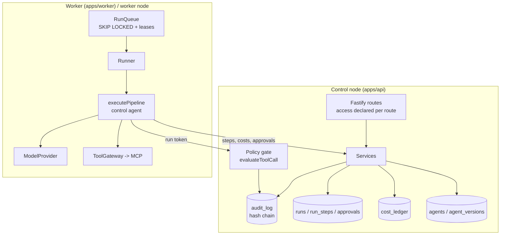

# Architecture

The product specification shared by the platform, Helm and website repositories lives in the
project's SPEC; this document describes how the platform implements it. Decisions are recorded
in [ADRs](adr/).

## Planes

## Run lifecycle

1. **Ingest**: a webhook/mail request is verified (HMAC, timestamp, replay protection in
   `webhook_deliveries`), normalised to a CloudEvent and stored in `events`; Kafka records and cron
   ticks enter through the same `IngestService.ingestEvent` / `RunsService.enqueue`.
2. **Queue**: a `runs` row (`queued`) referencing the agent's latest **immutable** version is
   created; a run whose tenant, use case or team reached its monthly budget gets
   `blocked_by_policy` immediately (see [budgets](budgets.md)).
3. **Claim**: a worker claims runs with `UPDATE … WHERE id IN (SELECT … FOR UPDATE SKIP LOCKED)`
   and holds a lease (heartbeat). Expired leases are requeued with exponential backoff.
4. **Execute** (`packages/runners/src/executor.ts`), per agent of the pipeline:
   - control agent check (budgets incl. the monthly tenant/use case/team budgets asked from the
     control node, timeout, rate, loops, errors, denials, cancellation),
   - model call with only the **granted** tools exposed,
   - for each tool call: **policy gate** on the control node -> `deny` (tool result tells the
     model), `require_approval` (run becomes `awaiting_approval` until a human decides) or
     `allow` -> MCP call with timeout and result size limit,
   - every step is persisted with tokens, cost and an audit entry.
5. **Complete**: status, outputs, usage and errors are stored; costs caches are invalidated;
   SSE subscribers receive the `end` event.

Typed handovers, `when` conditions, tool profiles, per-step credentials and isolated run nodes are
specified in [ADR 0008](adr/0008-agents-md-data-flow-and-isolation-contract.md); the new
`agents.md` fields are parsed and validated today and take effect as the wave 1 items land (see
[agents.md reference](agents-md.md)). Model calls of isolated run nodes go through the model proxy
on the control node, which measures usage and reserves budget before every call (proposed in
[ADR 0009](adr/0009-model-proxy.md), plan item W1-3b). The advisory Agent Check lints plans and
generates drafts ([Agent Check](agent-check.md)); it never publishes.

## Data model (PostgreSQL)

| Table | Notes |
| --- | --- |
| `teams`, `users`, `team_members` | RBAC bindings: global roles on users, team roles in memberships |
| `api_tokens` | sessions and API tokens; only SHA-256 of the secret is stored |
| `agents`, `agent_versions` | drafts and immutable versions (trigger forbids UPDATE/DELETE) |
| `event_sources`, `events`, `webhook_deliveries` | ingest and replay protection |
| `runs`, `run_steps`, `approvals` | queue + execution record |
| `connections`, `policies` | MCP servers (secret references only) and policy bundles |
| `audit_log`, `audit_checkpoints` | append-only hash chain and signed checkpoints |
| `cost_ledger`, `model_reservations`, `cron_ticks` | cost aggregation, worst-case model call reservations (per-tenant advisory lock) and cluster-wide cron de-duplication |

Hot-path indexes (verified by `apps/api/test/explain.test.ts`): runs by agent/status/team/time,
partial queue and lease indexes, audit by run and by time, events by source and time, pending
approvals, cost ledger by team/agent/month.

## Security model (summary)

- Every route declares its access (`permission`, `authenticated`, `public`, `run-token`,
  `webhook`); a route without a declaration fails at start-up and a test enforces 401/403.
- Resource-level team scoping in services (`hasPermission(principal, perm, teamId)`).
- Run tokens bind a worker to one leased run; they are verified before the body is parsed.
- Secrets: references only, redacted from logs (pino redact), audit payloads and prompts.
- Containers: non-root, read-only root fs, no capabilities; no run-time downloads.
